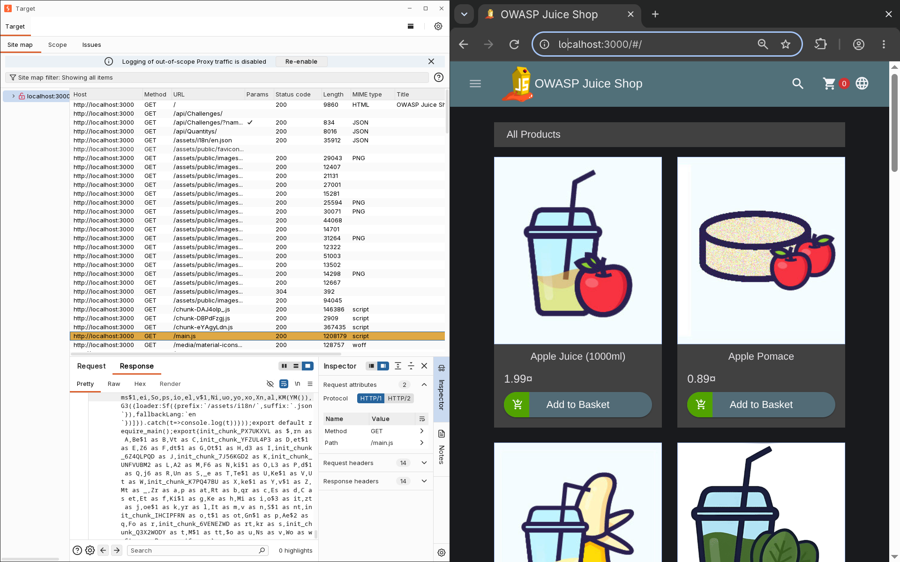

# Authentication Reconnaissance: OWASP Juice Shop

## 1. Overview & Objective
The goal of this phase was to conduct systematic reconnaissance against the authentication mechanisms of OWASP Juice Shop. Rather than jumping directly into payload delivery or automated vulnerability scanners, the focus was on establishing baseline application behavior, mapping authentication workflows, and identifying hidden or unlinked endpoints within client-side assets.

---

## 2. Dynamic Workflow Mapping

The initial mapping was conducted using Burp Suite's embedded browser routed through the local HTTP proxy. All HTTP request/response history and target site tree structures were tracked across both unauthenticated and authenticated states.

### Key Actions Performed:
* **Failure Cases:** Navigated to the login interface and submitted intentionally invalid credential pairs (non-existent emails, wrong passwords, malformed inputs) to capture baseline error codes and response structures.
* **Account Recovery:** Tested the "Forgot Password" workflow using both valid and invalid identifiers to evaluate whether the application reveals user existence (enumeration).
* **Legitimate Account Flow:** Registered a valid test account (`POST /api/Users/`), configured the security question (`POST /api/SecurityAnswers/`), and executed a successful login to capture valid session tokens and headers.
* **Post-Authentication Surface:** Navigated through user profile settings, security configurations, and password modification features while authenticated, logging all state transitions and session handling behaviors.

The intercepted routes and request behaviors were documented in [`endpoint_map.md`](../../../recon/endpoint_map.md), alongside notes in [`feature_map.md`](../../../recon/feature_map.md) and [`tech_stack.md`](../../../recon/tech_stack.md).

---

## 3. Static Client-Side Analysis

After establishing the dynamic baseline, static inspection was conducted on JavaScript bundles loaded by the browser (such as `main.js`, `polyfills.js`, and vendor files) to uncover endpoints, API routes, and hidden application logic not directly exposed through the UI.

### Custom Automation
To parse large minified bundles without relying on manual searches, a custom Python extraction utility—located at [`scripts/js_endpoints_crawler.py`](../../../../scripts/js_endpoints_crawler.py)—was developed. The script:
1. Accepts either a local file path or an application URL (automatically fetching remote assets).
2. Extracts API namespaces (`/rest/`, `/api/`) and Angular routing paths using regex rules tailored for ES6 template literals (backticks) and string concatenations.
3. Formats and organizes discovered endpoints into a structured report.

The output revealed multiple administrative, 2FA, and password management endpoints that were not visibly linked during standard browsing (such as `/rest/user/change-password`, `/rest/2fa/verify`, and `/rest/user/authentication-details/`). These additional routes were merged into [`endpoint_map.md`](../../../recon/endpoint_map.md).

### Noise Filtering & Triage
Auditing other included files highlighted the need to differentiate proprietary application logic from vendor and framework runtimes:
* Files like `polyfills.js` or `zone.js` handle asynchronous execution and browser compatibility, containing zero custom business logic.
* UI bundles like BeerCSS (`beer.min.js`) handle client-side rendering, styling tokens, and DOM manipulation rather than server data flow.

The rules and indicators used to triage these files have been documented in the testing methodology reference at [`js_file_testing_methodology.md`](../../../../notes/web-security/pentesting_methodology/js_file_testing_methodology.md).

---

## 4. Observations & Next Steps

All non-blocking insights, unusual parameter conventions (such as credentials passed via `GET` query parameters), and potential user enumeration vectors were cataloged in [`parked_observations.md`](../../../recon/parked_observations.md). 

With the attack surface mapped and the baseline behavior established, the next phase will transition from passive reconnaissance to focused vulnerability assessments across the identified authentication workflows.
