# Reverse Engineering Lab #1 - My First CrackMe Challenge

Yooooo... my first reverse engineering attempt. Let's goo.

This repository contains my very first reverse engineering writeup where I analyze and solve a beginner-level CrackMe challenge using x32/x64dbg.

I am currently learning reverse engineering using the "roam around and find out" approach:
- observe
- break things
- trace logic
- experiment
- learn

This writeup documents my full thought process instead of only showing the final answer.

---

# Educational Disclaimer

> This project is strictly for educational purposes.
> 
> The goal is to learn:
> - debugging
> - assembly analysis
> - reverse engineering workflows
> - understanding validation logic
> 
> All binaries used here are intentionally created CrackMe challenges meant for learning.

---

# Challenge Information

## CrackMe Target

CrackMe:
https://crackmes.one/crackme/5ab77f5933c5d40ad448c457

Password for ZIP:
```text
crackmes.one
```

## Video Reference

I initially followed this tutorial to understand the basics:

https://www.youtube.com/watch?v=sZnOEcCdLUo

After understanding the general workflow, I tried reproducing the process myself without blindly following the tutorial.

---

# Tools Used

- x32dbg / x64dbg
- Windows Console
- Python 3
- Brain damage
- Curiosity

---

# Repository Structure

The repository is organized like a small reverse engineering lab so anyone can follow along practically.

```text
reverse-engineering-lab-1/
│
├── README.md
│
├── crackme/
│   ├── crackme.exe
│   └── original_zip.zip
│
├── images/
│   ├── 1.png
│   ├── 2.png
│   ├── 3.png
│   ├── ...
│
├── keygen/
│   └── keygen.py
│
└── notes/
    └── random_notes.txt
```

## Folder Explanation

### `/crackme`
Contains:
- the CrackMe executable
- original ZIP if needed

This allows anyone cloning the repo to immediately start practicing.

---

### `/images`
Contains all screenshots used in the writeup.

I am using sequential image naming:

```text
1.png
2.png
3.png
4.png
...
```

This makes documenting easier and keeps the writeup clean.

---

### `/keygen`
Contains the Python key generator script created after reversing the validation logic.

---

### `/notes`
Contains random observations, failed ideas, scratch notes, or temporary findings during analysis.

---

# Initial Recon

First things first:
let's run the program normally and see what it does.

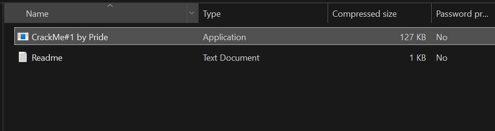

The program asks for:
- Name
- Serial Number

When an incorrect serial is entered:

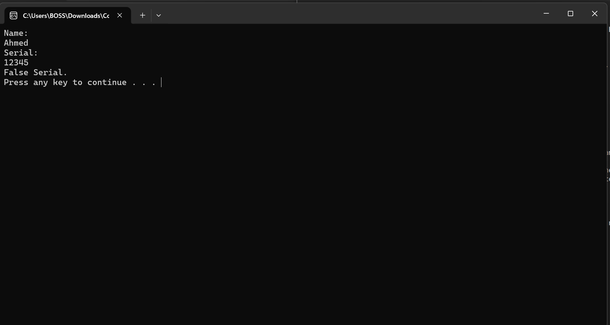

```text
Name:
Ahmed

Serial:
12345

False Serial.
Press any key to continue . . .
```

Now we know:
- the program is console-based
- it prints output to the terminal
- it validates user input somewhere internally

---

# Understanding `msvcrt`

Windows applications often use a runtime library called `msvcrt`.

`msvcrt` stands for:
Microsoft Visual C Runtime.

It handles common operations like:
- printing text
- user input
- memory functions
- standard C library functionality

Finding references to these runtime calls often helps locate important program logic.

---

# Launching the Debugger

I used x32dbg/x64dbg for debugging.

Open the debugger:

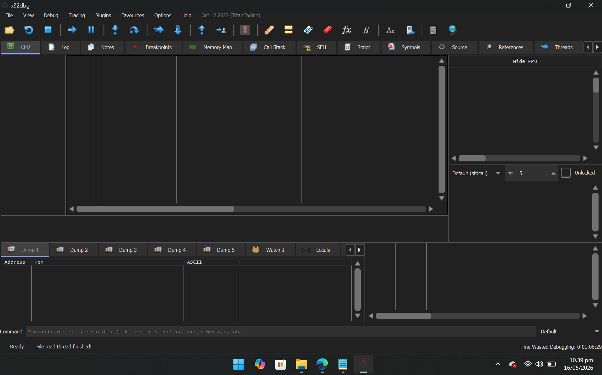

Now drag the CrackMe executable into the debugger:

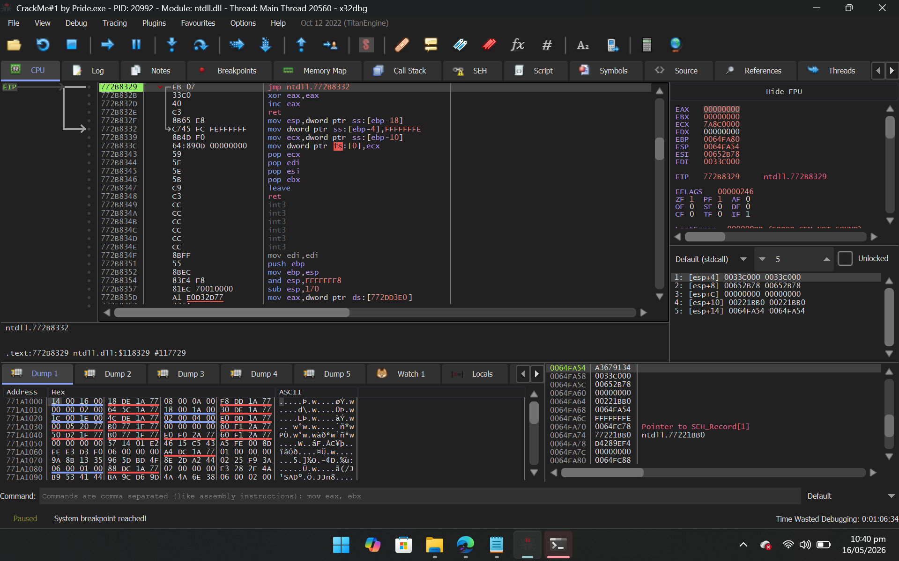

The debugger automatically pauses execution at the program Entry Point.

You can verify this inside the Breakpoints tab.

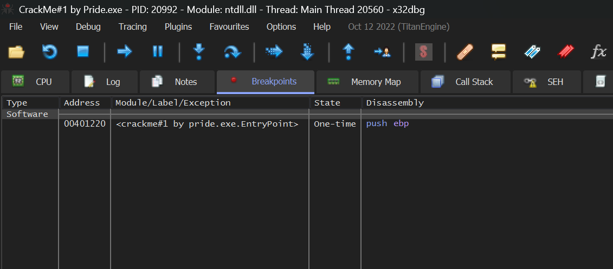

---

# Finding the Validation Logic

Now we need to locate the code responsible for validating the serial key.

There are multiple approaches.

---

# Method 1 - Searching Intermodular Calls

Navigate to:

```text
Search for -> All User Modules -> Intermodular Calls
```

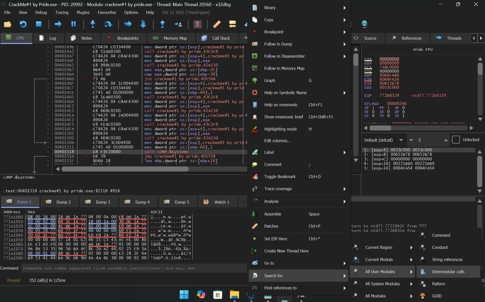

Search for:

```text
msvcrt.system
```

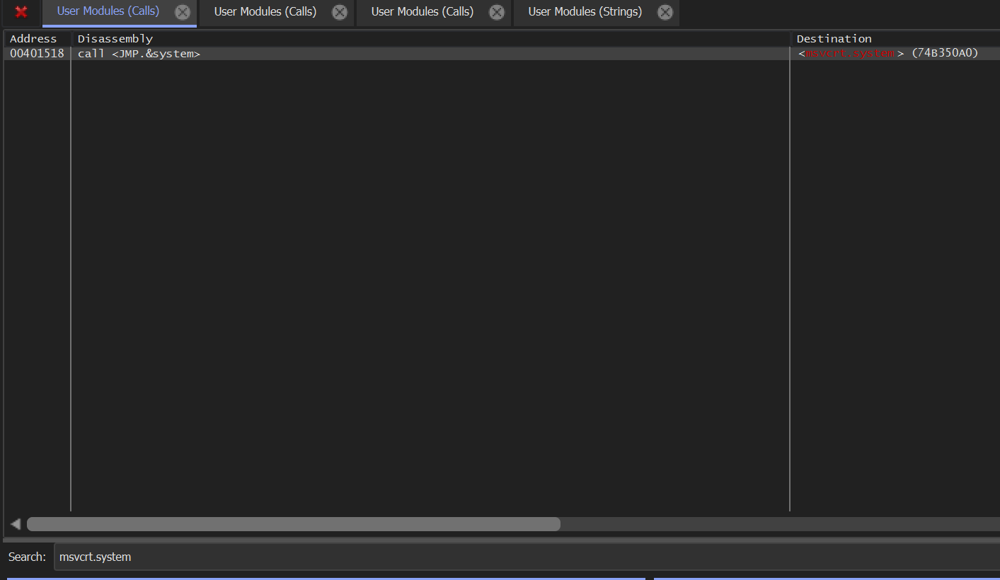

Open the result:

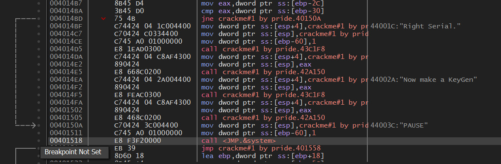

This leads us close to the validation logic.

---

# Method 2 - Searching String References

This method feels cleaner to me personally.

Navigate to:

```text
Search for -> All Modules -> String References
```

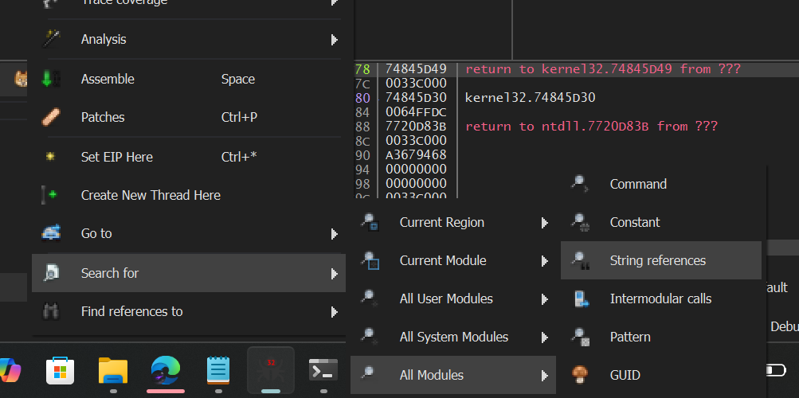

Search for:

```text
False Serial
```

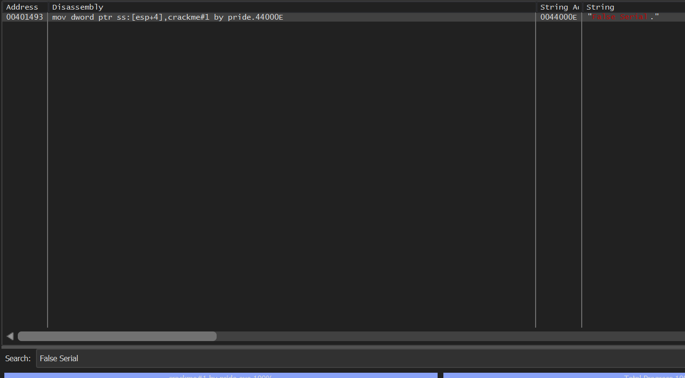

Open the reference:

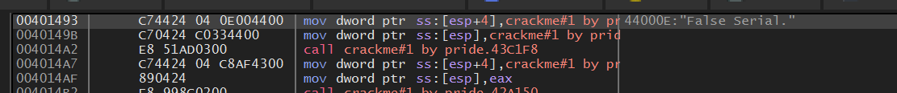

Both methods eventually lead to the same code region.

---

# Inspecting the Assembly

We now arrive at the interesting section.

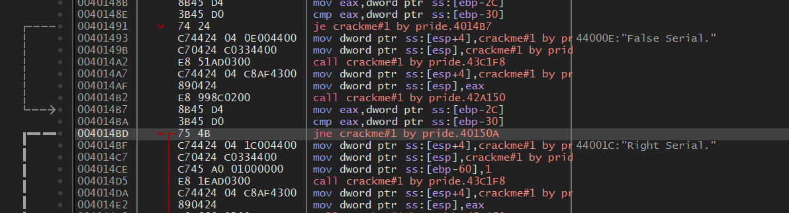

```assembly
0040148B | 8B45 D4 | mov eax,dword ptr ss:[ebp-2C]
0040148E | 3B45 D0 | cmp eax,dword ptr ss:[ebp-30]
00401491 | 74 24   | je crackme#1 by pride.4014B7
00401493 | C74424 04 0E004400 | "False Serial."
```

---

# Understanding the Comparison

This line is important:

```assembly
cmp eax,dword ptr ss:[ebp-30]
```

The instruction compares:
- the value stored in `EAX`
- with another value stored at `[ebp-30]`

Immediately after that:

```assembly
je crackme#1 by pride.4014B7
```

`je` means:
Jump If Equal.

So:
- if both values match → success path
- otherwise → "False Serial"

---

# Inspecting EAX

I placed a breakpoint at the comparison instruction and ran the program again.

Input used:

```text
Name: Ahmed
Serial: 12345
```

At the breakpoint:

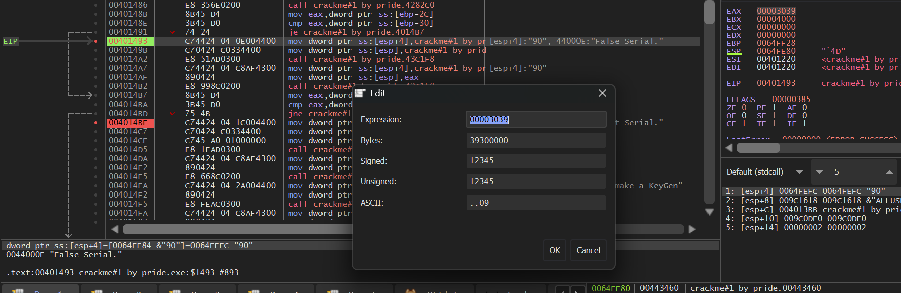

`EAX = 12345`

Interesting.

That means:
- `EAX` contains the serial number entered by the user
- the real calculated serial must be stored at `[ebp-30]`

Now we trace backwards.

---

# Tracing the Validation Algorithm

A few instructions above:

```assembly
00401442 | call crackme#1 by pride.412250
00401447 | add eax,CA
0040144C | xor eax,3D8D40F
00401451 | mov dword ptr ss:[ebp-30],eax
```

The program:
1. gets some value
2. adds `0xCA`
3. XORs the result with `0x3D8D40F`
4. stores the final value at `[ebp-30]`

But what was originally inside `EAX`?

---

# Following the Function Call

I followed the function:

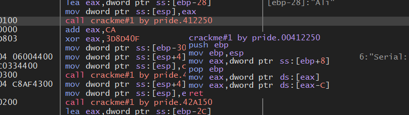

```assembly
00412250 | 55      | push ebp
00412251 | 89E5    | mov ebp,esp
00412253 | 8B45 08 | mov eax,dword ptr ss:[ebp+8]
00412256 | 5D      | pop ebp
00412257 | 8B00    | mov eax,dword ptr ds:[eax]
00412259 | 8B40 F4 | mov eax,dword ptr ds:[eax-C]
0041225C | C3      | ret
```

The function itself was not immediately obvious.

So instead of overthinking the assembly, I decided to experiment.

---

# Testing Hypotheses

I placed a breakpoint at:

```assembly
add eax,CA
```

and tested different names.

---

## Test 1

Input:

```text
Name: ALI
```

Result:

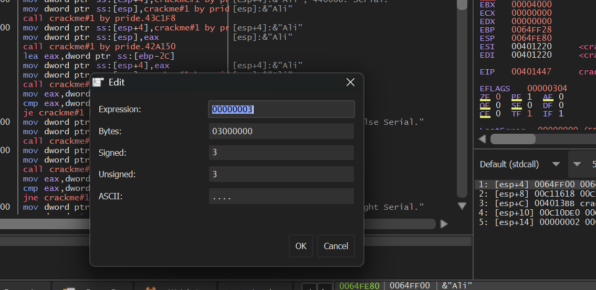

`EAX = 3`

---

## Test 2

Input:

```text
Name: Ahmed
```

Result:

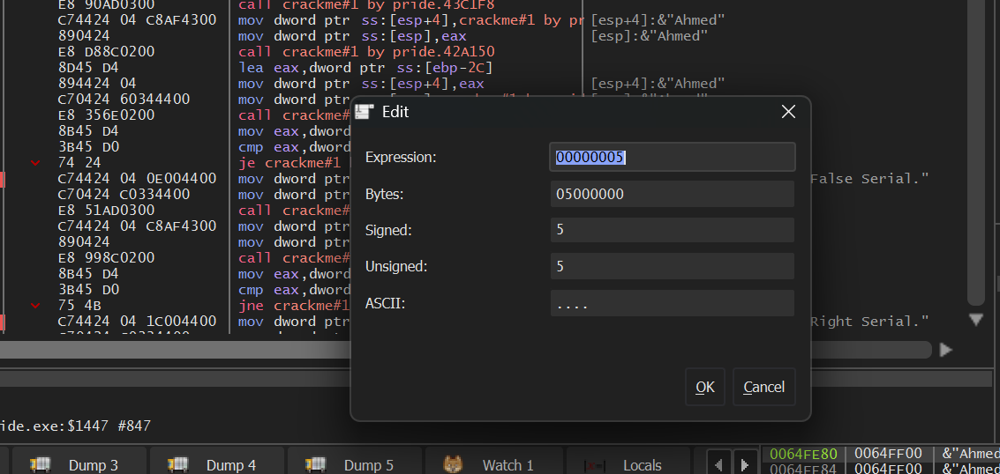

`EAX = 5`

---

# Discovery

The CrackMe is using:

```text
length(name)
```

as the base value.

So for:

```text
Ahmed
```

The process becomes:

```assembly
mov eax, 5
add eax, CA
xor eax, 3D8D40F
```

---

# Manual Calculation

## Step 1

```assembly
mov eax, 5
```

```text
EAX = 5
```

---

## Step 2

```assembly
add eax, CA
```

`0xCA = 202`

```text
5 + 202 = 207
```

---

## Step 3

```assembly
xor eax, 3D8D40F
```

Final result:

```text
64541888
```

Hex:

```text
0x03D8D4C0
```

---

# Testing the Real Serial

Input:

```text
Name: Ahmed
Serial: 64541888
```

Program output:

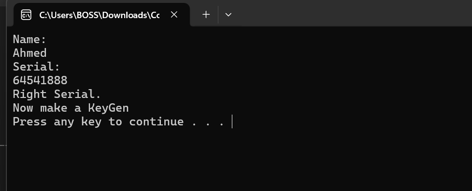

```text
Right Serial.
Now make a KeyGen
```

Success.

We reversed the validation logic.

---

# Creating a KeyGen

Now let's automate the process.

Inside:

```text
/keygen/keygen.py
```

```python
# Get user input
name = input("Enter the Name: ")

# Calculate string length
name_length = len(name)

# Add hexadecimal value
name_length += 0xCA

# XOR operation
name_length ^= 0x3D8D40F

# Print serial
print("Your Serial Key (Decimal):", name_length)
print("Your Serial Key (Hex):", hex(name_length).upper())

input("\nPress Enter to exit...")
```

---

# Running the KeyGen

Run:

```bash
python keygen.py
```

Example:

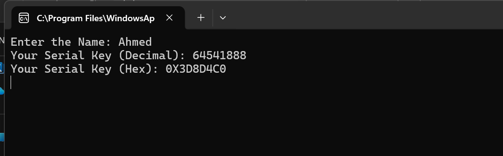

---

# What I Learned

From this challenge I learned:

- how to use x64dbg
- how breakpoints work
- how to inspect registers
- how conditional jumps work
- how to trace values backwards
- how to search string references
- how serial validation logic works
- how to recreate algorithms manually
- how to automate solutions with Python

---

# Final Thoughts

This was my first proper reverse engineering challenge.

The most important thing I learned is:

> reverse engineering is not magic

It is:
- observation
- experimentation
- patience
- tracing logic step-by-step

I still have a LOT to learn, but this was a fun start.

More RE labs coming soon.

---

# Future Goals

- Solve harder CrackMes
- Learn PE structure
- Learn Windows API internals
- Understand stack frames properly
- Learn unpacking
- Learn patching
- Create better keygens
- Learn malware analysis eventually

---

# References

## CrackMe

https://crackmes.one/

## Debugger

https://x64dbg.com/

## Tutorial

https://www.youtube.com/watch?v=sZnOEcCdLUo

---

# Author

Ahmed Hassan

First Reverse Engineering Lab