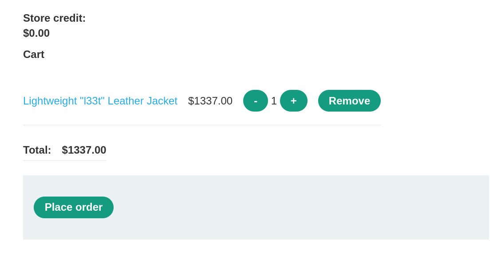
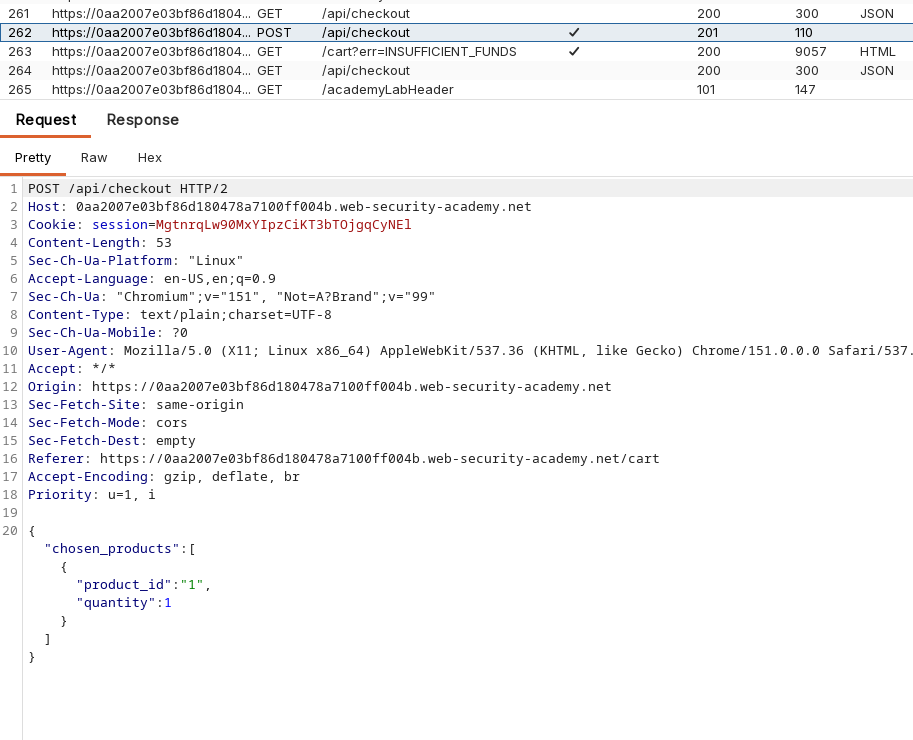
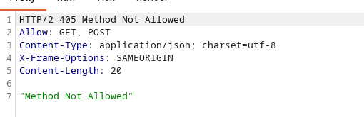

# Lab: Exploiting a Mass Assignment Vulnerability

> **Platform:** PortSwigger Web Security Academy  
> **Module:** API Testing  
> **Lab:** Exploiting a mass assignment vulnerability  
> **Lab Link:** https://portswigger.net/web-security/learning-paths/api-testing/api-testing-mass-assignment-vulnerabilities/api-testing/lab-exploiting-mass-assignment-vulnerability  
> **Goal:** Buy the leather jacket somehow.

---

## 1. Lab Goal

The goal of this lab was to exploit a mass assignment vulnerability to purchase the leather jacket despite having insufficient store credit.

---

## 2. Given Information

The lab gave the following information:

- `wiener:peter` are valid credentials.
- The target item is the leather jacket.

---

## 3. Vulnerability Summary

The application suffered from a mass assignment vulnerability. This vulnerability type often provides ease of development by automatically binding client input to internal objects, but it also allows clients to perform actions or modify fields that should have been restricted. In this case, it allowed an attacker to arbitrarily apply a 100% discount to their cart during checkout.

---

## 4. Observation

Just like always, I started by messing around with the site to gather information and understand how the application behaves. I logged in with the provided credentials and added the leather jacket to the cart, noting that I had $0 in store credit.



I roamed the site looking for an API endpoint. I couldn't find one immediately until I tried to check out the leather jacket. The checkout process triggered a `POST /api/checkout` request, giving me a potential endpoint to investigate. The initial request only contained a `chosen_products` parameter.



---

## 5. Initial Testing

I first tested the `OPTIONS` method on this endpoint to find out what HTTP methods were supported. I got a "Method Not Allowed" error, but the error message response headers revealed that `GET` and `POST` methods were acceptable for this endpoint.



Knowing that `GET` was allowed, I changed the request method to `GET` and sent it. The server returned the following JSON structure:

```json
{"chosen_discount":{"percentage":0},"chosen_products":[]}

```

This was a massive clue. It showed that the `chosen_discount` field existed on the backend object, suggesting it could potentially be an editable field in a `POST` request.

---

## 6. Exploiting the Vulnerability

Now that I knew the internal structure of the checkout object, I constructed a new `POST` request. I took the original checkout payload and injected the `chosen_discount` parameter, setting the percentage to 100.

```json
{
    "chosen_discount":{"percentage":100},
    "chosen_products":[{"product_id":"1","name":"Lightweight \"l33t\" Leather Jacket","quantity":1,"item_price":133700}]
}

```

I sent this modified `POST` request. The application accepted the mass-assigned parameter, applied the 100% discount, and placed the order successfully, solving the lab.

---

## 7. Correct Testing Approach

The correct approach for identifying and exploiting mass assignment involves understanding the data model:

1. Identify a state-changing API endpoint (like `POST /api/checkout`).
2. Use an `OPTIONS` request to discover other allowed methods (like `GET`).
3. Send a `GET` request to the endpoint to observe the full JSON object structure returned by the server.
4. Look for sensitive or hidden fields (like discounts, roles, or permissions) in the `GET` response that are not normally present in the client's `POST` request.
5. Attempt to inject those hidden fields into your `POST` request to see if the backend blindly binds the input to the object model.

---

## 8. Exploitation Steps

1. Logged into the application using `wiener:peter`.
2. Added the target leather jacket to the cart.
3. Proceeded to checkout and captured the `POST /api/checkout` request in Burp Suite.
4. Changed the request method to `OPTIONS` to discover allowed methods (`GET` and `POST` were supported).
5. Changed the request method to `GET` and observed the response, which revealed the `chosen_discount` field.
6. Reverted the request back to `POST`.
7. Injected `"chosen_discount":{"percentage":100}` into the JSON body alongside the `chosen_products` array.
8. Sent the request, which successfully applied a 100% discount and completed the purchase.

---

## 9. Evidence

### Target Endpoint

```text
/api/checkout

```

### Allowed Methods Discovered via OPTIONS

```text
GET, POST

```

### Information Leak via GET Request

```json
{"chosen_discount":{"percentage":0},"chosen_products":[]}

```

### Final Exploit Request Payload

```json
{
    "chosen_discount":{"percentage":100},
    "chosen_products":[{"product_id":"1","name":"Lightweight \"l33t\" Leather Jacket","quantity":1,"item_price":133700}]
}

```

The lab was solved after the modified `POST` request succeeded and the jacket was purchased using the injected discount.

---

## 10. Why This Worked

This worked because the application's backend framework was configured to automatically bind the parsed JSON data directly to internal application objects or database records (mass assignment). Because there was no explicit whitelist of allowed fields for the `POST` request, the application blindly accepted the `chosen_discount` parameter supplied by the client and updated the object's discount percentage accordingly.

---

## 11. Remediation / Fix

To fix this issue, developers must avoid blindly binding client input to internal objects:

* **Use Data Transfer Objects (DTOs):** Create specific objects for client input that only contain the fields the user is authorized to modify.
* **Implement Explicit Whitelisting:** If using built-in framework binding features, strictly define and whitelist the exact properties that are allowed to be assigned from an HTTP request.
* **Ignore Unrecognized Fields:** Configure the API or framework to ignore or reject any parameters in the payload that are not explicitly expected for that specific action.

---

## 12. Lessons Learned

* Mass assignment vulnerabilities exist at the intersection of developer convenience and lack of input sanitization.
* `GET` requests on endpoints typically used for `POST`/`PUT` actions can map out the internal data structures of the backend.
* Parameters not present in the default application UI or standard client requests can often be discovered and abused if the backend does not enforce explicit parameter whitelisting.

---

## 13. Final Summary

This lab demonstrated how a mass assignment vulnerability allows an attacker to manipulate hidden object parameters. By probing the `/api/checkout` endpoint with an `OPTIONS` request, I discovered that a `GET` request was allowed. The `GET` request revealed the internal structure of the checkout object, including a `chosen_discount` parameter. By injecting this parameter with a value of `100` into the `POST` checkout request, the backend blindly bound the input, applying a 100% discount and allowing me to purchase the item without sufficient funds.
