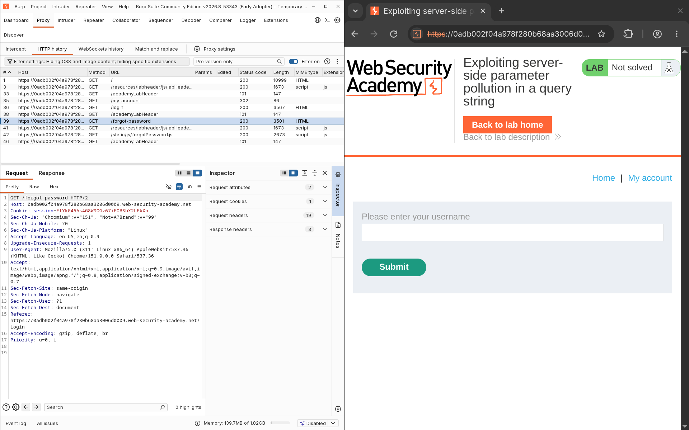
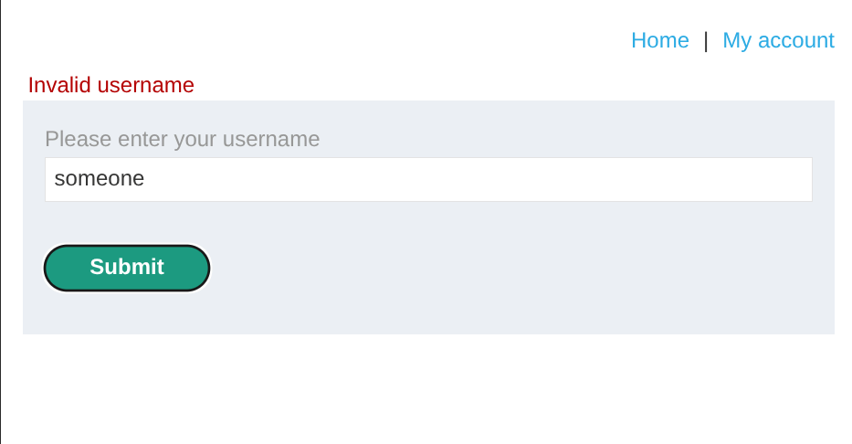
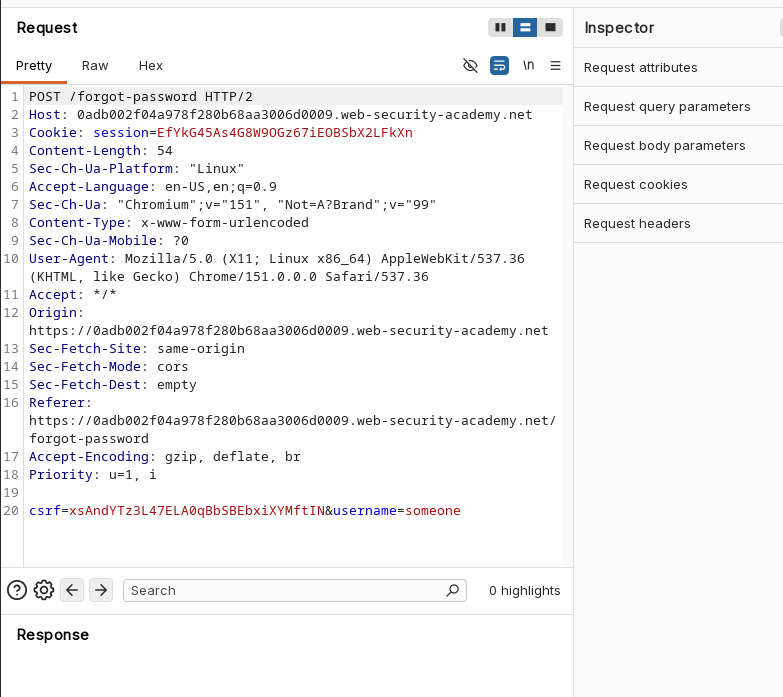
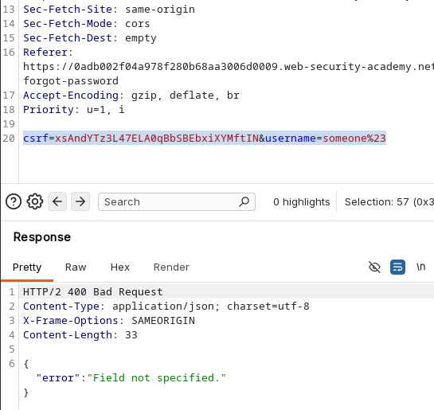
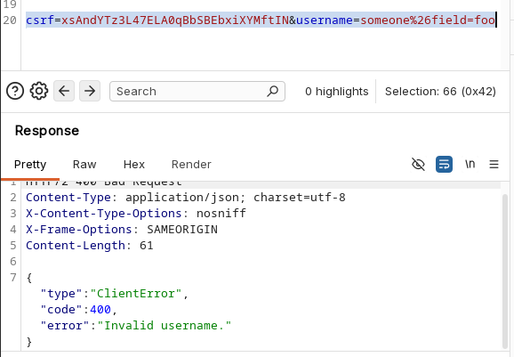
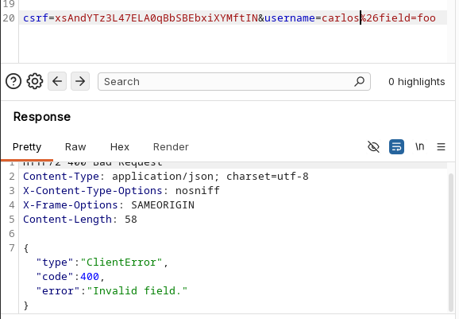
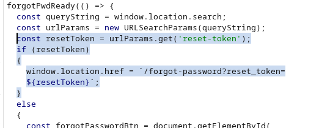

# Lab: Exploiting Server-Side Parameter Pollution in a Query String

> **Platform:** PortSwigger Web Security Academy  
> **Module:** API Testing  
> **Lab:** Exploiting server-side parameter pollution in a query string  
> **Lab Link:** https://portswigger.net/web-security/learning-paths/api-testing/api-testing-testing-for-server-side-parameter-pollution-in-the-query-string/api-testing/server-side-parameter-pollution/lab-exploiting-server-side-parameter-pollution-in-query-string  
> **Goal:** Delete Carlos' Account by taking over the admin account.

---

## 1. Lab Goal

The goal of this lab was to exploit a server-side parameter pollution vulnerability to retrieve a password reset token. Using this token, I needed to compromise the administrator account and delete Carlos' account.

---

## 2. Given Information

The lab provided the following information:

- `carlos` is a valid username.

---

## 3. Vulnerability Summary

The application's backend blindly concatenated user input into internal server-side requests without proper URL encoding. By injecting URL-encoded characters (like `%23` for `#` and `%26` for `&`), I was able to manipulate the server-side query string. This allowed me to expose a hidden `field` parameter and extract password reset tokens directly from the API response, ultimately leading to a full account takeover of the administrator.

---

## 4. Observation

We landed on a shopping site again. The site had options to log in, but since we didn't have any credentials, I checked out the "Forgot Password" functionality. 



Testing the input field revealed that the application returned a clear error message if the username was invalid, meaning usernames could easily be enumerated from this endpoint. 



I captured the `POST` request for the forgot password action in Burp Suite Repeater. The request only required a single `username` parameter.



When supplying a valid username like `carlos`, the web response confirmed that a reset link was generated.


---

## 5. Initial Testing

I opened the request in Repeater and started to poison the `username` parameter to look for server-side pollution vulnerabilities. 

First, I truncated the backend request by injecting a URL-encoded hash `%23` (`#`) after the username. The server returned an error stating a field was not specified: `{"error": "Field not specified."}`.



This meant the backend query string originally contained another parameter after `username`. I attempted to append a custom `field` parameter using `%26` (`&`): `username=someone%26field=foo`. This returned an "Invalid username" error.



I corrected the payload to use the valid `carlos` username: `username=carlos%26field=foo`. The response changed to: `{"type":"ClientError","code":400,"error":"Invalid field."}`.



This confirmed that `field` was the correct hidden parameter, but `foo` was not a valid value. Before enumerating random values, I inspected the frontend JavaScript files and found `forgotPassword.js`. The code contained a massive hint regarding a `reset-token` URL parameter.



---

## 6. Exploiting the Vulnerability

Knowing that `reset_token` was a valid internal attribute, I injected it into the `field` parameter: `username=carlos%26field=reset_token`. 

Initially, it returned: `{"type":"ClientError","code":400,"error":"The user does not have a reset password token."}`. I went to the frontend and manually triggered a password reset for `carlos`. When I sent my poisoned payload again, the API leaked the token:

```json
{"result":"a3tyokuhhxmw2j55hj7kg3v8e2g10trv","type":"reset_token"}

```

I put this token into the URL parameter found in the JS file (`/forgot-password?reset_token=...`), which took me to the password reset page.

I reset Carlos' password and logged in, but discovered his account didn't have the functionality to delete users. I needed an admin account.

Instead of full enumeration, I manually guessed common admin usernames on the `/forgot-password` endpoint. The username `administrator` returned a valid response. I requested a password reset for `administrator` from the UI, repeated my parameter pollution payload for their account, and successfully leaked the administrator's reset token.

I used the token to reset the admin password and logged in.

From the admin panel, I was able to delete Carlos' account and solve the lab.

---

## 7. Correct Testing Approach

The correct approach for identifying server-side parameter pollution involves breaking the internal query structure:

1. Look for API endpoints that take a single parameter (like a username) but might be making complex backend requests.
2. Inject URL-encoded truncating characters (like `%23`) to see if the server errors out about missing fields.
3. Inject URL-encoded separators (like `%26`) to append hidden parameters.
4. **Always review client-side code (JavaScript files)** before resorting to brute-forcing. Hardcoded parameters or URL logic can reveal the exact values the backend expects.

---

## 8. Exploitation Steps

1. Navigated to the "Forgot Password" page and captured the `POST` request.
2. Verified that invalid usernames return a distinct error, allowing for enumeration.
3. Injected `%23` at the end of the `username` parameter, causing a "Field not specified" error.
4. Appended `%26field=foo` to the payload, which returned an "Invalid field" error, proving the existence of the `field` parameter.
5. Reviewed `forgotPassword.js` and discovered the `reset-token` logic.
6. Triggered a normal password reset request for the user `carlos` from the UI.
7. Sent the poisoned payload: `username=carlos%26field=reset_token`.
8. Extracted the leaked `reset_token` from the JSON response.
9. Verified that Carlos did not have administrative privileges.
10. Tested the username `administrator` in the forgot password form and found it was valid.
11. Triggered a password reset for `administrator` and used the polluted payload to extract their token.
12. Reset the administrator's password, logged in, and deleted Carlos' account.

---

## 9. Evidence

### Initial Pollution Test Payload

```text
username=carlos%23

```

### Valid Parameter Discovery Payload

```text
username=carlos%26field=foo

```

### Final Token Extraction Payload

```text
csrf=8w1XWzKqhtsRlFqQ42Z6xIoI5b4tduWG&username=administrator%26field=reset_token

```

### Successful Token Leak Response

```json
{"result":"[admin_reset_token]","type":"reset_token"}

```

The lab was solved once the administrator account was compromised and Carlos was deleted.

---

## 10. Why This Worked

This worked because the application took the user-supplied `username` parameter and blindly concatenated it into an internal API request without properly URL-encoding the input. Because characters like `%26` (`&`) were decoded by the backend HTTP client, they were interpreted as structural query string delimiters rather than literal text. This allowed an attacker to overwrite or append internal parameters, forcing the backend API to return sensitive object fields (like the reset token) directly in the HTTP response.

---

## 11. Remediation / Fix

To prevent server-side parameter pollution, developers must ensure that user input cannot alter the structure of internal requests:

* **Strict URL Encoding:** Ensure all user input is properly URL-encoded before it is appended to any backend query string.
* **Use Parameterized Requests:** Instead of concatenating strings to build URLs, use secure HTTP libraries or API clients that handle parameterization automatically.
* **Data Minimization:** Do not return sensitive internal data (like password reset tokens) in API responses just because a field parameter requested it.

---

## 12. Lessons Learned

* Blindly brute-forcing or enumerating parameters with SecLists can be a massive waste of time. Always thoroughly inspect client-side JavaScript files first, as they often contain hardcoded parameters, endpoints, or logic that hands you the exact values you need.
* Error messages triggered by URL-encoded characters (like `%23`) are strong indicators of backend request manipulation.

---

## 13. Final Summary

This lab demonstrated how server-side parameter pollution can completely bypass intended application logic. By using URL-encoded characters (`%23` and `%26`), I deduced that the backend query string was vulnerable to manipulation. While I initially wasted time considering brute-force enumeration, reviewing the frontend JavaScript handed me the exact internal parameter I needed (`reset_token`). By injecting this parameter into the polluted query string, I forced the API to leak the password reset tokens for both a standard user and the administrator, allowing me to take over the application and delete the target account.

