```markdown
# Lab: Finding and Exploiting an Unused API Endpoint

> **Platform:** PortSwigger Web Security Academy  
> **Module:** API Testing  
> **Lab:** Finding and exploiting an unused API endpoint  
> **Lab Link:** https://portswigger.net/web-security/learning-paths/api-testing/api-testing-identifying-and-interacting-with-api-endpoints/api-testing/lab-exploiting-unused-api-endpoint  
> **Goal:** Buy the leather jacket somehow.

---

## 1. Lab Goal

The goal of this lab was to find and exploit an unused API endpoint to modify the price of a product, allowing the purchase of a high-value item (the leather jacket) despite having insufficient funds.

---

## 2. Given Information

The lab gave the following information:

- `wiener:peter` are valid credentials.
- The target item is the leather jacket, originally priced at $1337.

---

## 3. Vulnerability Summary

The application exposed an unused `PATCH` method on its product price API endpoint. While the endpoint required authentication, it lacked proper user-level authorization checks. Furthermore, the application's overly verbose error messages allowed a standard user to piece together the exact JSON payload required to arbitrarily change the price of items in the store.

---

## 4. Observation

Just like always, I started by messing around with the site a bit to gather information and understand how the application behaves.

The lab put us into a shopping site. We could see the leather jacket, but it was listed for $1337.

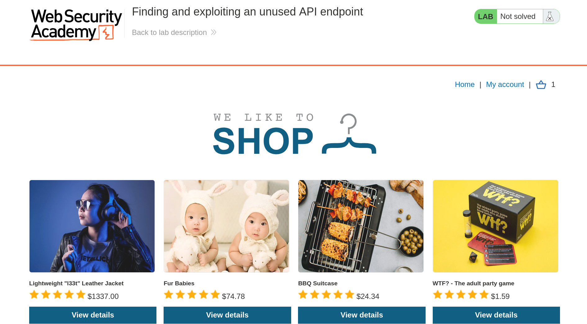

I opened my proxy in Burp Suite. I explored around the app, and upon clicking the jacket, it opened the jacket-specific page. I saw an API call for getting the price in the proxy tab. 

This call was of interest because we could potentially exploit it to perform actions that are not intended for us.

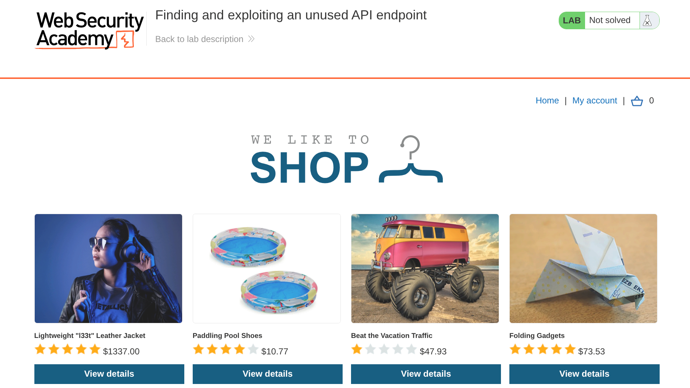

---

## 5. Initial Testing

Now I tested changing the HTTP methods on the call. I changed the `GET` to `OPTIONS` and it returned an error "Method Not Allowed" but also it returned `Allow: GET, PATCH`. 

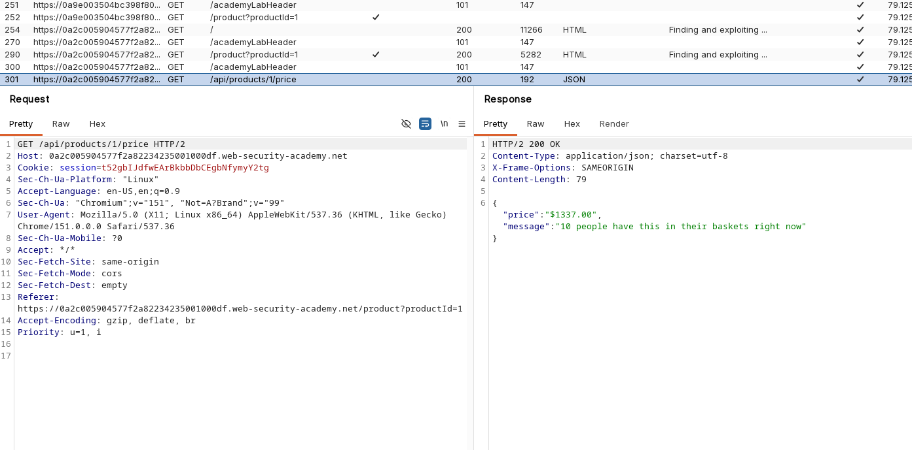

Now I knew that I could perform a `PATCH` method on this exposed endpoint. I replaced the `OPTIONS` with `PATCH` and again ran the request.

It returned "Unauthorized".

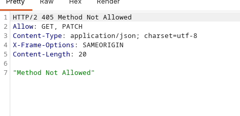

---

## 6. Logging In and Iterating the Request

Now I logged in using the given credentials and grabbed the session ID to replace the one in my request. After logging in, I found that my credit was $0, so I couldn't legitimately buy the jacket!

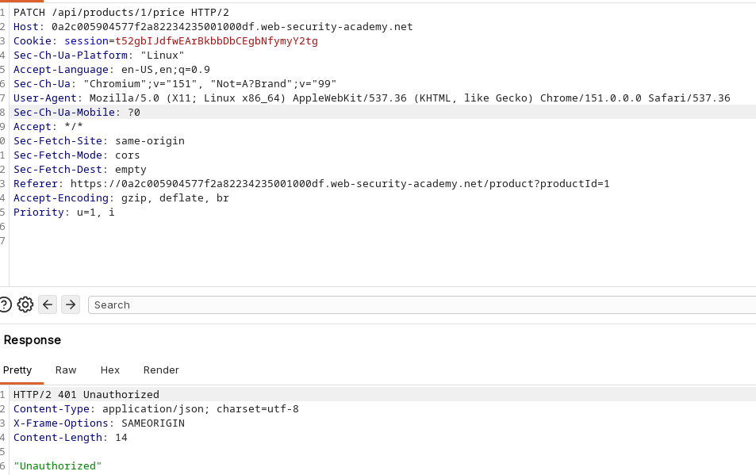

I replaced the session cookie in my request with the logged-in session.

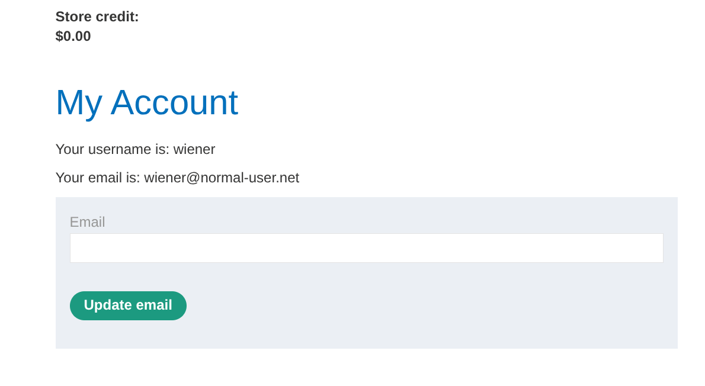

Then I made the `PATCH` request again. This time it returned a `Bad Request`. The error message stated: `error: "Only 'application/json' Content-Type is supported"`.

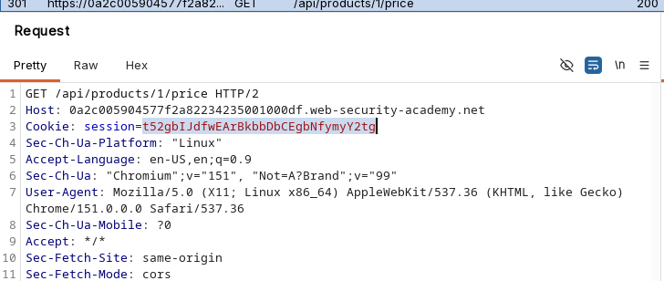

Now I added this header in the request and made the request again. It returned an `Internal Server Error`. The reason for this error was that we didn't provide any JSON format payload with the request.

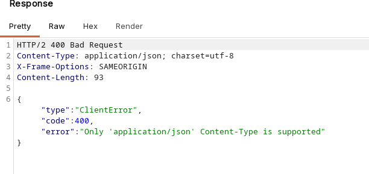

I added an empty JSON object `{}` to the request. Then I made it again. It now returned `Bad Request` and the error message stated that the "price parameter is missing". 

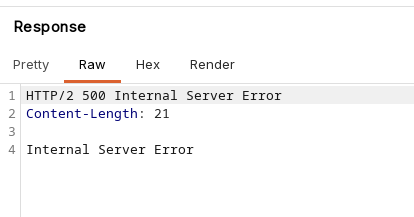

This gave us a clue on what the valid HTTP request would look like!

So we just added `"price" : 0` into the payload. I ran the request again. This time the request returned `HTTP/2 200 OK`. The price was set to 0 now.

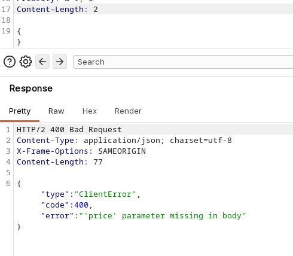

This meant that we could finally buy the jacket! I added the leather jacket to the basket, placed the order, and solved the lab.

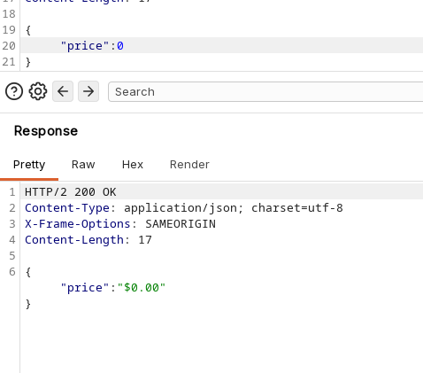

---

## 7. Correct Testing Approach

The correct approach in this scenario was to use the API's own responses to systematically map out its requirements. 

The important checks were:
1. Identify supported HTTP methods by sending an `OPTIONS` request.
2. Authenticate with valid credentials to bypass authorization blocks (`401 Unauthorized`).
3. Pay close attention to verbose server error messages to deduce required headers (like `Content-Type`).
4. Supply a basic data structure (like an empty JSON object) to see how the server parses it.
5. Use parameter-specific error messages to uncover hidden API parameters (like `price`) and build the final payload.

---

## 8. Exploitation Steps

1. Explored the shopping site and viewed the target leather jacket product page.
2. Captured the API request for the product price in Burp Suite Proxy.
3. Changed the HTTP method from `GET` to `OPTIONS` to discover allowed methods (`PATCH` was permitted).
4. Sent a `PATCH` request and received an `Unauthorized` error.
5. Logged into the application using `wiener:peter`.
6. Replaced the session cookie in the `PATCH` request with the authenticated session ID.
7. Sent the request again and received an error requiring an `application/json` Content-Type.
8. Added the `Content-Type: application/json` header.
9. Sent the request without a body, resulting in an `Internal Server Error`.
10. Added an empty JSON object `{}` to the request body, which returned a missing `price` parameter error.
11. Updated the JSON payload to `{"price": 0}` and sent the request.
12. Received a `200 OK` response, changing the product's price to $0.00.
13. Added the jacket to the basket and placed the order to solve the lab.

---

## 9. Evidence

### Target Endpoint
```text
/api/products/1/price

```

### Allowed Methods Discovered

```text
Allow: GET, PATCH

```

### Final Exploit Request Payload

```json
{
  "price": 0
}

```

### Successful Result

```text
200 OK

```

The lab was solved after the price modification request succeeded and the jacket was purchased for $0.00.

---

## 10. Why This Worked

This worked because the backend API blindly trusted the input provided in the `PATCH` request without performing proper authorization validation. While the endpoint verified that a user was logged in (by initially returning `Unauthorized`), it failed to enforce privilege checks to ensure only administrative accounts could alter pricing data.

Furthermore, the API was overly verbose. By returning specific errors like `"Only 'application/json' Content-Type is supported"` and `"price parameter is missing"`, the application effectively handed over the exact instructions needed to construct a malicious request.

---

## 11. Remediation / Fix

To fix this issue, the application must enforce strict access control and handle errors securely:

* **Implement Role-Based Access Control (RBAC):** Restrict dangerous HTTP methods like `PATCH` on product pricing endpoints to administrative users only.
* **Suppress Verbose Errors:** The API should return generic errors (e.g., `400 Bad Request` or `403 Forbidden`) instead of revealing missing parameters or expected content types.
* **Strict Input Validation:** Ensure prices cannot be arbitrarily modified or set below a specific threshold by untrusted client input.

---

## 12. Lessons Learned

* Unused or undocumented API endpoints can often be discovered by probing with different HTTP methods, such as `OPTIONS`.
* Verbose error messages are incredibly helpful for attackers, acting as a guide to construct valid exploit payloads.
* Authentication does not equal authorization. Just because an API requires a valid session cookie does not mean it is securely restricted from abuse by standard users.

---

## 13. Final Summary

This lab demonstrated how an unused API endpoint, combined with verbose error messaging, can lead to critical business logic abuse. By discovering a hidden `PATCH` method via an `OPTIONS` request, I was able to interact with the pricing API. After logging in as a standard user to bypass the initial `Unauthorized` restriction, I utilized the server's detailed error messages to deduce the required `Content-Type` header and the hidden `price` parameter. Supplying a JSON payload of `{"price": 0}` successfully updated the product's cost, allowing me to purchase the jacket for free and complete the lab.

```

```
