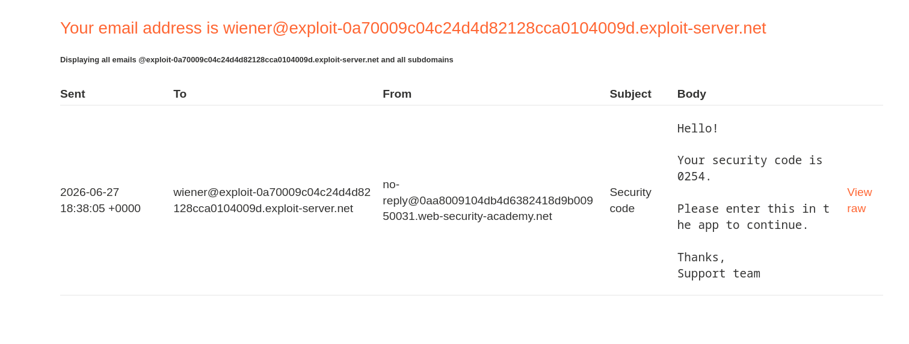
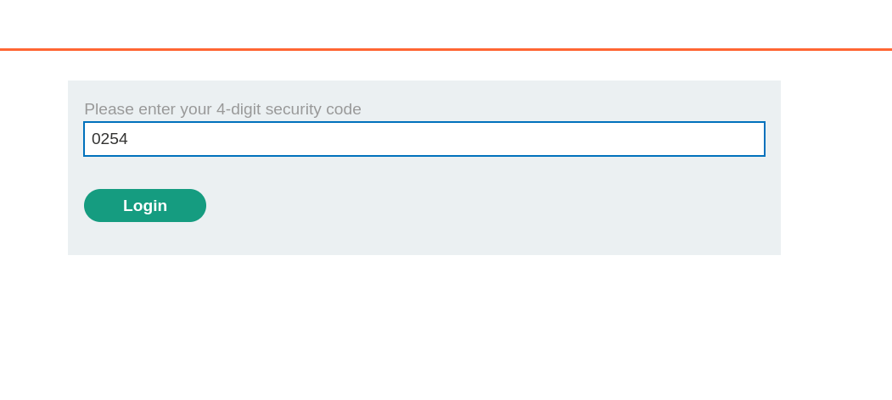
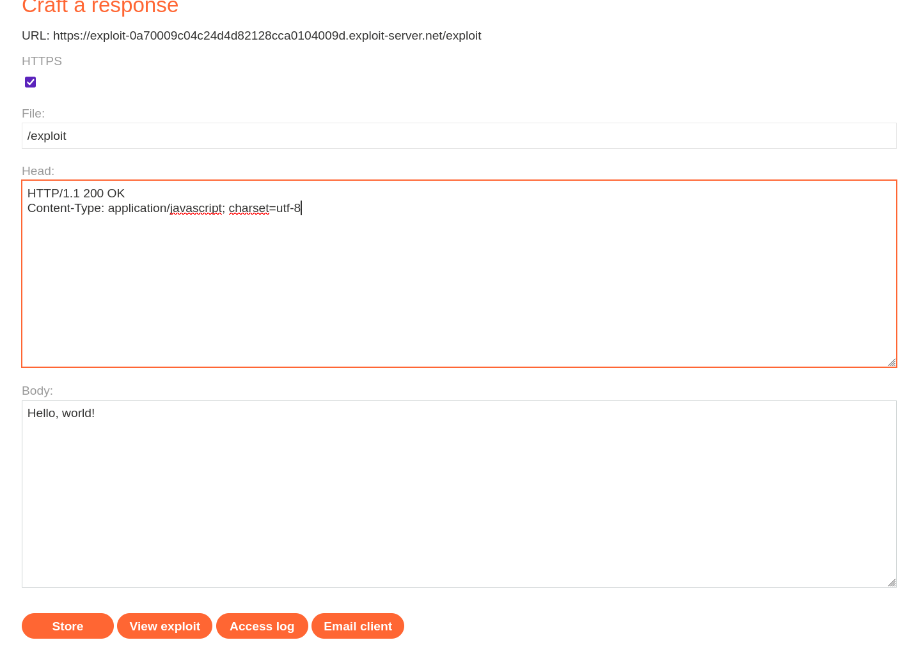

# Lab: 2FA Simple Bypass

**Lab Link:**  
https://portswigger.net/web-security/learning-paths/authentication-vulnerabilities/vulnerabilities-in-multi-factor-authentication/authentication/multi-factor/lab-2fa-simple-bypass

---

## 1. Lab Goal

The goal of this lab was to bypass the 2FA mechanism and access the target user's account.

Known credentials:

```text
My account: wiener:peter
Target account: carlos:montoya
```

---

## 2. Vulnerability Summary

The application had a simple 2FA bypass vulnerability.

After entering valid username and password credentials, the application redirected the user to the 2FA verification page. However, the application did not properly enforce the 2FA check before allowing access to authenticated pages.

Because of this, after logging in with the target user's credentials, I could manually change the URL to `/my-account` and access the account without entering the OTP.

---

## 3. Reconnaissance

This lab was a bit different from the previous authentication labs.

The application had a normal login page.


It also provided an email client where I could receive the OTP for my own account.



When I logged in using my own credentials:

```text
wiener:peter
```

I received the OTP through the email client.

This was the raw email I got:

```text
Sent:     2026-06-27 18:38:05 +0000
From:     no-reply@0aa8009104db4d6382418d9b00950031.web-security-academy.net
To:       wiener@exploit-0a70009c04c24d4d82128cca0104009d.exploit-server.net
Subject:  Security code

Hello!

Your security code is 0254.

Please enter this in the app to continue.

Thanks,
Support team
```

After submitting the username and password, the application asked me for the OTP on the next page.



I entered the OTP:

```text
0254
```

After that, I was logged in to my own account successfully.



---

## 4. Initial Thoughts

There was also an exploit server available in the lab.

At first, I thought maybe the exploit server was supposed to be used for crafting a fake OTP response or somehow manipulating the 2FA flow.

This part was a bit confusing because the lab included the exploit server, but it was not actually needed for the final bypass.

The important thing was to understand how the application handled the session after the username and password were accepted.

---

## 5. Testing the Login Flow

After logging in with my own account, I noticed that the final authenticated page was:

```text
/my-account
```

So the normal flow looked like this:

```text
/login  ->  /login2  ->  /my-account
```

Where:

- `/login` was the username and password login page.
- `/login2` was the OTP verification page.
- `/my-account` was the logged-in account page.

The question was whether the application actually required successful OTP verification before allowing access to `/my-account`.

---

## 6. Exploitation Steps

Next, I tried to log in as the target user.

Target credentials:

```text
carlos:montoya
```

After entering these credentials, the application accepted the username and password and redirected me to the OTP page.

At this point, I did not have access to Carlos's OTP.

But I noticed something important: after entering the correct username and password, I was already in a logged-in state.

So instead of entering the OTP, I manually changed the URL from the OTP page to:

```text
/my-account
```

And it worked.

The application allowed me to access Carlos's account without completing the 2FA step.

---

## 7. Evidence

The bypass worked because the application did not properly enforce 2FA on the `/my-account` endpoint.

The important behavior was:

```text
1. Enter target credentials: carlos:montoya
2. Application redirects to OTP page
3. Do not enter OTP
4. Manually visit /my-account
5. Target account is accessible
```

This means the application checked the password correctly, but failed to check whether the second authentication factor was completed before allowing access to authenticated functionality.

---

## 8. Why This Vulnerability Exists

The issue happened because the application treated password authentication and full authentication as the same thing.

After the correct username and password were submitted, the application likely created a valid logged-in session too early.

A safer design would be to create a temporary "pre-2FA" session after the password step, and only upgrade it to a fully authenticated session after the OTP is successfully verified.

---

## 9. Remediation / Fix

To fix this vulnerability, the application should enforce 2FA properly on all authenticated routes.

The application should not allow access to pages like:

```text
/my-account
```

until the user has completed both steps:

```text
1. Correct username and password
2. Correct OTP
```

A better implementation would be:

- After password login, create only a temporary pre-authentication session.
- Store that the user has passed the password step but not the 2FA step.
- Do not allow access to sensitive pages until the OTP is verified.
- Check the 2FA completion status on every protected endpoint.
- Redirect users back to the OTP page if 2FA has not been completed.

---

## 10. Lessons Learned

- 2FA should not only be shown in the UI, it must be enforced on the backend.
- After entering valid credentials, it is useful to manually test protected endpoints.
- A user should not be fully logged in until the second factor is verified.
- Sometimes the simplest bypass is just changing the URL manually.
- Not every feature in the lab, like the exploit server, is always needed for the solution.

---

## 11. Final Summary

This lab demonstrated a simple 2FA bypass vulnerability.

After logging in with valid target credentials, the application redirected me to the OTP page. However, the application did not properly enforce the OTP verification before allowing access to authenticated pages.

By manually visiting `/my-account` after entering the target username and password, I was able to access Carlos's account without submitting the OTP.

The main issue was that the application created or trusted an authenticated session before the 2FA process was fully completed.
