# Username Enumeration via Different Responses

> **Platform:** PortSwigger Web Security Academy  
> **Module:** Authentication vulnerabilities  
> **Lab:** Username enumeration via different responses  
> **Goal:** Identify a valid username, brute-force the password, and log in successfully.

Lab link: [Username enumeration via different responses](https://portswigger.net/web-security/learning-paths/authentication-vulnerabilities/password-based-vulnerabilities/authentication/password-based/lab-username-enumeration-via-different-responses)

> **Disclaimer:** This write-up is based on a controlled PortSwigger Web Security Academy lab. The techniques shown here should only be used in legal, authorized environments.

---

## Table of Contents

- [Lab Overview](#lab-overview)
- [Initial Reconnaissance](#initial-reconnaissance)
- [Understanding the Login Behavior](#understanding-the-login-behavior)
- [Trying Usernames from Public Site Content](#trying-usernames-from-public-site-content)
- [Using the Provided Username List](#using-the-provided-username-list)
- [Brute-Forcing the Password with Hydra](#brute-forcing-the-password-with-hydra)
- [Logging In Successfully](#logging-in-successfully)
- [Key Takeaways](#key-takeaways)
- [Wordlists Used](#wordlists-used)

---

## Lab Overview

The lab focuses on a common authentication vulnerability: **username enumeration through different login responses**.

In this case, the login form responds differently depending on whether the submitted username exists. This allows an attacker to distinguish between:

- an invalid username, and
- a valid username with an incorrect password.

That difference becomes enough to identify a real username and then move on to password brute-forcing.

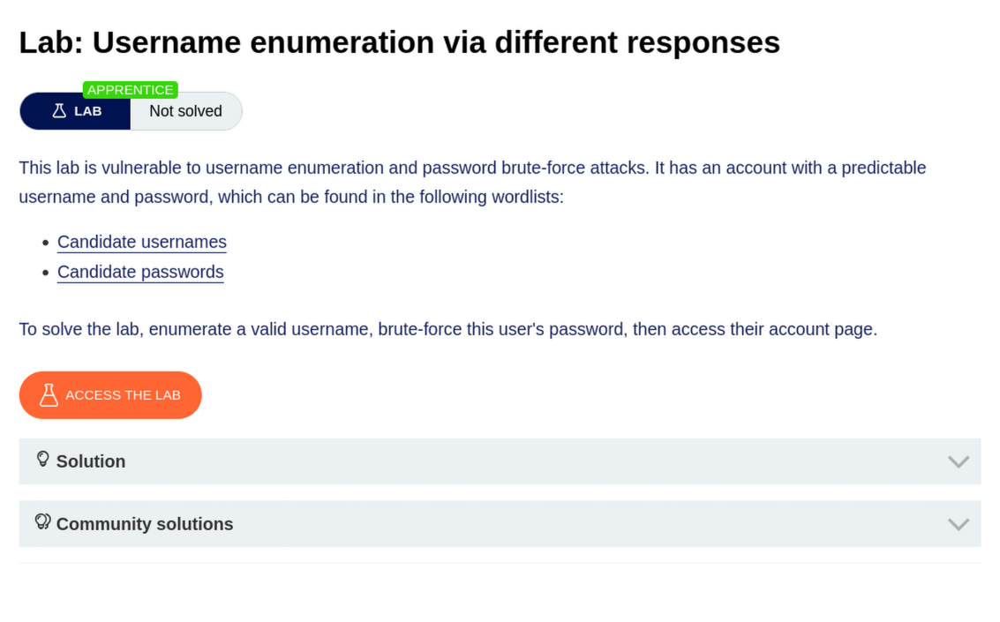

---

## Initial Reconnaissance

I started by looking around the target application instead of immediately jumping into the provided wordlists. The application appeared to be a simple blog website.

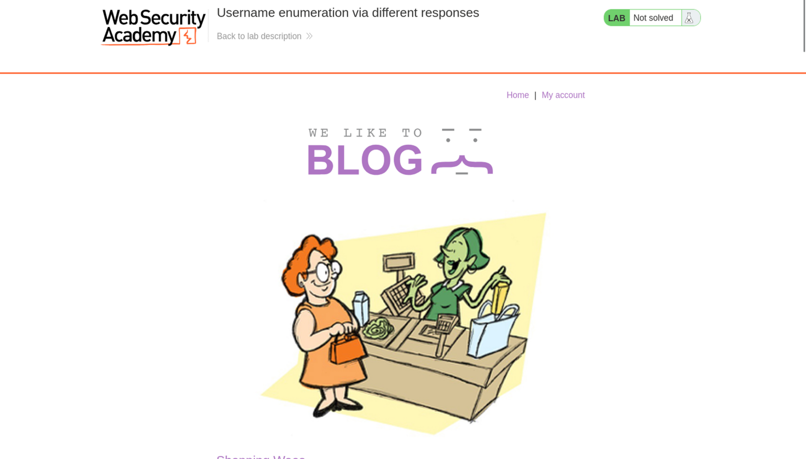

The site contained multiple blog posts.


Each blog post also had a comment section at the bottom.

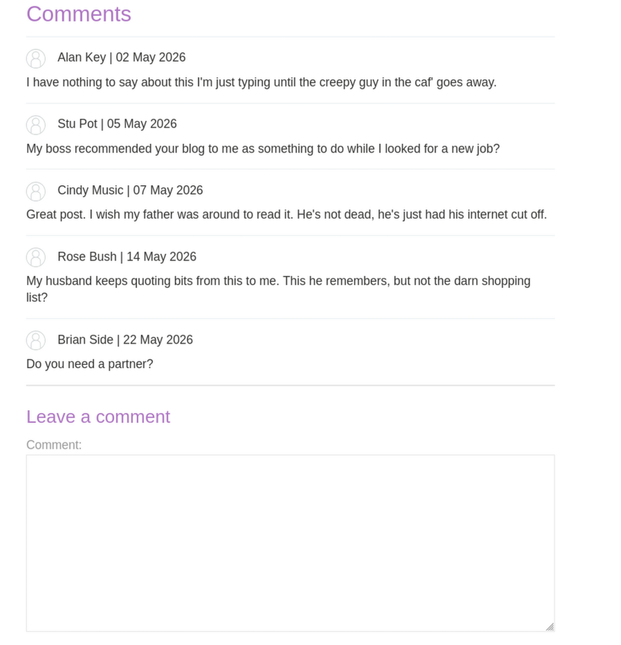

The comments displayed names and dates. This caught my attention because usernames are sometimes reused across different parts of an application. A comment name, author name, or visible profile name might match a real login username.

There was also a **My account** page containing a login form. Since the goal of the lab was to gain access with valid credentials, this login form became the main target for testing username enumeration.

---

## Understanding the Login Behavior

Before using the wordlists, I wanted to understand how the login form responded to failed login attempts.

My plan was simple:

1. Pick a visible name from the blog or comments.
2. Submit it as the username.
3. Use a random password such as `pass1234`.
4. Observe the error message.

If the application returned different error messages for different usernames, that would confirm a username enumeration issue.

---

## Trying Usernames from Public Site Content

I first selected a username candidate from one of the visible comments.

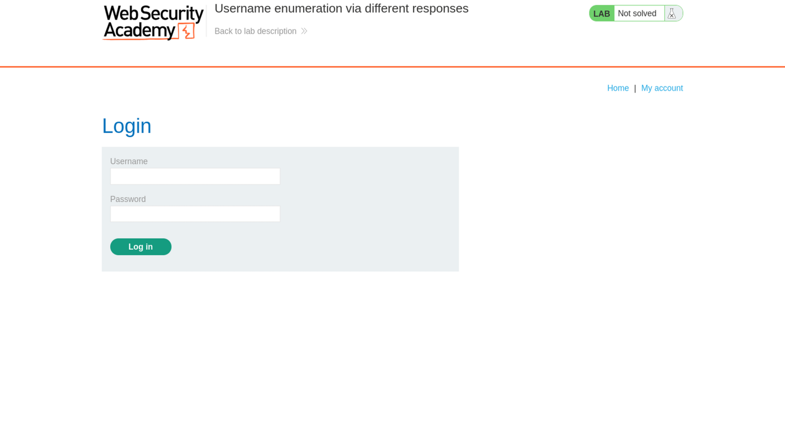

I submitted the candidate username with a random password.

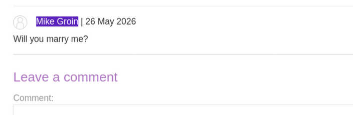

The application returned the following type of response:

```text
Invalid username
```

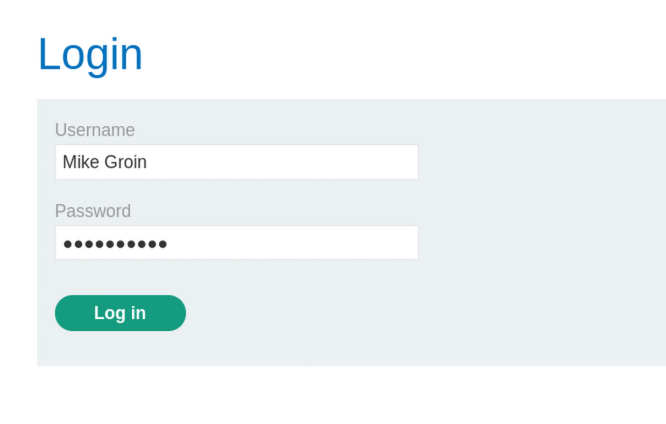

This was useful because it confirmed that the application clearly tells us when a username is invalid.

At this point, I knew that if the message changed to something like `Incorrect password`, then the username would likely be valid.

---

## Testing More Username Candidates

Next, I tried using a blog author name as another possible username source.

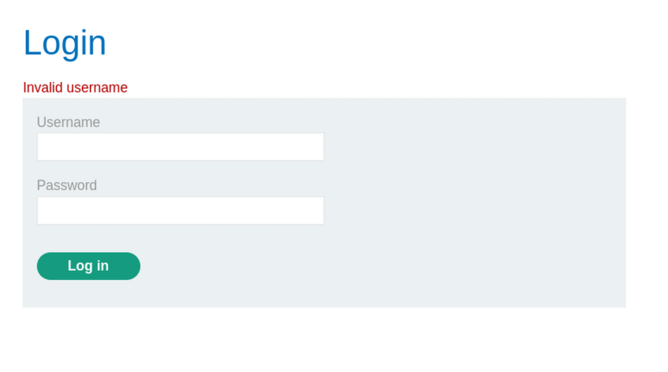

The author name was **Russell Up**, so I tested multiple possible username formats:

```text
RussellUp
russellup
russell_up
Russell-Up
RussellUP
russell
Russell
RUSSELL
```

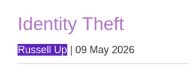

However, all of these attempts still resulted in the same invalid username response.

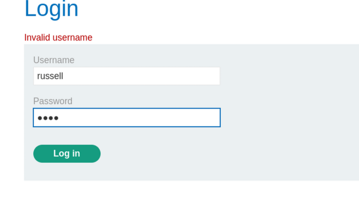

I then moved to another visible name from the comments: **Amber Light**.

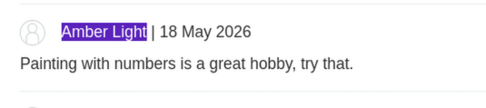

I tried several variations again:

```text
AMBERLIGHT
amber-light
amberLIGHT
AmberLight
aMbErLiGhT
amber
Amber
AMBER
aMbER
```

These attempts also failed.

This part was time-consuming, but it was still a useful reminder: reconnaissance and manual guessing can sometimes work, but they can also become inefficient very quickly. At that point, it made more sense to use the lab-provided username list.

---

## Using the Provided Username List

The lab provided a username list. Instead of trying every random visible name from the blog, I started testing usernames from the list in the order that seemed most likely.

Eventually, the username `oracle` produced a different error message:

```text
Incorrect password
```

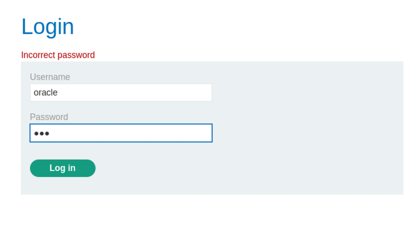

This was the turning point.

The application no longer said `Invalid username`. It now said `Incorrect password`, which means:

```text
oracle
```

was a valid username.

Now the problem changed from username discovery to password brute-forcing.

---

## Brute-Forcing the Password with Hydra

Initially, I tried doing some attempts manually, but manual brute-forcing quickly became repetitive and inefficient. This was a good moment to use automation.

Since Burp Suite was not set up yet, I used **Hydra** for the password attack.

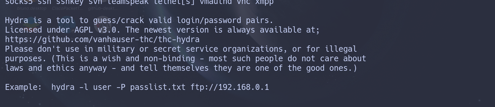

The login request was sent to the following path:

```text
/login
```

The lab instance host was:

```text
0a22002c04bf53d281126ccb006700fd.web-security-academy.net
```

> The exact lab host changes for every PortSwigger lab instance, so this value should be replaced with the current lab URL when reproducing the steps.

---

## Creating the Password List

I saved the provided password list into a local file named:

```text
words-list.txt
```

One way to create the file is with `nano`:

```bash
nano words-list.txt
```

Then paste the passwords, save, and exit:

```text
CTRL + O
CTRL + X
```

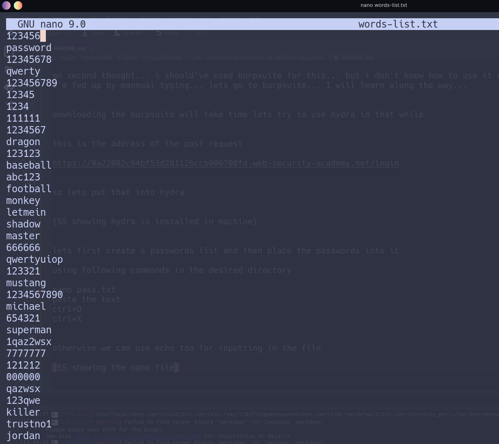

---

## Hydra Command

After identifying the valid username as `oracle`, I ran Hydra against the login form using the password list.

```bash
hydra -l oracle -P words-list.txt 0a22002c04bf53d281126ccb006700fd.web-security-academy.net https-post-form "/login:username=^USER^&password=^PASS^:F=Incorrect password" -V -f
```

### Command Breakdown

| Part | Meaning |
|---|---|
| `-l oracle` | Use `oracle` as the fixed username. |
| `-P words-list.txt` | Use `words-list.txt` as the password list. |
| `https-post-form` | Attack an HTTPS POST login form. |
| `/login` | Login endpoint. |
| `username=^USER^&password=^PASS^` | POST parameters used by the login form. |
| `F=Incorrect password` | Treat responses containing `Incorrect password` as failed attempts. |
| `-V` | Show verbose output. |
| `-f` | Stop after finding valid credentials. |

Hydra successfully found the password:

```text
Username: oracle
Password: 666666
```

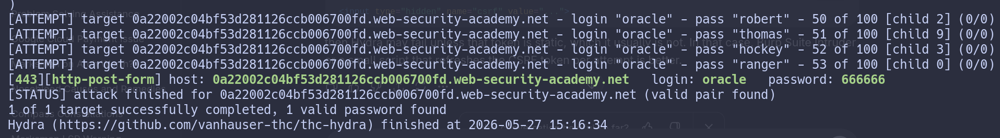

---

## Logging In Successfully

With the valid credentials identified, I returned to the login form and entered:

```text
Username: oracle
Password: 666666
```

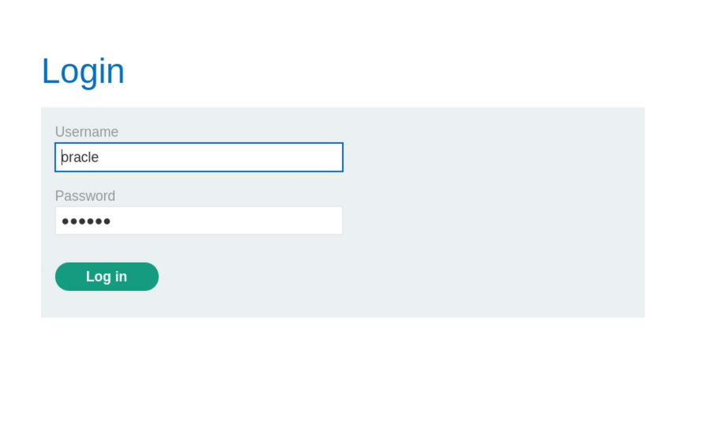

After submitting the form, I successfully logged in.

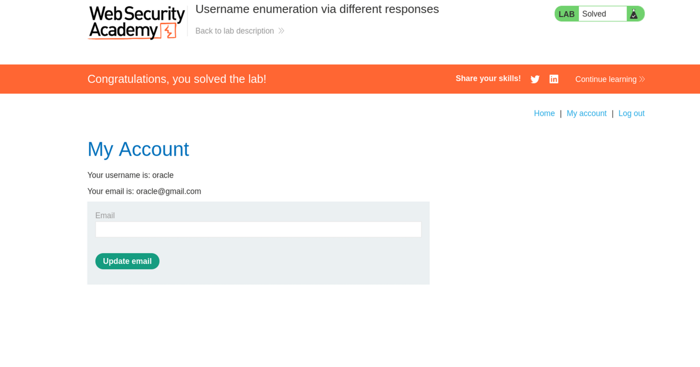

---

## Key Takeaways

This lab demonstrated how dangerous small differences in authentication responses can be.

The important issue was not that the application rejected invalid logins. The real problem was that it rejected them in **different ways**:

```text
Invalid username
```

versus

```text
Incorrect password
```

That difference allowed the username to be discovered first. Once a valid username was known, password brute-forcing became much easier.

### Lessons Learned

- Login forms should avoid revealing whether the username or password was incorrect.
- A safer error message would be something generic like:

```text
Invalid username or password
```

- Username enumeration can happen through very small response differences.
- Manual testing is useful for understanding behavior, but automation is much better for repetitive brute-force testing.
- Tools like Hydra can save a lot of time, especially in controlled lab environments.

---

## Conclusion

This was a useful lab for understanding username enumeration in a practical way. I first tried to discover usernames manually from visible site content such as comments and author names. That approach did not work in this case, but it helped me understand the application structure.

The actual vulnerability became clear when the login page returned different messages for invalid usernames and valid usernames with wrong passwords. After discovering the valid username `oracle`, I used Hydra to brute-force the password and successfully logged in.

Overall, this lab clearly showed why authentication responses should be generic and why automation is important during repetitive testing.

Meet you again in the next lab.

Till then, keep breaking!

---

## Wordlists Used

<details>
<summary>Username list</summary>

```text
carlos
root
admin
test
guest
info
adm
mysql
user
administrator
oracle
ftp
pi
puppet
ansible
ec2-user
vagrant
azureuser
academico
acceso
access
accounting
accounts
acid
activestat
ad
adam
adkit
admin
administracion
administrador
administrator
administrators
admins
ads
adserver
adsl
ae
af
affiliate
affiliates
afiliados
ag
agenda
agent
ai
aix
ajax
ak
akamai
al
alabama
alaska
albuquerque
alerts
alpha
alterwind
am
amarillo
americas
an
anaheim
analyzer
announce
announcements
antivirus
ao
ap
apache
apollo
app
app01
app1
apple
application
applications
apps
appserver
aq
ar
archie
arcsight
argentina
arizona
arkansas
arlington
as
as400
asia
asterix
at
athena
atlanta
atlas
att
au
auction
austin
auth
auto
autodiscover
```

</details>

<details>
<summary>Password list</summary>

```text
123456
password
12345678
qwerty
123456789
12345
1234
111111
1234567
dragon
123123
baseball
abc123
football
monkey
letmein
shadow
master
666666
qwertyuiop
123321
mustang
1234567890
michael
654321
superman
1qaz2wsx
7777777
121212
000000
qazwsx
123qwe
killer
trustno1
jordan
jennifer
zxcvbnm
asdfgh
hunter
buster
soccer
harley
batman
andrew
tigger
sunshine
iloveyou
2000
charlie
robert
thomas
hockey
ranger
daniel
starwars
klaster
112233
george
computer
michelle
jessica
pepper
1111
zxcvbn
555555
11111111
131313
freedom
777777
pass
maggie
159753
aaaaaa
ginger
princess
joshua
cheese
amanda
summer
love
ashley
nicole
chelsea
biteme
matthew
access
yankees
987654321
dallas
austin
thunder
taylor
matrix
mobilemail
mom
monitor
monitoring
montana
moon
moscow
```

</details>
